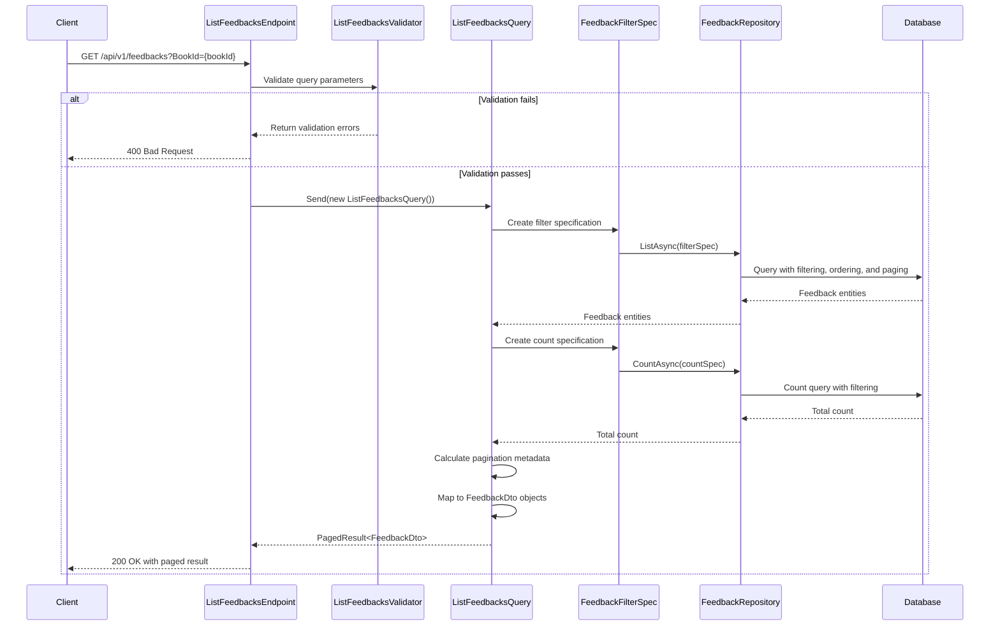

## Overview

The List Feedbacks endpoint is a core read operation within the Rating bounded context, responsible for fetching book feedback aggregates with pagination support. This endpoint implements a query-side operation following CQRS principles, allowing clients to access feedback data without impacting the command-side of the Rating domain.

## Implementation Details

The List Feedbacks operation is implemented using the CQRS pattern with a dedicated query handler:



### Key Components

1. **ListFeedbacksQuery**: Implements `IQuery<PagedResult<FeedbackDto>>` with parameters for filtering, pagination, and ordering
2. **ListFeedbacksHandler**: Processes the query using repository pattern and specification pattern
3. **FeedbackFilterSpec**: Specification that encapsulates the query logic for filtering, ordering, and paging
4. **ListFeedbacksValidator**: Validates the query parameters using FluentValidation
5. **ListFeedbacksEndpoint**: Maps the HTTP GET request to the query handler

## Domain Context

In our domain model, `Feedback` represents a valuable domain concept that captures reader opinions and ratings for books in the catalog. Each feedback belongs to a specific book and contains:

- Unique identifier (Id)
- Book reference (BookId)
- Customer information (FirstName, LastName)
- Review content (Comment)
- Rating score (numerical evaluation on a scale of 0-5)

The List Feedbacks query is a read-only operation that:

1. Filters feedbacks by BookId (required parameter)
2. Applies pagination to limit the result set (default page size is configurable)
3. Supports ordering by feedback properties (default is by Rating)
4. Returns a consistent data structure with pagination metadata

## Query Parameters

| Parameter    | Type    | Required | Default  | Description                                  |
| ------------ | ------- | -------- | -------- | -------------------------------------------- |
| BookId       | Guid    | Yes      | -        | The ID of the book to get feedback for       |
| PageIndex    | int     | No       | 1        | The page number (1-based indexing)           |
| PageSize     | int     | No       | 10       | Number of items per page                     |
| OrderBy      | string  | No       | "Rating" | Property to order results by                 |
| IsDescending | boolean | No       | false    | Whether to order results in descending order |

## Technical Implementation

The implementation uses several patterns and techniques:

1. **Specification Pattern**: The `FeedbackFilterSpec` encapsulates the query logic, making it reusable and testable
2. **Repository Pattern**: The `IFeedbackRepository` abstracts the data access layer
3. **CQRS**: Separates the read model (query) from the write model (command)
4. **Pagination**: Implements efficient data retrieval with `PagedResult<T>` return type
5. **Minimal API**: Uses .NET's minimal API approach with endpoint mapping

The query execution flow:

1. The endpoint receives the HTTP GET request with query parameters
2. Parameters are validated using FluentValidation
3. A filter specification is created with the BookId, ordering, and pagination parameters
4. The repository executes the query against the database using the specification
5. A count query is executed to determine the total number of matching records
6. Pagination metadata is calculated (total items, total pages)
7. Feedback entities are mapped to DTOs
8. A `PagedResult<FeedbackDto>` is returned with both data and pagination metadata

## Integration Points

This endpoint serves as an integration point for other bounded contexts within the BookWorm ecosystem:

- The Catalog service may consume this data to display aggregated ratings
- The UI components use this endpoint to display paginated feedback lists
- The Recommendation engine might analyze feedback patterns to suggest books

## Example Usage

```bash
curl -X GET "https://api.bookworm.com/api/v1/feedbacks?BookId={bookId}&PageIndex=1&PageSize=10&OrderBy=Rating&IsDescending=true" \
    -H "Content-Type: application/json"
```

## Example Response

```json
{
	"items": [
		{
			"id": "3fa85f64-5717-4562-b3fc-2c963f66afa6",
			"firstName": "John",
			"lastName": "Doe",
			"comment": "Great book, highly recommended!",
			"rating": 5,
			"bookId": "3fa85f64-5717-4562-b3fc-2c963f66afa6"
		},
		{
			"id": "4fa85f64-5717-4562-b3fc-2c963f66afa7",
			"firstName": "Jane",
			"lastName": "Smith",
			"comment": "Interesting read but a bit slow in the middle.",
			"rating": 4,
			"bookId": "3fa85f64-5717-4562-b3fc-2c963f66afa6"
		}
	],
	"pageIndex": 1,
	"pageSize": 10,
	"totalCount": 2,
	"totalPages": 1,
	"hasNextPage": false,
	"hasPreviousPage": false
}
```

## Architecture

<NodeGraph />

## GET `(/api/v1/feedbacks)`

### Parameters

- **BookId** (query) (required): The ID of the book to get feedback for
- **PageIndex** (query) (optional, default: 1): The page number (1-based indexing)
- **PageSize** (query) (optional, default: 10): Number of items per page
- **OrderBy** (query) (optional, default: "Rating"): Property to order results by
- **IsDescending** (query) (optional, default: false): Whether to order results in descending order

### Validation Rules

- PageIndex must be greater than 0
- PageSize must be greater than 0
- BookId must be a valid GUID

### Responses

#### <span className="text-green-500">200 OK</span>

Returns a paged result of feedback items for the specified book.

```json
{
	"items": [
		{
			"id": "string",
			"firstName": "string",
			"lastName": "string",
			"comment": "string",
			"rating": 0,
			"bookId": "string"
		}
	],
	"pageIndex": 0,
	"pageSize": 0,
	"totalCount": 0,
	"totalPages": 0
}
```

#### <span className="text-orange-500">400 Bad Request</span>

Returned when validation fails for the provided parameters.

```json
{
	"type": "https://tools.ietf.org/html/rfc7231#section-6.5.1",
	"title": "Bad Request",
	"status": 400,
	"errors": {
		"BookId": ["The BookId field is required."],
		"PageIndex": ["PageIndex must be greater than 0."],
		"PageSize": ["PageSize must be greater than 0."]
	}
}
```
