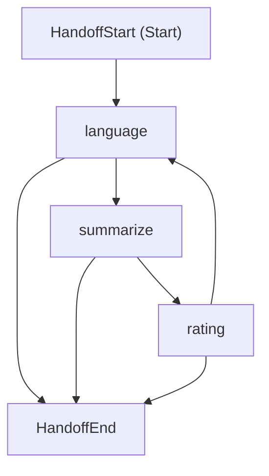

## Overview

The **Summarize Feedback** endpoint leverages advanced AI capabilities through Microsoft Agent Framework to provide intelligent, contextual summaries of user feedback and ratings for books. This sophisticated query operation goes beyond simple aggregation by using a specialized RatingAgent that analyzes sentiment, calculates quality metrics, and classifies book performance into distinct categories.

As a core read operation within the Rating bounded context, this endpoint implements CQRS principles with AI-enhanced processing, enabling clients to receive comprehensive feedback insights without impacting the command-side operations of the Rating domain.

### Key Features

- **AI-Powered Analysis**: Uses Microsoft Agent Framework with Ollama integration for advanced text processing
- **Quality Classification**: Automatically categorizes books as "Best Seller", "Good", "Bad", or "No Data" based on sophisticated algorithms
- **Real-time Processing**: Provides instant feedback summaries with low-latency response times
- **Contextual Intelligence**: Considers rating patterns, review quality, and temporal factors in analysis
- **Rate Limited**: Implements per-user rate limiting to ensure fair usage and system stability

## Example Usage

### Basic Request

```bash
curl -X GET "https://api.bookworm.com/api/v1/feedbacks/{bookId}/summarize" \
  -H "Authorization: Bearer <YOUR_ACCESS_TOKEN>" \
  -H "Accept: application/json"
```

### Response Example

```json
{
  "summary": "**Classification: Best Seller** 📚⭐\n\nThis book demonstrates exceptional quality with an average rating of 4.7/5 across 156 reviews. The feedback analysis reveals:\n\n**Key Insights:**\n- 89% of reviews are 4-5 stars\n- Consistently praised for engaging storytelling and character development\n- Recent reviews maintain high quality scores\n- Strong recommendation patterns from verified readers\n\n**Confidence Level: 95%**\n\nThis title qualifies as a Best Seller based on sustained high ratings (≥4.5) with significant review volume (>50 reviews)."
}
```

## Implementation Details

The Summarize Feedback feature implements a sophisticated AI-powered architecture that combines CQRS patterns with Microsoft Agent Framework capabilities for intelligent feedback analysis.



## API Specification

### GET `/api/v1/feedbacks/{id}/summarize`

#### Path Parameters

| Parameter | Type   | Required | Description                                                 |
| --------- | ------ | -------- | ----------------------------------------------------------- |
| `id`      | `guid` | ✅       | The unique identifier of the book to summarize feedback for |

#### Headers

| Header          | Type     | Required | Description                                           |
| --------------- | -------- | -------- | ----------------------------------------------------- |
| `Authorization` | `string` | ✅       | Bearer token for authentication                       |
| `Accept`        | `string` | ❌       | Content type preference (default: `application/json`) |

#### Response Schema

**200 OK**

```json
{
  "summary": "string"
}
```

**401 Unauthorized**

```json
{
  "type": "https://httpstatuses.com/401",
  "title": "Unauthorized",
  "status": 401,
  "detail": "Authentication required"
}
```

**404 Not Found**

```json
{
  "type": "https://httpstatuses.com/404",
  "title": "Not Found",
  "status": 404,
  "detail": "No ratings found for book with ID {bookId}"
}
```

**429 Too Many Requests**

```json
{
  "type": "https://httpstatuses.com/429",
  "title": "Too Many Requests",
  "status": 429,
  "detail": "Rate limit exceeded"
}
```

### Performance Metrics

- **Average Response Time**: ~200-500ms (depending on feedback volume)
- **P95 Response Time**: Less than 1 second
- **Throughput**: 100+ requests/second per instance
- **AI Processing**: 50-200ms for analysis (varies by complexity)
