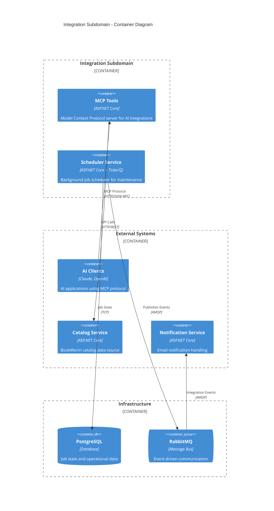
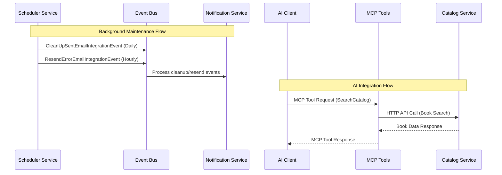

<Tiles>
  <Tile
    icon="WrenchScrewdriverIcon"
    href="/docs/services/MCPTools/1.0.0"
    title="MCP Tools Service"
    description="AI-powered Model Context Protocol server for catalog integration"
  />
  <Tile
    icon="ClockIcon"
    href="/docs/services/SchedulerService/1.0.0"
    title="Scheduler Service"
    description="Background job scheduler for automated maintenance tasks"
  />
  <Tile
    icon="BoltIcon"
    href="/visualiser/domains/Store/subdomains/integration"
    title="Integration Architecture"
    description="View the complete integration subdomain architecture"
  />
  <Tile
    icon="DocumentIcon"
    href="/docs/subdomains/integration/changelog"
    title="Subdomain Changelog"
    description="Track changes and evolution of integration services"
  />
</Tiles>

## Overview

The Integration subdomain in the BookWorm system serves as the central hub for cross-cutting concerns and facilitates seamless interactions between various services and external systems. This subdomain encapsulates two critical aspects of the platform: AI-powered integrations through the Model Context Protocol (MCP) and automated system maintenance through background job scheduling.

Built following our [microservices architecture](https://foxminchan.github.io/BookWorm/architecture-decisions/adr-001-microservices-architecture) principles, this subdomain ensures that the overall system operates cohesively and efficiently while maintaining clean boundaries with other bounded contexts.

### Strategic Importance

The Integration subdomain addresses several key business and technical requirements:

- **AI Integration**: Enables AI-powered applications to interact with BookWorm catalog data through standardized protocols
- **System Reliability**: Provides automated maintenance and cleanup operations to ensure system health
- **Cross-Service Communication**: Facilitates seamless event-driven communication between services
- **External System Integration**: Manages connections and interactions with third-party services and AI platforms

## Services Architecture

## Service Details

### MCP Tools Service

**Purpose**: AI-powered Model Context Protocol server enabling AI applications to interact with BookWorm catalog data

**Key Features**:

- **MCP Protocol Implementation**: Full HTTP-based MCP server following specification
- **Tool Registry**: Auto-discovery of MCP tools via .NET attributes
- **Catalog Integration**: Seamless integration with BookWorm Catalog Service
- **AI Assistant Support**: Pre-defined prompts for customer service interactions
- **OpenAPI Documentation**: Self-documenting API with MCP extensions

**Integration Points**:

- External AI clients (Claude, OpenAI assistants, etc.)
- BookWorm Catalog Service for book data retrieval
- OpenTelemetry for observability

### Scheduler Service

**Purpose**: Background job scheduler managing automated maintenance tasks and system health operations

**Key Features**:

- **TickerQ Framework**: Robust job scheduling with cron expressions
- **Event-Driven**: Publishes integration events for cross-service communication
- **Dashboard**: Built-in monitoring and management interface
- **Outbox Pattern**: Reliable event publishing with transactional guarantees
- **High Availability**: Instance identification and missed job recovery

**Scheduled Jobs**:

- **Email Cleanup**: Daily cleanup of processed email records (`0 0 * * *`)
- **Email Resend**: Hourly retry of failed email deliveries (`0 * * * *`)

## Event Flow

## Integration Patterns

The Integration subdomain employs several key patterns:

### Event-Driven Architecture

- **Publisher**: Scheduler Service publishes maintenance events
- **Consumer**: Notification Service processes scheduler events
- **Reliability**: Outbox pattern ensures reliable event delivery

### Protocol Gateway

- **MCP Server**: Standardized interface for AI applications
- **HTTP Transport**: Stateless communication for scalability
- **Tool Discovery**: Attribute-based registration of available tools

### Background Processing

- **Cron Scheduling**: Time-based job execution
- **Transactional**: Database operations with event publishing
- **Monitoring**: Built-in dashboard for operational visibility

## Technology Stack

| Component            | Technology                      | Purpose                         |
| -------------------- | ------------------------------- | ------------------------------- |
| **Runtime**          | .NET                            | Core application framework      |
| **Job Scheduling**   | TickerQ                         | Background job processing       |
| **MCP Protocol**     | ModelContextProtocol.AspNetCore | AI integration server           |
| **Database**         | PostgreSQL                      | Job state and operational data  |
| **Message Bus**      | RabbitMQ + MassTransit          | Event-driven communication      |
| **HTTP Client**      | Refit                           | Type-safe API integration       |
| **Observability**    | OpenTelemetry                   | Distributed tracing and metrics |
| **Containerization** | Docker                          | Deployment and scaling          |

## Business Value

### Operational Excellence

- **Automated Maintenance**: Reduces manual operations through scheduled cleanup
- **System Reliability**: Proactive error recovery and system health monitoring
- **Monitoring**: Real-time visibility into background operations

### AI Integration

- **Standardized Protocol**: Industry-standard MCP for AI tool integration
- **Extensible**: Easy addition of new AI-powered tools and capabilities
- **Performance**: Optimized for AI assistant response times

### Developer Experience

- **Self-Documenting**: OpenAPI specifications for both services
- **Type Safety**: Strong typing throughout the integration layer
- **Testability**: Clean architecture supporting comprehensive testing

## Security & Compliance

### Authentication & Authorization

- **Basic Auth**: TickerQ Dashboard protected access
- **Service-to-Service**: Secure communication between internal services
- **AI Client Auth**: Configurable authentication for MCP clients

### Data Protection

- **Encryption**: TLS for all external communications
- **Audit Trail**: Comprehensive logging of all operations
- **Data Minimization**: Only necessary data exposed through integrations

### Operational Security

- **Resource Limits**: Configured constraints on job execution
- **Error Handling**: Graceful degradation and error recovery
- **Monitoring**: Real-time alerting on security events
