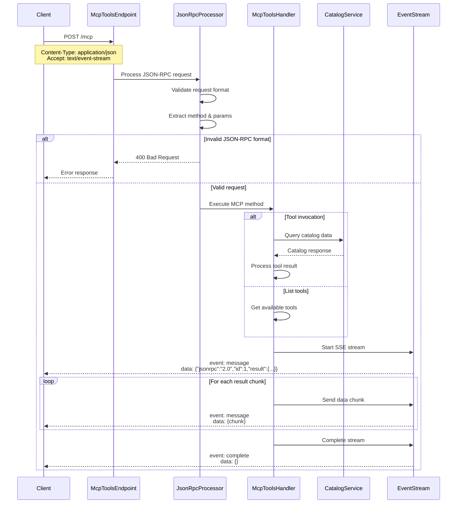

## Overview

The `Get MCP Components` endpoint provides access to Model Context Protocol (MCP) tools and components within the Integration bounded context. This operation follows the MCP streamable protocol (`mcp-streamable-1.0`) and returns responses as Server-Sent Events for real-time streaming capabilities.

The endpoint enables interaction with various MCP tools for managing and querying BookWorm catalog data, including book search operations and catalog management functions.

## Implementation Details

The Get MCP Components operation is implemented using JSON-RPC over HTTP with streaming response support:



### Key Components

1. **JSON-RPC Processor**: Handles JSON-RPC 1.0/2.0 protocol validation and routing
2. **MCP Tools Handler**: Processes MCP method invocations and tool executions
3. **Event Stream Manager**: Manages Server-Sent Events streaming using `mcp-streamable-1.0` protocol
4. **Catalog Service Integration**: Provides access to BookWorm catalog data
5. **Tool Registry**: Maintains available MCP tools and their capabilities

### Technical Implementation

The operation execution follows these steps:

1. **Request Validation**: Validates JSON-RPC format and required fields (`method`, `params`, `jsonrpc`, `id`)
2. **Method Routing**: Routes the request to appropriate MCP tool or system method
3. **Tool Execution**: Executes the requested MCP tool with provided arguments
4. **Stream Initialization**: Starts Server-Sent Events stream with `text/event-stream` content type
5. **Response Streaming**: Streams results in real-time using MCP streamable protocol
6. **Stream Completion**: Sends completion event to close the stream

## POST `(/mcp)`

### Request Body

The endpoint accepts JSON-RPC formatted requests with the following structure:

| Field   | Type    | Required | Description                                     |
| ------- | ------- | -------- | ----------------------------------------------- |
| method  | string  | Yes      | Name of the MCP method to invoke                |
| params  | object  | Yes      | Method parameters containing tool-specific args |
| jsonrpc | string  | Yes      | JSON-RPC version ("1.0" or "2.0")               |
| id      | integer | Yes      | Unique request identifier                       |

#### Parameters Object

| Field     | Type   | Required | Description                      |
| --------- | ------ | -------- | -------------------------------- |
| name      | string | No       | Target component or tool name    |
| arguments | object | No       | Key-value arguments for the tool |

### Examples Usage

#### List Available Tools

```bash title="Example Request"
curl -X POST "https://mcp.bookworm.com/mcp" \
  -H "Content-Type: application/json" \
  -H "Accept: text/event-stream" \
  -d '{
    "method": "tools/list",
    "params": {},
    "jsonrpc": "2.0",
    "id": 1
  }'
```

#### Search Books Tool

```bash title="Example Request"
curl -X POST "https://mcp.bookworm.com/mcp" \
  -H "Content-Type: application/json" \
  -H "Accept: text/event-stream" \
  -d '{
    "method": "tools/call",
    "params": {
      "name": "search_books",
      "arguments": {
        "query": "fantasy novels",
        "limit": 10
      }
    },
    "jsonrpc": "2.0",
    "id": 2
  }'
```

#### Get Catalog Information

```bash title="Example Request"
curl -X POST "https://mcp.bookworm.com/mcp" \
  -H "Content-Type: application/json" \
  -H "Accept: text/event-stream" \
  -d '{
    "method": "tools/call",
    "params": {
      "name": "get_catalog_info",
      "arguments": {
        "include_stats": true
      }
    },
    "jsonrpc": "2.0",
    "id": 3
  }'
```

### Responses

#### <span className="text-green-500">200 OK</span> (Server-Sent Events)

Successful streaming response with MCP data:

```
Content-Type: text/event-stream

event: message
data: {"jsonrpc":"2.0","id":1,"result":{"status":"ok","tools":[{"name":"search_books","description":"Search for books in the catalog"}]}}

event: message
data: {"jsonrpc":"2.0","id":1,"result":{"data":"Additional result chunk"}}

event: complete
data: {}
```

#### <span className="text-red-500">400 Bad Request</span>

When the JSON-RPC request is malformed:

```json
{
  "error": "Bad Request: The POST body did not contain a valid JSON-RPC message.",
  "code": 400,
  "jsonrpc": "2.0",
  "id": 1
}
```

#### <span className="text-red-500">406 Not Acceptable</span>

When the client doesn't accept Server-Sent Events:

```json
{
  "error": "Not Acceptable: Client must accept both application/json and text/event-stream",
  "code": 406,
  "jsonrpc": "2.0",
  "id": 1
}
```

## MCP Protocol Details

The endpoint implements the **MCP streamable protocol version 1.0** (`mcp-streamable-1.0`) with the following characteristics:

### Event Types

- **`message`**: Contains JSON-RPC response data
- **`error`**: Indicates an error occurred during processing
- **`complete`**: Signals the end of the stream

### Available Tools

The MCP Tools service provides the following tools for BookWorm integration:

| Tool Name          | Description                                | Arguments                                 |
| ------------------ | ------------------------------------------ | ----------------------------------------- |
| `search_books`     | Search for books in the BookWorm catalog   | `query`, `limit`, `filters`               |
| `get_book_details` | Retrieve detailed information about a book | `book_id`                                 |
| `list_categories`  | Get available book categories              | `include_counts`                          |
| `get_catalog_info` | Get catalog statistics and information     | `include_stats`, `include_recent_updates` |
| `list_authors`     | Retrieve authors from the catalog          | `limit`, `search`                         |

### Error Handling

Errors are streamed as part of the Server-Sent Events response:

```
event: error
data: {"jsonrpc":"2.0","id":1,"error":{"code":-32602,"message":"Invalid params","data":"Tool 'unknown_tool' not found"}}

event: complete
data: {}
```

## Security Considerations

- The endpoint validates JSON-RPC format to prevent injection attacks
- Tool execution is sandboxed within the MCP context
- Rate limiting may be applied to prevent abuse
- Authentication may be required depending on the tool being invoked

## Integration Points

This query integrates with:

- **Catalog Service**: For book search and catalog operations
- **Event Streaming Infrastructure**: For real-time response delivery
- **MCP Tool Registry**: For tool discovery and execution
- **BookWorm API Gateway**: For routing and load balancing
