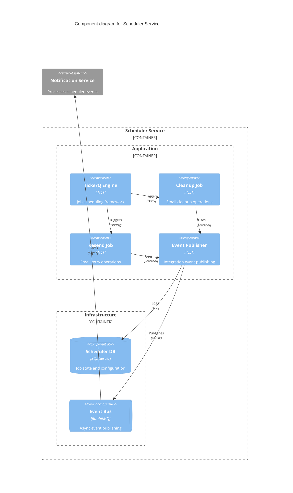
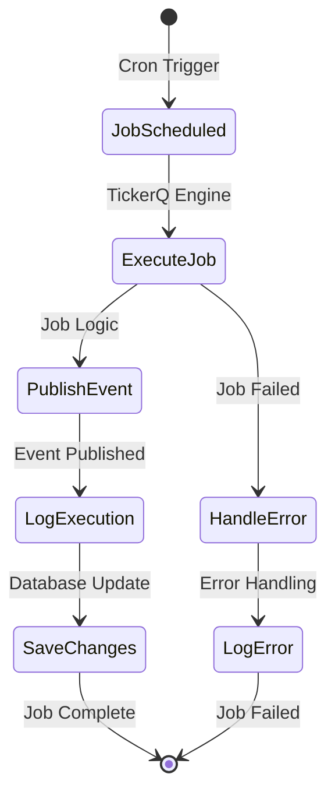

<Tiles>
  <Tile
    icon="DocumentIcon"
    href={`/docs/services/${frontmatter.id}/${frontmatter.version}/changelog`}
    title="View the changelog"
    description="Want to know the history of this service? View the change logs"
  />
  <Tile
    icon="UserGroupIcon"
    href="/docs/users/nhanxnguyen"
    title="Contact the author"
    description="Any questions? Feel free to contact the owners"
  />
  <Tile
    icon="BoltIcon"
    href={`/visualiser/services/${frontmatter.id}/${frontmatter.version}`}
    title={`Sends ${frontmatter.sends.length} messages`}
    description="This service publishes messages to other services"
  />
</Tiles>

## Overview

The Scheduler Service is a critical infrastructure component within BookWorm's [microservices architecture](https://foxminchan.github.io/BookWorm/architecture-decisions/adr-001-microservices-architecture), responsible for managing background jobs and automated maintenance tasks. Built using the TickerQ framework, this service orchestrates time-based operations that ensure system health, performance optimization, and reliable email delivery across the platform.

### Key Responsibilities

- **Email Maintenance**: Manages cleanup and retry operations for email notifications
- **System Health**: Performs regular maintenance tasks to optimize system performance
- **Background Processing**: Executes scheduled jobs without blocking user operations
- **Event Publishing**: Triggers integration events for cross-service communication
- **Error Recovery**: Implements retry mechanisms for failed operations
- **Resource Optimization**: Manages system resources through automated cleanup processes

## Component Diagram

## Architecture diagram

<NodeGraph />

## Scheduled Jobs

The Scheduler Service manages the following automated tasks:

| Job                   | Schedule    | Priority | Purpose                         | Target Service       |
| --------------------- | ----------- | -------- | ------------------------------- | -------------------- |
| `CleanUpSentEmailJob` | Daily 00:00 | Normal   | Cleanup processed email records | Notification Service |
| `ResendErrorEmailJob` | Hourly      | High     | Retry failed email deliveries   | Notification Service |

### Job Implementation Details

#### CleanUpSentEmailJob

- **Class**: `CleanUpSentEmailJob`
- **Cron Expression**: `"0 0 * * *"` (Daily at midnight)
- **Priority**: Normal
- **Implementation**: Publishes `CleanUpSentEmailIntegrationEvent` and saves changes to database

#### ResendErrorEmailJob

- **Class**: `ResendErrorEmailJob`
- **Cron Expression**: `"0 * * * *"` (Every hour)
- **Priority**: `TickerTaskPriority.High`
- **Implementation**: Publishes `ResendErrorEmailIntegrationEvent` and saves changes to database

### Job Execution Flow

## Event Publishing

The service publishes integration events to trigger downstream processing:

### Email Cleanup Event

- **Event**: `CleanUpSentEmailIntegrationEvent`
- **Schedule**: Daily at midnight (`0 0 * * *`)
- **Purpose**: Triggers cleanup of successfully sent email records
- **Target**: Notification Service outbox cleanup

### Email Resend Event

- **Event**: `ResendErrorEmailIntegrationEvent`
- **Schedule**: Every hour (`0 * * * *`)
- **Priority**: High priority processing
- **Purpose**: Triggers retry mechanism for failed email deliveries
- **Target**: Notification Service error recovery

## Technical Architecture

### Job Framework

- **Framework**: TickerQ.Utilities for .NET
- **Execution Model**: Background service with cron scheduling using `[TickerFunction]` attributes
- **Persistence**: PostgreSQL for job state and operational store
- **Dashboard**: Built-in TickerQ Dashboard at `/tickerq` endpoint with basic authentication
- **Concurrency**: Max concurrency set to `Environment.ProcessorCount`
- **Instance Identification**: Uses `Environment.MachineName` for instance identification

### Database Configuration

- **Primary Database**: Azure PostgreSQL via Aspire integration
- **Context**: `SchedulerDbContext` implementing `ISchedulerDbContext`
- **Outbox Pattern**: EntityFramework outbox for reliable event publishing
- **Migrations**: EF Core migrations with operational store support

### Event Integration

- **Message Bus**: RabbitMQ via MassTransit
- **Pattern**: Outbox pattern with EntityFramework for transactional messaging
- **Serialization**: JSON with MassTransit envelope
- **Duplicate Detection**: 5-minute duplicate detection window
- **Query Delay**: 1-second query delay for outbox processing

## Infrastructure

The Scheduler Service is deployed as a containerized application on Microsoft Azure, leveraging Azure PostgreSQL for persistence and RabbitMQ for event publishing. The service includes a built-in dashboard for monitoring job execution.

```mermaid
architecture-beta
    group prod[Production Environment]
    group dev[Development Environment]

    service app(logos:docker)[Scheduler Service] in prod
    service postgres(logos:microsoft-azure)[Azure PostgreSQL] in prod
    service bus(logos:rabbitmq)[RabbitMQ] in prod
    service monitor(logos:microsoft-azure)[Azure Monitor] in prod
    service notification(logos:docker)[Notification Service] in prod
    service dashboard(logos:docker)[TickerQ Dashboard] in prod

    service appDev(logos:docker)[Scheduler Service] in dev
    service postgresDev(logos:postgresql)[PostgreSQL] in dev
    service busDev(logos:rabbitmq)[RabbitMQ] in dev
    service notificationDev(logos:docker)[Notification Service] in dev
    service dashboardDev(logos:docker)[TickerQ Dashboard] in dev

    app:B --> T:postgres
    app:R --> L:bus
    app:L --> R:monitor
    app:T --> B:dashboard
    bus:R --> L:notification

    appDev:B --> T:postgresDev
    appDev:R --> L:busDev
    appDev:T --> B:dashboardDev
    busDev:R --> L:notificationDev
```

## Monitoring & Observability

### Health Checks

- **Database Connectivity**: Verifies PostgreSQL connection via Aspire health checks
- **Message Bus**: Confirms RabbitMQ availability through MassTransit health checks
- **Job Status**: Monitors active and failed job executions via TickerQ Dashboard

### Logging

- **Structured Logging**: Built-in .NET logging with structured data
- **Job Execution**: TickerQ framework provides detailed execution logs
- **Error Tracking**: Comprehensive error logging with stack traces
- **Dashboard Monitoring**: Real-time job status and execution history via `/tickerq` endpoint

### Management Dashboard

- **TickerQ Dashboard**: Accessible at `/tickerq` endpoint
- **Authentication**: Basic authentication enabled for security
- **Features**: Job monitoring, execution history, error tracking, and manual job triggers
- **Real-time Updates**: Live job status and execution statistics

### Alerting

- **Failed Jobs**: Immediate alerts for job execution failures
- **High Error Rate**: Threshold-based alerts for email delivery issues
- **Resource Usage**: Memory and CPU utilization monitoring

## Security Considerations

- **Database Security**: Encrypted connections with Azure SQL
- **Message Security**: TLS encryption for RabbitMQ communication
- **Access Control**: Service principal authentication
- **Audit Trail**: Complete logging of all job executions
- **Resource Limits**: CPU and memory constraints to prevent resource exhaustion

## Performance Optimizations

- **Async Processing**: All operations are fully asynchronous
- **Connection Pooling**: Reuses database and message bus connections
- **Batch Operations**: Groups related operations when possible
- **Resource Management**: Proper disposal of resources and connections
- **Parallel Execution**: Concurrent job processing with throttling limits
