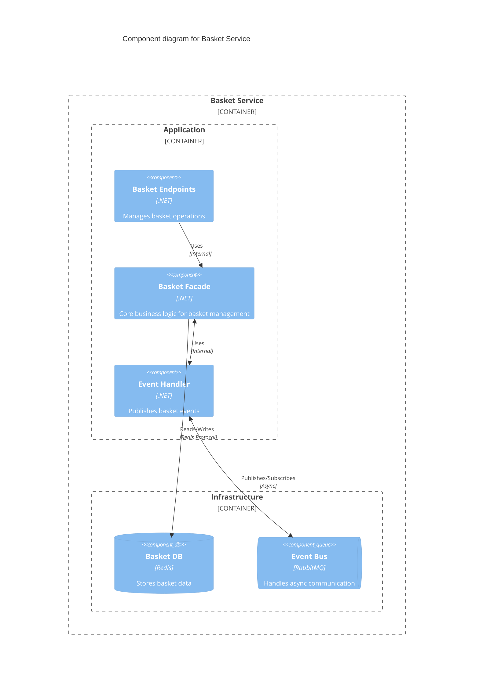

<Tiles>
  <Tile
    icon="DocumentIcon"
    href={`/docs/services/${frontmatter.id}/${frontmatter.version}/changelog`}
    title="View the changelog"
    description="Want to know the history of this service? View the change logs"
  />
  <Tile
    icon="UserGroupIcon"
    href="/docs/users/nhanxnguyen"
    title="Contact the author"
    description="Any questions? Feel free to contact the owners"
  />
  <Tile
    icon="BoltIcon"
    href={`/visualiser/services/${frontmatter.id}/${frontmatter.version}`}
    title={`Sends ${frontmatter.sends.length} messages`}
    description="This service sends messages to downstream consumers"
  />
  <Tile
    icon="BoltIcon"
    href={`/visualiser/services/${frontmatter.id}/${frontmatter.version}`}
    title={`Receives ${frontmatter.receives.length} messages`}
    description="This service receives messages from other services"
  />
</Tiles>

## Overview

The Basket Service is a domain-centric microservice within our bounded context that implements a gRPC-based API architecture to manage the transient state of customer shopping carts. This service encapsulates the complete lifecycle of a basket aggregate, from creation through modification to eventual checkout processing.

As a core part of our Domain-Driven Design implementation, the Basket Service maintains its own dedicated Redis persistence store, ensuring proper encapsulation of the basket domain model. It serves as the system of record for the shopping intent of customers before this intent is transformed into an order through domain events.

### Key Responsibilities

- **Basket Lifecycle Management**: Creation, modification, and deletion of shopping baskets
- **Item Management**: Adding, updating, and removing items with quantity validation
- **Checkout Orchestration**: Coordinating the transition from basket to order
- **State Persistence**: Maintaining basket state in Redis with configurable TTL
- **Event Publishing**: Emitting domain events for basket state changes
## Component Diagram

## Core Features

| Feature                     | Description                                                                                               | Event Published                |
| --------------------------- | --------------------------------------------------------------------------------------------------------- | ------------------------------ |
| **Get Basket**              | Retrieves the current basket for an authenticated user, including all items and their quantities.         | -                              |
| **Add Item to Basket**      | Allows customers to add items to their basket, with validation ensuring quantities are greater than zero. | `BasketItemAddedEvent`         |
| **Remove Item from Basket** | Enables customers to remove items from their basket, maintaining data consistency.                        | `BasketItemRemovedEvent`       |
| **Update Item Quantity**    | Supports customers in updating the quantity of items in their basket, with built-in validation.           | `BasketItemQuantityUpdatedEvent` |
| **Clear Basket**            | Removes all items from the basket at once.                                                               | `BasketClearedEvent`           |
| **Delete Basket**           | Permanently removes the basket from the system.                                                           | `BasketDeletedCompletedEvent`  |

## Architecture diagram

<NodeGraph />

<MessageTable format="all" limit={4} />

## Key Concepts

<AccordionGroup>
  <Accordion title="Basket">
    The basket is the core domain entity representing a customer's shopping
    cart. It is identified by a unique ID and contains a collection of basket
    items. The basket is stored in Redis for fast access and persistence.
  </Accordion>
  <Accordion title="Basket Item">
    Basket items are the individual products added to the basket by the
    customer.
  </Accordion>
</AccordionGroup>

## Infrastructure

The Basket Service is deployed as a containerized application within the BookWorm ecosystem, leveraging cloud-native technologies for scalability and resilience.

```mermaid
architecture-beta
    group api(logos:microsoft-azure)[API Layer]
    group data(logos:microsoft-azure)[Data Layer]
    group messaging(logos:microsoft-azure)[Messaging Layer]

    service server(logos:docker-icon)[Application] in api

    service db(logos:redis)[Redis Primary] in data

    service bus(logos:rabbitmq)[RabbitMQ] in messaging

    server:L --> R:db
    server:R --> L:bus
```

## Performance Optimizations

- **Connection Pooling**: Redis connection multiplexing
- **Caching Strategy**: L1 in-memory cache with L2 Redis cache
- **Batch Operations**: Bulk item updates in single transactions
- **Async/Await**: Non-blocking I/O throughout the stack

## Security Considerations

- **Authentication**: JWT bearer tokens validated on each request
- **Authorization**: Customer can only access their own basket
- **Input Validation**: All inputs sanitized and validated
- **Rate Limiting**: Per-customer request throttling
- **Data Encryption**: TLS for transit, optional Redis encryption at rest
