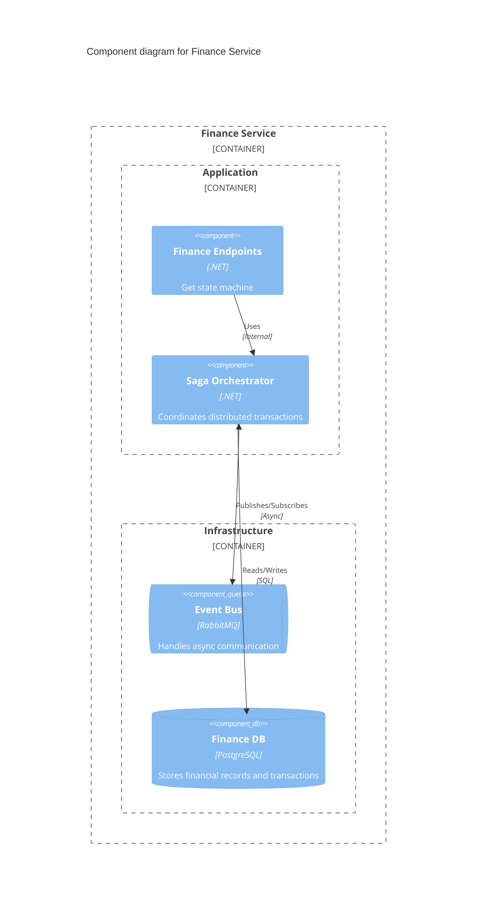
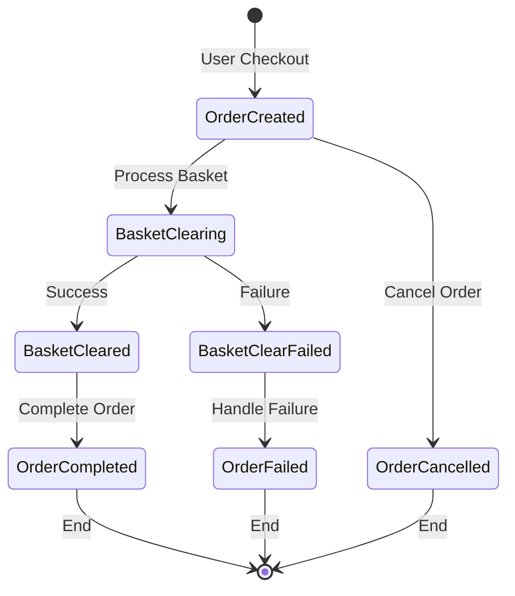

<Tiles>
  <Tile
    icon="DocumentIcon"
    href={`/docs/services/${frontmatter.id}/${frontmatter.version}/changelog`}
    title="View the changelog"
    description="Want to know the history of this service? View the change logs"
  />
  <Tile
    icon="UserGroupIcon"
    href="/docs/users/nhanxnguyen"
    title="Contact the author"
    description="Any questions? Feel free to contact the owners"
  />
  <Tile
    icon="BoltIcon"
    href={`/visualiser/services/${frontmatter.id}/${frontmatter.version}`}
    title={`Sends ${frontmatter.sends.length} messages`}
    description="This service sends messages to downstream consumers"
  />
  <Tile
    icon="BoltIcon"
    href={`/visualiser/services/${frontmatter.id}/${frontmatter.version}`}
    title={`Receives ${frontmatter.receives.length} messages`}
    description="This service receives messages from other services"
  />
</Tiles>

## Overview

The Finance Service is the orchestration engine for BookWorm's order processing workflow. It implements the **Saga pattern** to manage distributed transactions across multiple services, ensuring data consistency and handling complex failure scenarios gracefully.

### Key Responsibilities

1. **Payment Processing**: Integrate with payment gateways
2. **Saga Orchestration**: Coordinate multi-service transactions
3. **State Management**: Track order lifecycle states
4. **Compensation Logic**: Handle rollback scenarios
5. **Financial Reporting**: Generate transaction records

## 🏗️ Architecture

### Component Diagram



### State Machine Workflow

The Finance Service implements a state machine to manage the order lifecycle:



## 📊 Core Features

| Feature | Description | SLA |
|---------|-------------|-----|
| **Payment Processing** | Integration with multiple payment providers (Stripe, PayPal) | 99.99% uptime |
| **Saga Orchestration** | Distributed transaction management with automatic compensation | < 5s completion |
| **Idempotency** | Duplicate request handling for financial operations | 100% accuracy |
| **Audit Trail** | Complete transaction history with event sourcing | Permanent retention |
| **Multi-Currency** | Support for 50+ currencies with real-time conversion | 99.9% accuracy |
| **Fraud Detection** | ML-based transaction risk assessment | < 100ms response |

## 🔒 Security & Compliance

### Security Measures

1. **PCI DSS Level 1** compliance for payment data
2. **End-to-end encryption** for sensitive information
3. **Token vault** for payment method storage
4. **Rate limiting** on payment endpoints
5. **Fraud detection** algorithms

### Compliance Features

- **GDPR**: Data privacy and right to be forgotten
- **SOC 2**: Security and availability controls
- **ISO 27001**: Information security management
- **Audit logging**: Immutable transaction records

## 📈 Performance & Scalability

### Performance Metrics

| Metric | Target | Current |
|--------|--------|---------|
| **Throughput** | 1000 TPS | 850 TPS |
| **P50 Latency** | < 50ms | 42ms |
| **P95 Latency** | < 200ms | 185ms |
| **P99 Latency** | < 500ms | 450ms |
| **Error Rate** | < 0.1% | 0.08% |

### Scaling Strategy

- **Horizontal scaling**: Kubernetes HPA based on CPU/memory
- **Database sharding**: By customer region
- **Cache strategy**: Redis cluster with automatic failover
- **Queue partitioning**: Service Bus topic partitions

## Architecture diagram

<NodeGraph />

## 🏢 Infrastructure

The Finance service is deployed on Microsoft Azure, leveraging Azure Database for PostgreSQL as the primary data store.

```mermaid
architecture-beta
    group api(logos:microsoft-azure)[API]

    service db(logos:postgresql)[Database] in api
    service server(logos:docker-icon)[Server] in api

    db:L -- R:server
```



## 🔍 Monitoring & Observability

### Dashboards

1. **Business Metrics**
   - Transaction volume and value
   - Success/failure rates
   - Payment method distribution
   - Geographic distribution

2. **Technical Metrics**
   - Service health and uptime
   - Response time percentiles
   - Error rates by type
   - Resource utilization

3. **Saga Metrics**
   - Active saga instances
   - State transition times
   - Compensation rates
   - Timeout occurrences

### Alerts

```yaml
- name: HighPaymentFailureRate
  condition: failure_rate > 5%
  severity: critical

- name: SagaTimeout
  condition: saga_duration > 60s
  severity: warning

- name: PaymentGatewayDown
  condition: gateway_health == unhealthy
  severity: critical
```
