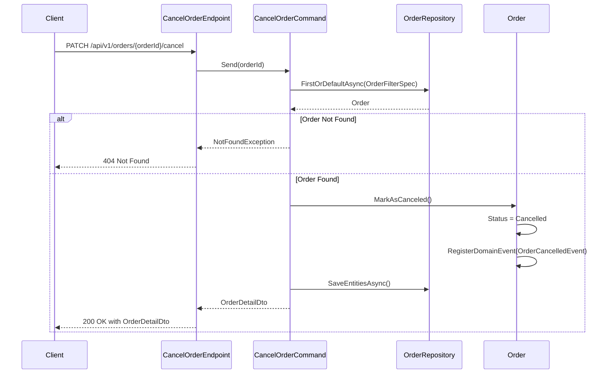

## Overview

The Order Cancellation operation is a critical boundary-crossing interaction within the Ordering domain. This endpoint empowers authenticated users to cancel an existing order that hasn't progressed beyond a cancellable state in its lifecycle.

From a domain perspective, order cancellation represents an important state transition that triggers several domain events and side effects:

1. **State Validation**: The domain enforces business rules to verify if the order is eligible for cancellation based on its current state (only orders in "New" status can be cancelled).

2. **Domain Event Publication**: Upon successful cancellation, the `OrderCancelledEvent` is raised, which may trigger compensating transactions across bounded contexts.

3. **Aggregate Consistency**: The Order aggregate's invariants are preserved throughout the cancellation process, ensuring the order transitions to a cancelled state only when business rules permit.

4. **Notification Generation**: The cancellation typically initiates notification events to inform customers about their order status change.

## Implementation Details

The Cancel Order operation is implemented using the CQRS pattern with a query handler that returns the updated order details:



### Key Components

1. **CancelOrderCommand**: Implements `IQuery<OrderDetailDto>` to retrieve and update the order
2. **OrderFilterSpec**: Ensures only orders in "New" status can be cancelled
3. **MarkAsCanceled**: Domain method that changes the order status and registers the domain event
4. **OrderCancelledEvent**: Domain event that triggers downstream processes

## API Endpoint

The endpoint is configured with several important characteristics:

- **Authentication**: Requires an authenticated user
- **Idempotency**: Supports idempotent requests via the `WithIdempotency()` middleware
- **Versioning**: Mapped to API version 1.0

## Architecture

<NodeGraph />

## PATCH `(/api/v1/orders/{orderId}/cancel)`

### Parameters

- **orderId** (path) (required): The unique identifier of the order to cancel
- **x-request-id** (header) (required): A unique key to ensure idempotent processing

### Example Usage

```bash
curl -X PATCH "https://api.bookworm.com/api/v1/orders/{orderId}/cancel" \
    -H "Authorization: Bearer <your-jwt-token>" \
    -H "x-request-id: <unique-request-id>"
```

### Responses

#### <span className="text-green-500">200 OK</span>

Returns the cancelled order details.

<SchemaViewer file="response-200.json" maxHeight="500" id="response-200" />

### Example Response

```json title="200 OK"
{
	"id": "3fa85f64-5717-4562-b3fc-2c963f66afa6",
	"date": "2025-03-31T02:54:17.223Z",
	"status": "Cancelled",
	"total": 292.4,
	"items": [
		{
			"id": "3fa85f64-5717-4562-b3fc-2c963f66afa6",
			"name": "Book Name",
			"quantity": 10,
			"price": 29.24
		}
	]
}
```

#### <span className="text-red-500">404 Not Found</span>

```json title="404 Not Found"
{
	"type": "https://tools.ietf.org/html/rfc7231#section-6.5.4",
	"title": "Not Found",
	"status": 404,
	"detail": "Order with id {orderId} not found."
}
```

#### <span className="text-red-500">401 Unauthorized</span>

Returned when the request lacks valid authentication credentials.

#### <span className="text-red-500">400 Bad Request</span>

Returned when the order cannot be cancelled (e.g., already completed or cancelled).

#### <span className="text-red-500">409 Conflict</span>

Returned when the order is already cancelled.
