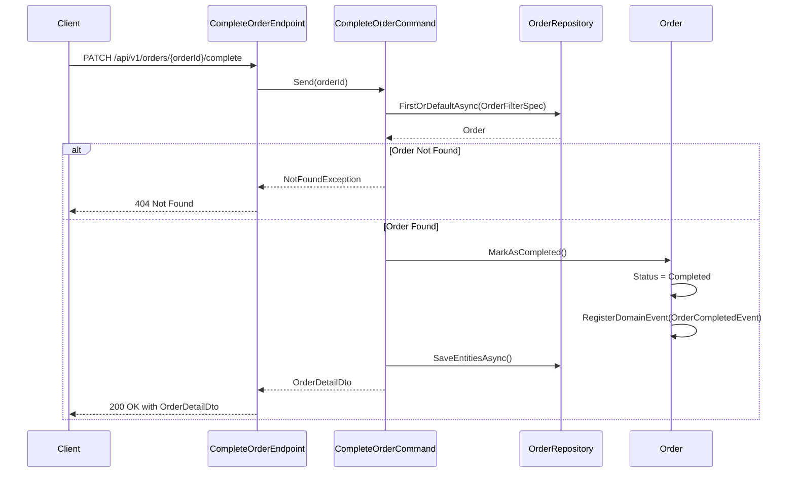

## Overview

This endpoint marks an order as complete within the Ordering bounded context, representing the final state transition in the order fulfillment lifecycle. When an order is completed, it signifies that all items have been delivered to the customer and the business transaction is finalized.

## Domain Significance

In our domain model, order completion is a crucial state transition that:

- Validates that the order is in a valid state for completion (only orders in "New" status can be completed)
- Triggers domain events for cross-service communication
- Updates aggregate state while preserving invariants
- Provides a consistent view of the completed order back to the client

## Implementation Details

The Complete Order operation is implemented using the CQRS pattern with a query handler that returns the updated order details:



### Key Components

1. **CompleteOrderCommand**: Implements `IQuery<OrderDetailDto>` to retrieve and update the order
2. **OrderFilterSpec**: Ensures only orders in "New" status can be completed
3. **MarkAsCompleted**: Domain method that changes the order status and registers the domain event
4. **OrderCompletedEvent**: Domain event that triggers downstream processes

## Domain Events

Upon successful completion, the system publishes an `OrderCompletedEvent` that notifies other bounded contexts about this state change. This event contains the entire Order aggregate, allowing downstream services to access all relevant order information.

The event triggers several important cross-domain processes:

- **Notification Service**: Sends a completion confirmation email to the customer
- **Finance Service**: Finalizes payment processing and generates receipts
- **Analytics Service**: Updates sales metrics and customer purchase history

## API Endpoint

The endpoint is configured with several important characteristics:

- **Authentication**: Requires an authenticated user
- **Idempotency**: Supports idempotent requests via the `WithIdempotency()` middleware
- **Versioning**: Mapped to API version 1.0

## Architecture

<NodeGraph />

## PATCH `(/api/v1/orders/{orderId}/complete)`

### Parameters

- **orderId** (path) (required): The unique identifier of the order to complete
- **x-request-id** (header) (required): A unique key to ensure idempotent processing

### Example Usage

```bash
curl -X PATCH "https://api.bookworm.com/api/v1/orders/{orderId}/complete" \
    -H "Authorization: Bearer <your-jwt-token>" \
    -H "x-request-id: <unique-request-id>"
```

### Responses

#### <span className="text-green-500">200 OK</span>

Returns the completed order details.

<SchemaViewer file="response-200.json" maxHeight="500" id="response-200" />

### Example Response

```json title="200 OK"
{
  "id": "3fa85f64-5717-4562-b3fc-2c963f66afa6",
  "date": "2025-03-31T10:05:17.223Z",
  "status": "Completed",
  "total": 292.4,
  "items": [
    {
      "id": "3fa85f64-5717-4562-b3fc-2c963f66afa6",
      "name": "Book Name",
      "quantity": 10,
      "price": 29.24
    }
  ]
}
```

#### <span className="text-red-500">404 Not Found</span>

```json title="404 Not Found"
{
  "type": "https://tools.ietf.org/html/rfc7231#section-6.5.4",
  "title": "Not Found",
  "status": 404,
  "detail": "Order with id {orderId} not found."
}
```

#### <span className="text-red-500">401 Unauthorized</span>

Returned when the request lacks valid authentication credentials.

#### <span className="text-red-500">400 Bad Request</span>

Returned when the order cannot be completed (e.g., already completed or cancelled).

#### <span className="text-red-500">409 Conflict</span>

Returned when the order is already completed.
