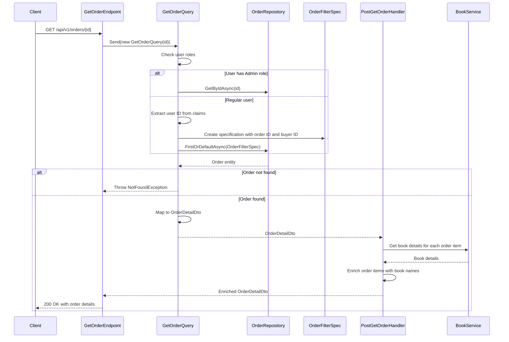

## Overview

The `Get Order` endpoint provides access to a complete Order aggregate within the Ordering bounded context. This read operation aligns with the Query side of our CQRS pattern implementation, retrieving a fully hydrated Order aggregate root along with its associated value objects and entities.

## Implementation Details

The Get Order operation is implemented using the CQRS pattern with a dedicated query handler and post-processor:



### Key Components

1. **GetOrderQuery**: Implements `IQuery<OrderDetailDto>` to retrieve an order by ID
2. **Role-Based Access Control**: Admins can retrieve any order, regular users can only retrieve their own orders
3. **OrderFilterSpec**: Specification pattern implementation for filtering orders by ID and buyer ID
4. **PostGetOrderHandler**: Post-processor that enriches order items with book details from the Catalog service
5. **OrderDetailDto**: Detailed projection of the Order aggregate including order items

## Domain Model

Within our domain model, an Order represents a crucial business document that encapsulates the entire purchasing transaction. The Order aggregate maintains several important invariants and contains:

- Order header information with customer identity and creation date
- Collection of OrderItem entities representing the purchased products with quantities and prices
- Order status reflecting its position in the fulfillment lifecycle (New, Cancelled, Completed)
- Total price calculated as the sum of all item prices multiplied by quantities

## Technical Implementation

This endpoint follows the CQRS pattern using a dedicated query handler that:

1. Authenticates the current user and checks their roles
2. For admin users, retrieves the order directly by ID
3. For regular users, applies a specification that ensures they can only access their own orders
4. Maps the domain entity to a DTO for the response
5. Enriches the response with additional data from the Catalog service

## Authorization Context

Access to orders is governed by domain policies that determine which orders a particular user can view:

- **Regular Users**: Can only view their own orders (enforced by filtering on buyer ID)
- **Administrators**: Can view any order in the system

This endpoint serves various domain use cases including order tracking, fulfillment processing, and customer service inquiries. It enforces access control to ensure that only authorized contexts can retrieve order information.

As per DDD principles, the internal domain model is not exposed directly - instead, a DTO representation is returned that contains all necessary information while preserving the integrity of our domain boundaries.

## Architecture

<NodeGraph />

## GET `(/api/v1/orders/{id})`

### Path Parameters

- **id** (path) (required): The unique identifier of the order to retrieve

### Example Usage

#### Regular User

```bash
curl -X GET "https://api.bookworm.com/api/v1/orders/{orderId}" \
    -H "Authorization: Bearer <your-jwt-token>"
```

#### Admin User

```bash
curl -X GET "https://api.bookworm.com/api/v1/orders/{orderId}" \
    -H "Authorization: Bearer <admin-jwt-token>"
```

### Responses

#### <span className="text-green-500">200 OK</span>

Returns the complete order details including items.

<SchemaViewer file="response-200.json" maxHeight="500" id="response-200" />

#### Example Response

```json title="200 OK"
{
	"id": "3fa85f64-5717-4562-b3fc-2c963f66afa6",
	"date": "2025-03-30T15:30:45Z",
	"total": 59.97,
	"status": "New",
	"items": [
		{
			"id": "8a1b6a9c-7d3e-4f5a-9b2c-1d3e5f7a9b2c",
			"name": "The Great Gatsby",
			"quantity": 1,
			"price": 14.99
		},
		{
			"id": "7c2f9b8a-6d5e-4c3b-2a1d-0f9e8d7c6b5a",
			"name": "To Kill a Mockingbird",
			"quantity": 3,
			"price": 14.99
		}
	]
}
```

#### <span className="text-red-500">401 Unauthorized</span>

Returned when the request lacks valid authentication credentials.

#### <span className="text-red-500">403 Forbidden</span>

Returned when a non-admin user attempts to access another user's order.

#### <span className="text-red-500">404 Not Found</span>

Returned when the requested order does not exist or is not accessible by the current user.
