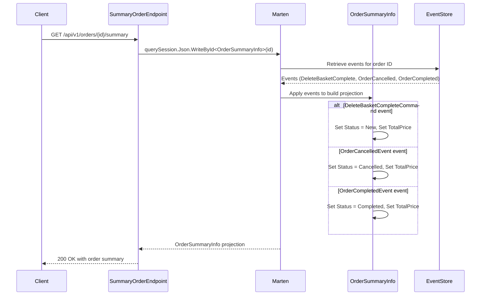

## Overview

This endpoint retrieves the current state of an Order aggregate by replaying events from the event store, following our event sourcing pattern within the Ordering bounded context.

## Implementation Details

The Order Summary query is implemented using event sourcing and projections:



### Key Components

1. **OrderSummaryInfo**: A lightweight projection model that captures essential order information
2. **MultiStreamProjection**: Projects events from multiple streams into a single read model
3. **Event Handlers**: Apply specific events to update the projection state
4. **Marten**: Document database with event sourcing capabilities that manages the projection

## Technical Implementation

The Order Summary endpoint demonstrates several advanced patterns:

1. **Event Sourcing**: The system stores all domain events and reconstructs state by replaying them
2. **CQRS (Command Query Responsibility Segregation)**: Separate read and write models
3. **Projections**: Transform event streams into optimized read models
4. **Multi-Stream Aggregation**: Combine events from different streams to build a cohesive view

This endpoint demonstrates the CQRS principle by providing a dedicated read model optimized for client consumption. The Order aggregate rebuilds its state by sequentially applying all recorded domain events associated with the specified order ID.

## Architecture

<NodeGraph />

## GET `(/api/v1/orders/{id}/summary)`

### Path Parameters

- **id** (path) (required): The unique identifier of the order to retrieve summary for

### Example Usage

```bash
curl -X GET "https://api.bookworm.com/api/v1/orders/{orderId}/summary"
```

### Responses

#### <span className="text-green-500">200 OK</span>

Returns a lightweight summary of the order's current state.

#### <span className="text-red-500">404 Not Found</span>

Returned when no events exist for the specified order ID.
