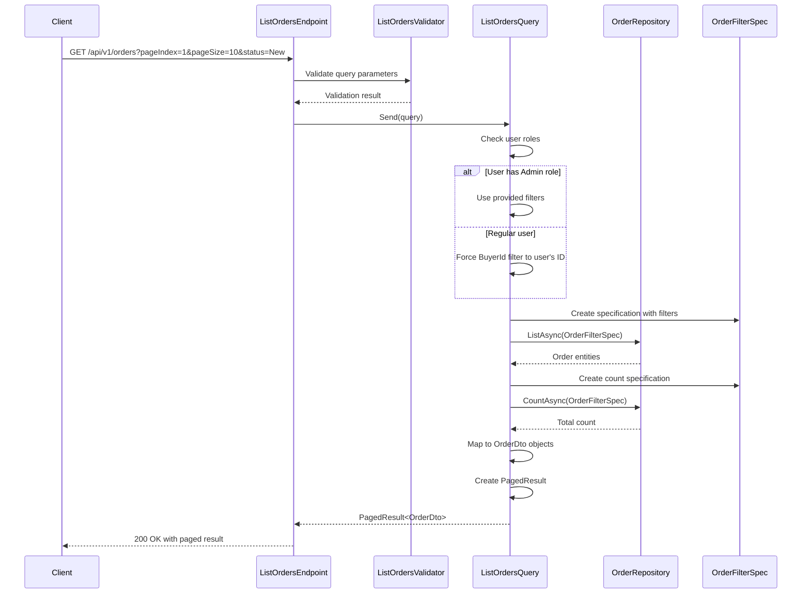

## Overview

The `GET /api/v1/orders` endpoint provides access to the Order aggregate roots within the Ordering bounded context. This endpoint implements a paginated collection pattern to efficiently retrieve and present Order entities while maintaining system performance under load.

## Implementation Details

The List Orders operation is implemented using the CQRS pattern with a dedicated query handler:



### Key Components

1. **ListOrdersQuery**: Implements `IQuery<PagedResult<OrderDto>>` to retrieve a paginated list of orders
2. **ListOrdersValidator**: Validates the pagination and filter parameters
3. **OrderFilterSpec**: Specification pattern implementation for filtering and pagination
4. **Role-Based Access Control**: Regular users can only see their own orders, while admins can see all orders
5. **OrderDto**: Lightweight projection of the Order aggregate for read operations

## Domain Significance

Orders represent completed purchase intentions by customers and serve as the primary aggregate root in the Ordering domain. Each Order encapsulates:

- Customer information (BuyerId)
- Order items with their quantities and prices
- Order status within the fulfillment lifecycle (New, Cancelled, Completed)
- Creation date and total price

## Technical Implementation

The endpoint uses page-based navigation to handle potentially large datasets according to domain constraints:

- **CQRS Pattern**: Separates read and write concerns with dedicated query handlers
- **Specification Pattern**: Uses a dedicated specification class for filtering and pagination
- **Repository Pattern**: Abstracts the underlying data access concerns
- **Role-Based Security**: Automatically filters results based on the user's role
- **Sorting**: Results are ordered by creation date in descending order (newest first)

## Authorization Context

Access to orders is governed by domain policies that determine which orders a particular user can view:

- **Regular Users**: Can only view their own orders (BuyerId is automatically set to the user's ID)
- **Administrators**: Can view all orders and optionally filter by BuyerId or Status

## Architecture

<NodeGraph />

## GET `(/api/v1/orders)`

### Query Parameters

- **pageIndex** (query) (optional): The page number to retrieve (default: 1)
- **pageSize** (query) (optional): The number of items per page (default: 10)
- **status** (query) (optional): Filter orders by status (New, Cancelled, Completed)
- **buyerId** (query) (optional): Filter orders by buyer ID (admin only)

### Validation Rules

- **pageIndex**: Must be greater than 0
- **pageSize**: Must be greater than 0
- **status**: Must be a valid enum value (New, Cancelled, Completed)

### Example Usage

#### Regular User

```bash
curl -X GET "https://api.bookworm.com/api/v1/orders?pageIndex=1&pageSize=10&status=New" \
    -H "Authorization: Bearer <your-jwt-token>"
```

#### Admin User

```bash
curl -X GET "https://api.bookworm.com/api/v1/orders?pageIndex=1&pageSize=10&status=New&buyerId={buyerId}" \
    -H "Authorization: Bearer <admin-jwt-token>"
```

### Responses

#### <span className="text-green-500">200 OK</span>

Returns a paginated list of orders with metadata about the pagination.

<SchemaViewer file="response-200.json" maxHeight="500" id="response-200" />

#### Example Response

```json title="200 OK"
{
	"pageIndex": 1,
	"pageSize": 10,
	"totalItems": 25,
	"totalPages": 3,
	"hasNextPage": true,
	"hasPreviousPage": false,
	"items": [
		{
			"id": "3fa85f64-5717-4562-b3fc-2c963f66afa6",
			"date": "2025-03-30T15:30:45Z",
			"total": 59.97,
			"status": "New"
		},
		{
			"id": "8a1b6a9c-7d3e-4f5a-9b2c-1d3e5f7a9b2c",
			"date": "2025-03-29T10:15:22Z",
			"total": 124.5,
			"status": "New"
		}
	]
}
```

#### <span className="text-red-500">400 Bad Request</span>

Returned when the request validation fails.

```json title="400 Bad Request"
{
	"type": "https://tools.ietf.org/html/rfc7231#section-6.5.1",
	"title": "Bad Request",
	"status": 400,
	"errors": {
		"PageIndex": ["The field PageIndex must be greater than 0."],
		"PageSize": ["The field PageSize must be greater than 0."],
		"Status": ["The field Status has a range of values which does not include '5'."]
	}
}
```

#### <span className="text-red-500">401 Unauthorized</span>

Returned when the request lacks valid authentication credentials.
