# 4. Solution Strategy

## 4.1 Technology Decisions

### Core Technology Stack

| Technology | Decision Rationale |
|------------|-------------------|
| **.NET Aspire** | Provides cloud-native development framework with built-in observability, service discovery, and configuration management |
| **C# 13** | Latest language features including pattern matching, nullable reference types, and performance improvements |
| **Domain-Driven Design** | Ensures business logic clarity and maintainable service boundaries aligned with business domains |
| **Vertical Slice Architecture** | Organizes code by feature rather than layer, improving maintainability and team autonomy |
| **Event-Driven Architecture** | Enables loose coupling, scalability, and eventual consistency across microservices |

### Data Storage Strategy

| Storage Type | Technology | Use Case |
|--------------|------------|----------|
| **Primary Database** | PostgreSQL | All transactional data with ACID properties |
| **Cache Layer** | Redis | Session storage, caching, and performance optimization |
| **Event Store** | PostgreSQL | Event sourcing for domain events |

## 4.2 Architectural Patterns

### Microservices Architecture

```mermaid
graph TB
    subgraph "Domain Boundaries"
        Catalog[📚 Catalog Domain<br/>Books, Categories]
        Basket[🛒 Basket Domain<br/>Shopping Baskets]
        Ordering[📋 Ordering Domain<br/>Orders, Fulfillment]
        Finance[💰 Finance Domain<br/>Financial Transactions]
        Communication[💬 Communication Domain<br/>Chat, Notifications]
        Rating[⭐ Rating Domain<br/>Reviews, Ratings]
    end
    
    subgraph "Cross-Cutting Concerns"
        Gateway[🌐 API Gateway]
        EventBus[📡 Event Bus]
        Monitoring[📈 Observability]
        Config[⚙️ Configuration]
    end
    
    Gateway --> Catalog
    Gateway --> Basket
    Gateway --> Ordering
    Gateway --> Finance
    Gateway --> Communication
    Gateway --> Rating
    
    Catalog --> EventBus
    Basket --> EventBus
    Ordering --> EventBus
    Finance --> EventBus
    Communication --> EventBus
    Rating --> EventBus
```

### Event-Driven Communication

#### Saga Patterns

**Orchestration Saga**: Used for complex business processes requiring centralized control
- Order processing workflow
- Compensation handling for failed transactions

**Choreography Saga**: Used for loosely coupled domain interactions
- Catalog updates triggering search index refresh
- User actions generating analytics events
- Cross-domain notifications

#### Event Patterns

| Pattern | Implementation | Use Case |
|---------|----------------|----------|
| **Outbox Pattern** | Database transaction + event publishing | Ensuring reliable event publishing |
| **Inbox Pattern** | Idempotent event processing | Preventing duplicate event handling |
| **Event Sourcing** | Domain events as source of truth | Audit trail and temporal queries |
| **CQRS** | Separate read/write models | Optimized queries and command processing |

## 4.3 Quality Assurance Strategy

### Testing Strategy

### Quality Attributes Implementation

| Quality Attribute | Implementation Strategy |
|-------------------|------------------------|
| **Scalability** | Horizontal scaling with container orchestration, stateless services, async processing |
| **Reliability** | Circuit breakers, retry policies, health checks, graceful degradation |
| **Performance** | Caching strategies, optimized queries, CDN usage, async operations |
| **Security** | OAuth 2.0/OIDC, HTTPS everywhere, input validation, audit logging |
| **Maintainability** | Clean architecture, automated testing, comprehensive documentation |
| **Observability** | Distributed tracing, structured logging, metrics collection, health monitoring |

## 4.4 Deployment Strategy

### Container-First Approach

All services are containerized using Docker with multi-stage builds for optimized image sizes and security.

### Infrastructure as Code

- **Azure Bicep** templates for infrastructure provisioning
- **GitHub Actions** for CI/CD pipeline automation

### Environment Strategy

| Environment | Purpose | Deployment Method |
|-------------|---------|-------------------|
| **Development** | Local development | Docker Compose + .NET Aspire |
| **Staging** | Integration testing | Azure Container Apps (staging) |
| **Production** | Live system | Azure Container Apps (production) |

## 4.5 Security Strategy

### Authentication and Authorization

### Security Measures

| Security Layer | Implementation |
|----------------|----------------|
| **API Gateway** | Rate limiting, request validation, token verification |
| **Service Level** | Authorization policies, input validation, output encoding |
| **Data Layer** | Encryption at rest, secure connection strings, backup encryption |
| **Network** | HTTPS/TLS, network segmentation, WAF protection |
| **Monitoring** | Security event logging, anomaly detection, audit trails |

## 4.6 AI Integration Strategy

### AI Services Architecture

- **Text Embedding**: Nomic Embed Text for semantic search capabilities
- **Conversational AI**: Gemma 3 for intelligent chatbot interactions
- **Search Enhancement**: AI-powered search with natural language understanding

### AI Service Integration

