---
category:
  - Architecture Documentation
tag:
  - arc42
---

# 5. Building Block View

## 5.1 Whitebox Overall System

### System Overview

BookWorm is decomposed into distinct microservices following Domain-Driven Design principles, with each service owning its data and business logic.

### Contained Building Blocks

| Component            | Responsibility                                 | Technology                       |
| -------------------- | ---------------------------------------------- | -------------------------------- |
| **API Gateway**      | Request routing, authentication, rate limiting | YARP                             |
| **Catalog API**      | Book catalog management, search functionality  | .NET Core, PostgreSQL, Qdrant    |
| **Ordering API**     | Order processing, payment coordination         | .NET Core, PostgreSQL            |
| **Basket API**       | Shopping cart management                       | .NET Core, Redis                 |
| **Rating API**       | Reviews and ratings management                 | .NET Core, PostgreSQL            |
| **Chat API**         | Real-time communication                        | .NET Core, SignalR, PostgreSQL   |
| **Notification API** | Email and push notifications                   | .NET Core, SendGrid, Azure Table |
| **Finance API**      | Order processing                               | .NET Core, PostgreSQL            |
| **Event Bus**        | Asynchronous messaging                         | RabbitMQ                         |

## 5.2 Level 2 - Catalog Service

### Catalog Service Whitebox

```mermaid
graph TB
    subgraph "Catalog API"
        API[📋 Catalog API]

        subgraph "Application Layer"
            Commands[📝 Commands<br/>Create, Update, Delete]
            Queries[🔍 Queries<br/>Search, Filter, Browse]
            Handlers[⚙️ Command/Query Handlers]
        end

        subgraph "Domain Layer"
            Entities[📚 Domain Entities<br/>Book, Author, Category]
            Services[🔧 Domain Services<br/>Search, Query Data]
            Events[📡 Domain Events<br/>BookCreated, BookModified]
        end

        subgraph "Infrastructure Layer"
            Repository[🗄️ Repository<br/>Data Access]
            EventPublisher[📡 Event Publisher<br/>Outbox Pattern]
            SearchIndex[🔍 Hybrid Search<br/>Qdrant]
        end
    end

    API --> Commands
    API --> Queries
    Commands --> Handlers
    Queries --> Handlers
    Handlers --> Entities
    Handlers --> Services
    Services --> Events
    Handlers --> Repository
    Events --> EventPublisher
    Queries --> SearchIndex

    click API "https://bookwormdev.netlify.app/docs/services/productservice/1.0.0/spec/openapi-v1/"
```

### Catalog Service Components

| Component                | Purpose                             | Implementation        |
| ------------------------ | ----------------------------------- | --------------------- |
| **Book Management**      | CRUD operations for books           | Entity Framework Core |
| **Author Management**    | Author profiles and relationships   | Entity Framework Core |
| **Category Management**  | Book categorization and hierarchy   | Entity Framework Core |
| **Publisher Management** | Publisher details and relationships | Entity Framework Core |
| **Search Service**       | Full-text search and filtering      | Semantic Kernel       |

## 5.3 Level 2 - Ordering Service

### Ordering Service Whitebox

```mermaid
graph TB
    subgraph "Ordering API"
        OrderAPI[📦 Order API]

        subgraph "Application Layer"
            OrderCommands[📝 Order Commands<br/>Create, Update, Cancel]
            OrderQueries[🔍 Order Queries<br/>History, Status]
            SagaOrchestrator[🎭 Saga Orchestrator<br/>Order Processing Workflow]
        end

        subgraph "Domain Layer"
            Order[📦 Order Aggregate<br/>Order, OrderItem]
            OrderPolicy[📋 Order Policies<br/>Validation, Business Rules]
        end

        subgraph "Infrastructure Layer"
            OrderRepo[🗄️ Order Repository]
            EventHandlers[📡 Event Handlers<br/>Inbox Pattern]
        end
    end

    OrderAPI --> OrderCommands
    OrderAPI --> OrderQueries

    OrderCommands --> SagaOrchestrator
    SagaOrchestrator --> Order
    Order --> OrderPolicy

    Order --> OrderRepo
    SagaOrchestrator --> EventHandlers

    click OrderAPI "https://bookwormdev.netlify.app/docs/services/orderingservice/1.0.0/spec/openapi-v1/"
```

### Ordering Service Components

| Component           | Purpose                    | Implementation             |
| ------------------- | -------------------------- | -------------------------- |
| **Order Aggregate** | Order lifecycle management | DDD aggregate pattern      |
| **Order Saga**      | Complex order workflow     | Saga orchestration pattern |
| **Order Events**    | Domain event publishing    | Event-driven coordination  |

## 5.4 Level 2 - Chat Service

### Chat Service Whitebox

```mermaid
graph TB
    subgraph "Chat API"
        ChatHub[💬 SignalR Hub]
        ChatAPI[📱 Chat API]

        subgraph "Application Layer"
            MessageCommands[📝 Message Commands<br/>Send, Edit, Delete]
            AICommands[🤖 AI Commands<br/>Bot Responses]
            ChatQueries[🔍 Chat Queries<br/>History, Participants]
        end

        subgraph "Domain Layer"
            Conversation[💬 Conversation Aggregate]
            Message[📨 Message Entity]
            Participant[👤 Participant Entity]
            AIBot[🤖 AI Bot Service]
        end

        subgraph "Infrastructure Layer"
            ChatRepo[🗄️ Chat Repository<br/>PostgreSQL]
            AIIntegration[🤖 AI Integration<br/>Gemma 3 API]
        end
    end

    ChatHub --> MessageCommands
    ChatAPI --> ChatQueries
    MessageCommands --> Conversation
    AICommands --> AIBot
    Conversation --> Message
    Conversation --> Participant
    AIBot --> AIIntegration
    Conversation --> ChatRepo

    click ChatHub "https://bookwormdev.netlify.app/docs/services/chatservice/1.0.0/spec/openapi-v1/"
    click ChatAPI "https://bookwormdev.netlify.app/docs/services/chatservice/1.0.0/spec/openapi-v1/"
```

### Chat Service Components

| Component               | Purpose                    | Implementation               |
| ----------------------- | -------------------------- | ---------------------------- |
| **Real-time Messaging** | Live chat functionality    | SignalR for WebSockets       |
| **AI Chatbot**          | Automated customer support | Gemma 3 integration          |
| **Message Persistence** | Chat history storage       | PostgreSQL database          |
| **Notification System** | Alert delivery             | Email and push notifications |
| **Presence Management** | User online status         | In-memory state with Redis   |

## 5.5 Cross-Cutting Concerns

### Shared Infrastructure Components

| Component            | Purpose                       | Used By                        |
| -------------------- | ----------------------------- | ------------------------------ |
| **Authentication**   | JWT token validation          | All API services               |
| **Logging**          | Structured logging            | All services                   |
| **Monitoring**       | Health checks and metrics     | All services                   |
| **Caching**          | Response caching              | High-frequency read operations |
| **Event Publishing** | Domain event handling         | All domain services            |
| **Configuration**    | Environment-specific settings | All services                   |
