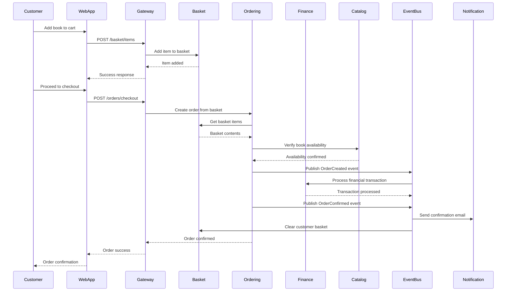
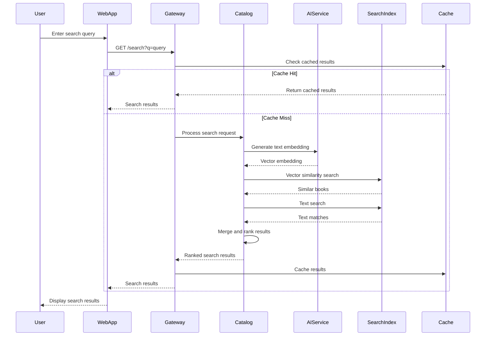
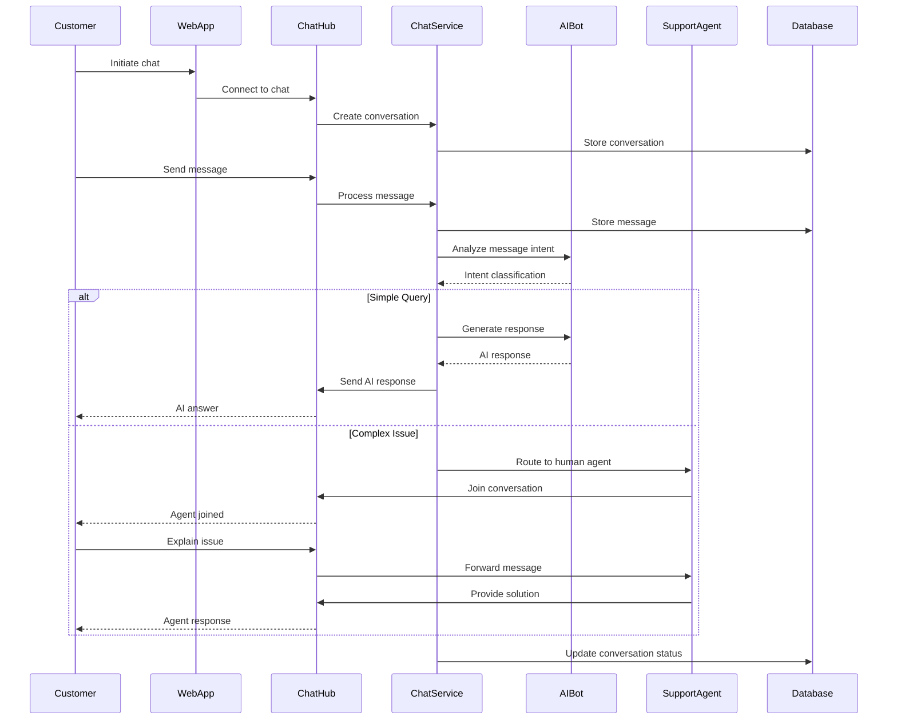
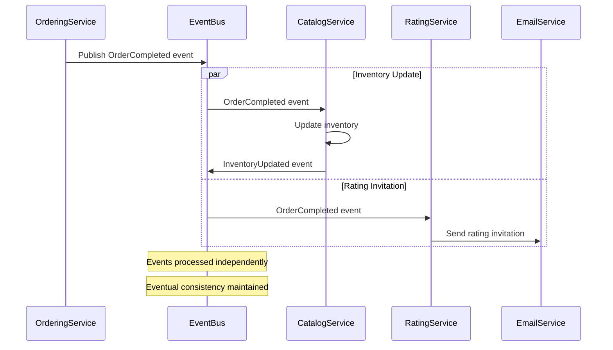
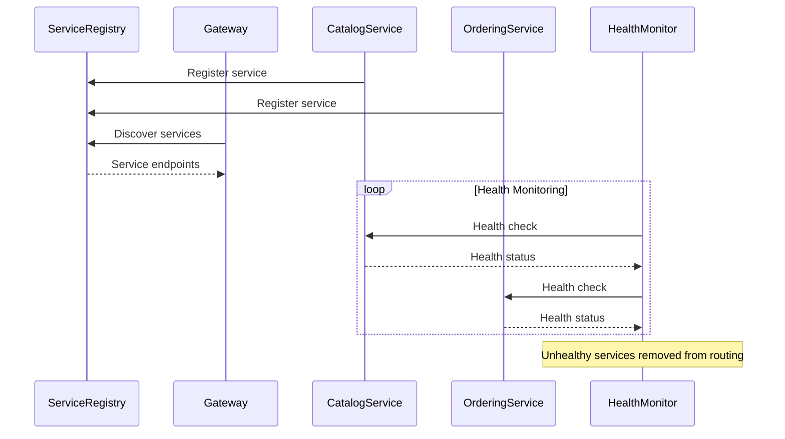
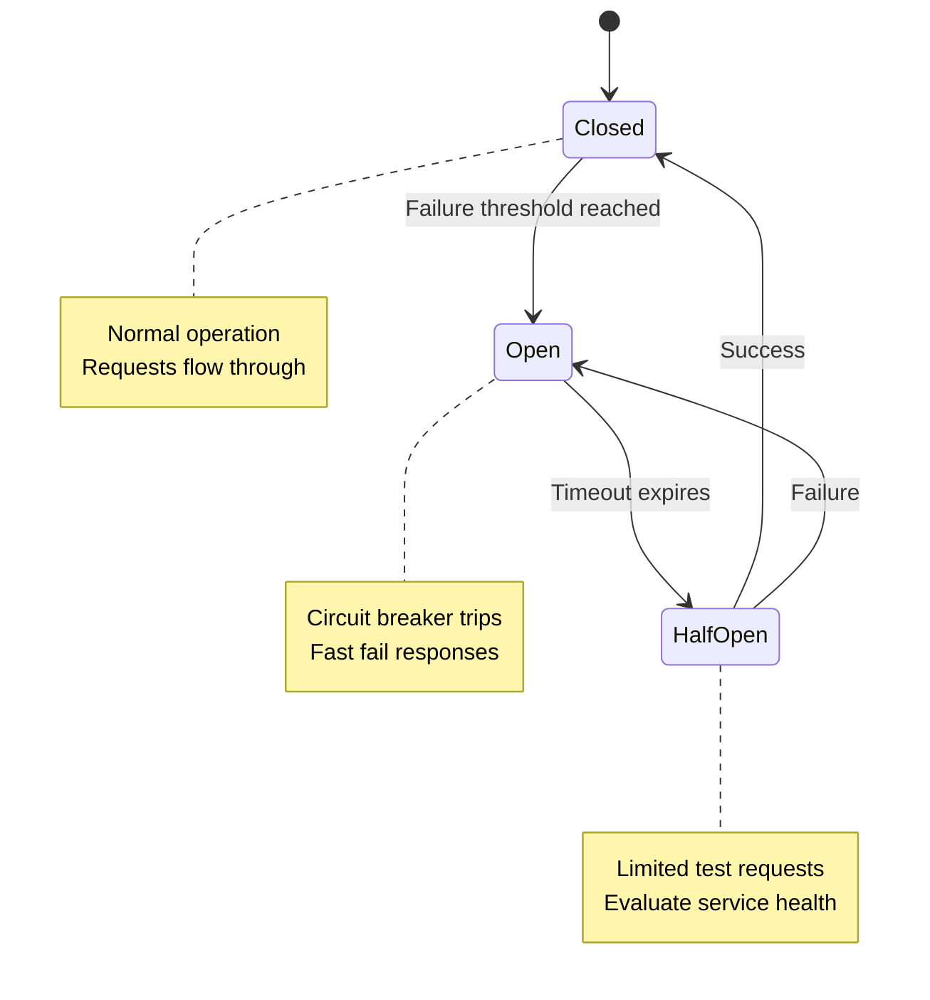

# 6. Runtime View

## 6.1 Important Scenarios

This section describes the dynamic behavior of BookWorm through key runtime scenarios, showing how the building blocks interact to fulfill important use cases.

## 6.2 Book Purchase Scenario

### Complete Order Processing Flow

### Key Runtime Aspects

1. **Basket to Order Transition**: Atomic conversion ensuring data consistency
2. **Book Availability**: Verification of catalog items during order processing
3. **Financial Processing**: Integration with finance service for transactions
4. **Event-Driven Notifications**: Asynchronous email and cleanup processes
5. **Error Handling**: Saga pattern for rollback on failures

## 6.3 Book Search and Discovery

### AI-Enhanced Search Flow

### Search Performance Optimizations

- **Multi-level Caching**: Redis cache for frequently searched terms
- **Vector Search**: AI embeddings for semantic similarity
- **Hybrid Search**: Combination of text and vector search
- **Real-time Indexing**: Immediate search index updates for new books

## 6.4 Real-time Chat Scenario

### Customer Support Chat Flow

### Chat System Features

- **Real-time Messaging**: SignalR for instant message delivery
- **AI Triage**: Automatic classification of customer inquiries
- **Agent Routing**: Intelligent assignment to available support agents
- **Message Persistence**: MongoDB for chat history storage
- **Presence Indicators**: Real-time user status updates

## 6.5 Event-Driven Architecture Flow

### Cross-Service Event Processing

### Event Processing Patterns

| Pattern | Implementation | Purpose |
|---------|----------------|---------|
| **Outbox Pattern** | Database transaction + event publishing | Ensures reliable event publishing |
| **Inbox Pattern** | Idempotent event processing | Prevents duplicate processing |
| **Event Sourcing** | Events as source of truth | Provides audit trail and temporal queries |
| **Saga Orchestration** | Centralized workflow coordination | Manages complex business processes |
| **Saga Choreography** | Decentralized event reactions | Enables loose coupling between services |

## 6.6 System Startup and Health Monitoring

### Service Discovery and Health Checks

### Observability and Monitoring

- **Distributed Tracing**: OpenTelemetry for request correlation across services
- **Structured Logging**: Serilog with correlation IDs and contextual information
- **Metrics Collection**: Prometheus-compatible metrics for performance monitoring
- **Health Dashboards**: Real-time system health visualization
- **Alerting**: Automated alerts for critical system issues

## 6.7 Error Handling and Recovery

### Circuit Breaker Pattern Implementation

### Resilience Strategies

| Strategy | Implementation | Use Case |
|----------|----------------|----------|
| **Retry Policies** | Exponential backoff with jitter | Transient failures |
| **Circuit Breakers** | Polly library integration | Cascading failure prevention |
| **Timeouts** | Configurable per operation | Resource protection |
| **Bulkhead Isolation** | Separate thread pools | Fault isolation |
| **Graceful Degradation** | Fallback responses | Service unavailability |