# 7. Deployment View

## 7.1 Infrastructure Overview

BookWorm is designed for cloud-native deployment on Azure Container Apps (ACA), providing managed container hosting with automatic scaling, load balancing, and integrated monitoring.

### High-Level Deployment Architecture

```mermaid
graph TB
    subgraph "Azure Cloud"
        subgraph "Azure Container Apps Environment"
            subgraph "Frontend Tier"
                WebApp[🖥️ Web Application<br/>SPA React/Blazor]
                AdminUI[⚙️ Admin Dashboard<br/>Management Interface]
            end
            
            subgraph "API Gateway Tier"
                Gateway[🌐 API Gateway<br/>YARP Reverse Proxy]
            end
            
            subgraph "Microservices Tier"
                CatalogAPI[📚 Catalog Service<br/>2-10 replicas]
                OrderingAPI[🛒 Ordering Service<br/>2-5 replicas]
                BasketAPI[🛍️ Basket Service<br/>1-3 replicas]
                RatingAPI[⭐ Rating Service<br/>1-3 replicas]
                ChatAPI[💬 Chat Service<br/>1-5 replicas]
            end
            
            subgraph "Infrastructure Services"
                Keycloak[🔐 Keycloak<br/>Identity Provider]
                EventBus[📡 Event Bus<br/>RabbitMQ/Service Bus]
            end
        end
        
        subgraph "Data Services"
            PostgreSQL[🗄️ Azure Database<br/>PostgreSQL Flexible]
            Redis[⚡ Azure Cache<br/>Redis]
            Storage[💾 Azure Blob Storage<br/>Static Assets]
        end
        
        subgraph "External Services"
            CDN[🌐 Azure CDN<br/>Content Delivery]
            KeyVault[🔑 Azure Key Vault<br/>Secrets Management]
            Monitor[📊 Azure Monitor<br/>Observability]
        end
    end
    
    subgraph "External APIs"
        SendGrid[📧 SendGrid API]
        AIServices[🤖 AI Model APIs<br/>Nomic, Gemma]
    end
    
    WebApp --> Gateway
    AdminUI --> Gateway
    Gateway --> CatalogAPI
    Gateway --> OrderingAPI
    Gateway --> BasketAPI
    Gateway --> RatingAPI
    Gateway --> ChatAPI
    
    CatalogAPI --> PostgreSQL
    OrderingAPI --> PostgreSQL
    BasketAPI --> Redis
    RatingAPI --> PostgreSQL
    
    CatalogAPI --> EventBus
    OrderingAPI --> EventBus
    RatingAPI --> EventBus
    ChatAPI --> EventBus
    
    Gateway --> Keycloak
    ChatAPI --> SendGrid
    CatalogAPI --> AIServices
    
    WebApp --> CDN
    CatalogAPI --> Storage
    
    Gateway --> KeyVault
    CatalogAPI --> Monitor
```



## 7.2 Infrastructure as Code with Bicep

### Bicep Template Structure

All Azure resources are deployed using Bicep templates for Infrastructure as Code:

```bicep
@description('The name of the Container Apps environment')
param environmentName string = 'bookworm-env'

@description('The location for all resources')
param location string = resourceGroup().location

@description('Log Analytics Workspace Name')
param logAnalyticsWorkspaceName string = 'bookworm-logs'

resource logAnalyticsWorkspace 'Microsoft.OperationalInsights/workspaces@2023-09-01' = {
  name: logAnalyticsWorkspaceName
  location: location
  properties: {
    sku: {
      name: 'PerGB2018'
    }
    retentionInDays: 90
  }
}

resource containerAppsEnvironment 'Microsoft.App/managedEnvironments@2024-03-01' = {
  name: environmentName
  location: location
  properties: {
    appLogsConfiguration: {
      destination: 'log-analytics'
      logAnalyticsConfiguration: {
        customerId: logAnalyticsWorkspace.properties.customerId
        sharedKey: logAnalyticsWorkspace.listKeys().primarySharedKey
      }
    }
    workloadProfiles: [
      {
        name: 'Consumption'
        workloadProfileType: 'Consumption'
      }
    ]
  }
}

resource catalogApi 'Microsoft.App/containerApps@2024-03-01' = {
  name: 'catalog-api'
  location: location
  properties: {
    managedEnvironmentId: containerAppsEnvironment.id
    configuration: {
      ingress: {
        external: true
        targetPort: 8080
        allowInsecure: false
      }
      secrets: [
        {
          name: 'connection-string'
          value: connectionString
        }
      ]
    }
    template: {
      containers: [
        {
          name: 'catalog-api'
          image: 'bookworm.azurecr.io/catalog-api:latest'
          resources: {
            cpu: json('0.5')
            memory: '1Gi'
          }
          env: [
            {
              name: 'ConnectionStrings__DefaultConnection'
              secretRef: 'connection-string'
            }
          ]
        }
      ]
      scale: {
        minReplicas: 1
        maxReplicas: 10
        rules: [
          {
            name: 'http-rule'
            http: {
              metadata: {
                concurrentRequests: '100'
              }
            }
          }
        ]
      }
    }
  }
}
```

### Service Scaling Configuration

| Service | Min Replicas | Max Replicas | Scaling Rules |
|---------|--------------|--------------|---------------|
| **Catalog API** | 2 | 10 | CPU > 70%, Memory > 80%, HTTP requests > 100/min |
| **Ordering API** | 2 | 5 | CPU > 80%, HTTP requests > 50/min |
| **Basket API** | 1 | 3 | CPU > 70%, HTTP requests > 200/min |
| **Rating API** | 1 | 3 | HTTP requests > 30/min |
| **Chat API** | 1 | 5 | WebSocket connections > 100, CPU > 70% |
| **API Gateway** | 2 | 5 | CPU > 60%, HTTP requests > 500/min |

## 7.4 Data Layer Deployment

### Database Configuration

#### PostgreSQL (Primary Database)

```yaml
# Azure Database for PostgreSQL Flexible Server
serverName: bookworm-postgres-prod
location: East US
tier: GeneralPurpose
skuName: Standard_D2s_v3
storageSize: 256GB
backupRetentionDays: 30
geoRedundantBackup: Enabled

databases:
  - catalog_db
  - ordering_db
  - rating_db
  - event_store_db

configuration:
  shared_preload_libraries: pg_stat_statements
  log_statement: all
  log_min_duration_statement: 1000
```

#### Redis Cache

```yaml
# Azure Cache for Redis
cacheName: bookworm-redis-prod
location: East US
sku:
  name: Standard
  family: C
  capacity: 1
enableNonSslPort: false
redisConfiguration:
  maxmemory-policy: allkeys-lru
  maxmemory-delta: 10%
```

## 7.5 Network and Security Configuration

### Network Security

```mermaid
graph TB
    subgraph "Internet"
        Users[👥 Users]
        AdminUsers[👤 Administrators]
    end
    
    subgraph "Azure Front Door"
        WAF[🛡️ Web Application Firewall]
        CDN[🌐 Content Delivery Network]
    end
    
    subgraph "Container Apps Environment"
        subgraph "Public Subnet"
            Gateway[🌐 API Gateway]
            WebApp[🖥️ Web Application]
        end
        
        subgraph "Private Subnet"
            Services[🔧 Microservices]
            InternalLB[⚖️ Internal Load Balancer]
        end
    end
    
    subgraph "Data Subnet"
        Databases[🗄️ Databases]
        Cache[⚡ Cache]
    end
    
    Users --> WAF
    AdminUsers --> WAF
    WAF --> CDN
    CDN --> Gateway
    CDN --> WebApp
    Gateway --> InternalLB
    InternalLB --> Services
    Services --> Databases
    Services --> Cache
```



### Security Configuration

| Component | Security Measure | Implementation |
|-----------|------------------|----------------|
| **API Gateway** | TLS termination, Rate limiting | Azure Container Apps ingress |
| **Services** | mTLS, JWT validation | .NET Aspire security middleware |
| **Databases** | Private endpoints, SSL only | Azure private link |
| **Secrets** | Key Vault integration | Managed identity authentication |
| **Network** | NSG rules, Private DNS | Azure VNET configuration |

## 7.6 CI/CD Pipeline

### Deployment Pipeline

```mermaid
graph LR
    subgraph "Source Control"
        GitHub[📂 GitHub Repository]
    end
    
    subgraph "Build Pipeline"
        Build[🔨 Build & Test]
        Security[🔒 Security Scan]
        Package[📦 Container Build]
    end
    
    subgraph "Registry"
        ACR[📋 Azure Container Registry]
    end
    
    subgraph "Deployment Stages"
        Dev[🧪 Development]
        Staging[🎭 Staging]
        Prod[🚀 Production]
    end
    
    subgraph "Monitoring"
        Monitor[📊 Azure Monitor]
        Alerts[🚨 Alerting]
    end
    
    GitHub --> Build
    Build --> Security
    Security --> Package
    Package --> ACR
    ACR --> Dev
    Dev --> Staging
    Staging --> Prod
    Prod --> Monitor
    Monitor --> Alerts
```



### Infrastructure as Code

```bash
# Azure Resource Manager deployment
az deployment group create \
  --resource-group rg-bookworm-prod \
  --template-file infrastructure/main.bicep \
  --parameters @parameters/prod.json
```

### Health Check Configuration

```csharp
// Health check endpoints for each service
services.AddHealthChecks()
    .AddCheck("database", () => CheckDatabaseConnection())
    .AddCheck("external-api", () => CheckExternalAPIs())
    .AddCheck("memory", () => CheckMemoryUsage())
    .AddCheck("disk-space", () => CheckDiskSpace());
```

## 7.8 Disaster Recovery

### Backup Strategy

| Component | Backup Method | Retention | Recovery Time |
|-----------|---------------|-----------|---------------|
| **PostgreSQL** | Automated daily backups | 30 days | < 1 hour |
| **Redis** | Data persistence enabled | Real-time | < 5 minutes |
| **Azure Table Storage** | Automatic backups | 30 days | < 30 minutes |
| **Application Code** | Container registry | Version-based | < 10 minutes |
| **Configuration** | Key Vault backup | 90 days | < 5 minutes |

### Recovery Procedures

1. **Database Recovery**: Point-in-time restore from automated backups
2. **Application Recovery**: Container redeployment from registry
3. **Configuration Recovery**: Key Vault restore and service restart
4. **Network Recovery**: Infrastructure as Code redeployment