# 8. Cross-cutting Concepts

## 8.1 Domain Model and Business Logic

### Domain-Driven Design Implementation

BookWorm follows Domain-Driven Design principles with clear domain boundaries and ubiquitous language throughout the system.

#### Domain Boundaries

```mermaid
graph TB
    subgraph "Catalog Domain"
        Book[📚 Book Aggregate]
        Author[✍️ Author Entity]
        Category[📂 Category Value Object]
        Price[💰 Price Value Object]
    end
    
    subgraph "Ordering Domain"
        Order[📦 Order Aggregate]
        OrderItem[📝 Order Item Entity]
        Address[🏠 Address Value Object]
    end
    
    subgraph "Identity Domain"
        User[👤 User Aggregate]
        Role[🎭 Role Entity]
        Permission[🔐 Permission Value Object]
    end
    
    subgraph "Communication Domain"
        Conversation[💬 Conversation Aggregate]
        Message[📨 Message Entity]
        Participant[👥 Participant Entity]
    end
    
    Book --> Author
    Book --> Category
    Book --> Price
    Order --> OrderItem
    Order --> Address
    User --> Role
    Role --> Permission
    Conversation --> Message
    Conversation --> Participant
```



### Ubiquitous Language

| Domain Term | Definition | Context |
|-------------|------------|---------|
| **Book** | A published work available for purchase | Catalog Domain |
| **Order** | A customer's request to purchase items | Ordering Domain |
| **Basket** | Temporary collection of items for purchase | Shopping Domain |
| **Conversation** | A chat session between participants | Communication Domain |

## 8.2 Security Architecture

### Authentication and Authorization


### Security Policies

| Security Aspect | Implementation | Standards |
|-----------------|----------------|-----------|
| **Authentication** | OAuth 2.0 / OIDC with Keycloak | RFC 6749, RFC 6750 |
| **Authorization** | Role-based access control (RBAC) | Custom policy framework |
| **Data Encryption** | TLS 1.3 in transit, AES-256 at rest | FIPS 140-2 compliance |
| **API Security** | JWT tokens, rate limiting, input validation | OWASP guidelines |
| **Secrets Management** | Azure Key Vault integration | Zero-trust principles |

## 8.3 Performance and Scalability

### Caching Strategy

```mermaid
graph TB
    subgraph "Caching Layers"
        Browser[🌐 Browser Cache<br/>Static Assets]
        CDN[🌍 CDN Cache<br/>Global Distribution]
        Gateway[🚪 API Gateway Cache<br/>Response Caching]
        Application[⚡ Application Cache<br/>Redis/Memory]
        Database[🗄️ Database Cache<br/>Query Results]
    end
    
    Request[📨 User Request] --> Browser
    Browser --> CDN
    CDN --> Gateway
    Gateway --> Application
    Application --> Database
    
    Database --> DataStore[(💾 Data Store)]
```



### Caching Policies

| Cache Type | TTL | Use Case | Invalidation Strategy |
|------------|-----|----------|----------------------|
| **Browser Cache** | 1 hour | Static assets, images | Version-based |
| **CDN Cache** | 24 hours | Public content | Manual purge |
| **API Response Cache** | 5-15 minutes | Catalog data, search results | Time-based + tag-based |
| **Application Cache** | 30 minutes | User sessions, temporary data | Event-driven |
| **Database Query Cache** | Variable | Expensive queries | Data change triggers |

### Performance Optimizations

| Optimization | Implementation | Benefit |
|-------------|----------------|---------|
| **Async Operations** | Task-based programming | Non-blocking I/O operations |
| **Connection Pooling** | EF Core connection pooling | Reduced connection overhead |
| **Pagination** | Cursor-based pagination | Efficient large dataset handling |
| **Compression** | Gzip/Brotli response compression | Reduced bandwidth usage |
| **Lazy Loading** | On-demand data loading | Faster initial response times |

## 8.4 Error Handling and Resilience

### Error Handling Strategy

```csharp
// Global exception handling middleware
public class GlobalExceptionHandlingMiddleware
{
    public async Task InvokeAsync(HttpContext context, RequestDelegate next)
    {
        try
        {
            await next(context);
        }
        catch (ValidationException ex)
        {
            await HandleValidationException(context, ex);
        }
        catch (BusinessException ex)
        {
            await HandleBusinessException(context, ex);
        }
        catch (Exception ex)
        {
            await HandleGenericException(context, ex);
        }
    }
}
```

### Resilience Patterns

| Pattern | Implementation | Use Case |
|---------|----------------|----------|
| **Circuit Breaker** | Polly library | External service failures |
| **Retry Policies** | Exponential backoff | Transient failures |
| **Timeout Policies** | Configurable timeouts | Long-running operations |
| **Bulkhead Isolation** | Separate thread pools | Fault isolation |
| **Fallback Mechanisms** | Graceful degradation | Service unavailability |

## 8.5 Logging and Monitoring

### Structured Logging

```csharp
// Structured logging configuration
Log.Logger = new LoggerConfiguration()
    .WriteTo.Console(new JsonFormatter())
    .WriteTo.ApplicationInsights(services.GetService<TelemetryConfiguration>())
    .Enrich.FromLogContext()
    .Enrich.WithCorrelationId()
    .Enrich.WithUserContext()
    .CreateLogger();
```

### Log Correlation


### Monitoring Metrics

| Metric Category | Key Metrics | Alerting Thresholds |
|-----------------|-------------|-------------------|
| **Performance** | Response time, throughput, error rate | > 2s response, > 5% error rate |
| **Infrastructure** | CPU, memory, disk usage | > 80% utilization |
| **Business** | Orders/hour, revenue, conversion rate | -20% from baseline |
| **Security** | Failed logins, suspicious activity | > 10 failed attempts/minute |

## 8.6 Observability with OpenTelemetry

### OpenTelemetry Integration

```mermaid
graph TB
    subgraph "Application"
        App[📱 BookWorm Services]
        Metrics[📊 Metrics Collection]
        Traces[🔍 Distributed Tracing]
        Logs[📝 Structured Logging]
    end
    
    subgraph "OpenTelemetry"
        Collector[🔄 OTel Collector]
        Processors[⚙️ Data Processors]
        Exporters[📤 Data Exporters]
    end
    
    subgraph "Backends"
        AppInsights[📈 Application Insights]
        Jaeger[🕵️ Jaeger Tracing]
        Prometheus[📊 Prometheus Metrics]
    end
    
    App --> Metrics
    App --> Traces
    App --> Logs
    
    Metrics --> Collector
    Traces --> Collector
    Logs --> Collector
    
    Collector --> Processors
    Processors --> Exporters
    
    Exporters --> AppInsights
    Exporters --> Jaeger
    Exporters --> Prometheus
```



### Telemetry Configuration

```csharp
// OpenTelemetry setup in Program.cs
services.AddOpenTelemetry()
    .WithTracing(builder => builder
        .AddAspNetCoreInstrumentation()
        .AddHttpClientInstrumentation()
        .AddEntityFrameworkCoreInstrumentation()
        .AddRedisInstrumentation()
        .AddJaegerExporter()
        .AddApplicationInsightsExporter())
    .WithMetrics(builder => builder
        .AddAspNetCoreInstrumentation()
        .AddRuntimeInstrumentation()
        .AddProcessInstrumentation()
        .AddPrometheusExporter()
        .AddApplicationInsightsExporter());
```

## 8.7 Data Consistency and Transactions

### Transaction Patterns

| Pattern | Use Case | Implementation |
|---------|----------|----------------|
| **ACID Transactions** | Single service operations | Entity Framework transactions |
| **Saga Pattern** | Multi-service workflows | Orchestrated/Choreographed sagas |
| **Eventual Consistency** | Cross-domain updates | Event-driven synchronization |
| **Optimistic Concurrency** | Conflict resolution | Version-based conflict detection |

### Event Sourcing Implementation

```csharp
// Event sourcing aggregate
public abstract class AggregateRoot
{
    private readonly List<IDomainEvent> _events = new();
    
    protected void AddEvent(IDomainEvent @event)
    {
        _events.Add(@event);
    }
    
    public IReadOnlyList<IDomainEvent> GetUncommittedEvents()
    {
        return _events.AsReadOnly();
    }
    
    public void MarkEventsAsCommitted()
    {
        _events.Clear();
    }
}
```

### API Standards

| Aspect | Standard | Example |
|--------|----------|---------|
| **HTTP Methods** | REST semantics | GET, POST, PUT, DELETE |
| **Status Codes** | HTTP standards | 200, 201, 400, 404, 500 |
| **Resource Naming** | Plural nouns | `/books`, `/orders`, `/users` |
| **Error Format** | RFC 7807 | Problem Details for HTTP APIs |
| **Date/Time** | ISO 8601 | `2024-12-31T23:59:59Z` |