# 9. Architecture Decisions

## 9.1 Decision Record Format

This section documents significant architectural decisions using the Architecture Decision Record (ADR) format. Each decision includes context, considered options, and rationale.

## 9.2 ADR-001: Microservices Architecture

### Status
**Accepted** - July 2024

### Context
BookWorm needs to demonstrate modern cloud-native patterns while maintaining educational value. The system must support independent development, deployment, and scaling of different business capabilities.

### Decision
Adopt a microservices architecture with domain-driven service boundaries.

### Consequences
**Positive:**
- Independent service deployment and scaling
- Technology diversity within services
- Team autonomy and faster development cycles
- Fault isolation and resilience
- Aligned with .NET Aspire cloud-native approach

**Negative:**
- Increased operational complexity
- Network latency between services
- Distributed system challenges (consistency, monitoring)
- More complex testing strategies

### Alternatives Considered
- **Modular Monolith**: Simpler deployment but less scalable
- **Service-Oriented Architecture**: Too heavyweight for the use case

## 9.3 ADR-002: Event-Driven Architecture with CQRS

### Status
**Accepted** - July 2024

### Context
The system requires loose coupling between services while maintaining data consistency and providing audit capabilities. Different services have varying read and write performance requirements.

### Decision
Implement event-driven architecture with Command Query Responsibility Segregation (CQRS) pattern.

### Rationale
- **Scalability**: Separate read and write workloads can be optimized independently
- **Consistency**: Eventual consistency through events is acceptable for most use cases
- **Auditability**: Event sourcing provides complete audit trail
- **Integration**: Services can react to business events without tight coupling

### Implementation
```cs
// Command side - write operations
public sealed record UpdateAuthorCommand(Guid Id, string Name) : ICommand;

// Event - represents what happened
public sealed class BookUpdatedEvent(Book book) : DomainEvent
{
    public Book Book { get; init; } = book;
}

// Query side - read operations
public sealed record ListAuthorsQuery : IQuery<List<AuthorDto>>;
```

### Consequences
**Positive:**
- Improved scalability and performance
- Better separation of concerns
- Comprehensive audit trail
- Loose coupling between services

**Negative:**
- Eventual consistency complexity
- More complex development model
- Additional infrastructure (event store, message bus)

## 9.4 ADR-003: .NET Aspire for Cloud-Native Development

### Status
**Accepted** - December 2024

### Context
The project aims to demonstrate modern .NET cloud-native development. The team needs simplified local development, service discovery, configuration management, and observability.

### Decision
Use .NET Aspire as the primary cloud-native development framework.

### Rationale
- **Developer Experience**: Simplified local development and debugging
- **Service Discovery**: Built-in service discovery and communication
- **Observability**: Integrated telemetry, logging, and monitoring
- **Configuration**: Centralized configuration management
- **Cloud Deployment**: Simplified container deployment and scaling

### Implementation
```csharp
// AppHost project configuration
var builder = DistributedApplication.CreateBuilder(args);

var postgres = builder.AddPostgres("postgres")
    .WithEnvironment("POSTGRES_DB", "bookworm");

var redis = builder.AddRedis("redis");

var catalogApi = builder.AddProject<Projects.BookWorm_Catalog_Api>("catalog-api")
    .WithReference(postgres)
    .WithReference(redis);

var gateway = builder.AddProject<Projects.BookWorm_Gateway>("gateway")
    .WithReference(catalogApi);

builder.Build().Run();
```

### Consequences
**Positive:**
- Simplified service orchestration
- Built-in observability and monitoring
- Consistent development experience
- Easier cloud deployment

**Negative:**
- Framework dependency and lock-in
- Learning curve for team members
- Limited to .NET ecosystem

## 9.5 ADR-004: PostgreSQL as Primary Database

### Status
**Accepted** - December 2024

### Context
The system needs a reliable, ACID-compliant database for transactional data with support for complex queries and JSON documents.

### Decision
Use PostgreSQL as the primary relational database for most services.

### Rationale
- **ACID Compliance**: Strong consistency for critical business data
- **JSON Support**: Native JSON handling for flexible schemas
- **Performance**: Excellent performance with proper indexing
- **Azure Integration**: Azure Database for PostgreSQL provides managed service
- **Ecosystem**: Strong .NET integration with Entity Framework Core

### Service-Specific Database Decisions

| Service | Database | Rationale |
|---------|----------|-----------|
| **Catalog** | PostgreSQL | Complex relationships, search capabilities |
| **Ordering** | PostgreSQL | ACID compliance for financial data |
| **Rating** | PostgreSQL | Relational data with aggregations |
| **Basket** | Redis | High-performance caching, session data |
| **Chat** | PostgreSQL | Structured messaging with relational integrity |

### Consequences
**Positive:**
- Strong consistency guarantees
- Rich query capabilities
- Mature ecosystem and tooling
- Azure managed service availability

**Negative:**
- Scaling limitations compared to NoSQL
- Potential performance bottlenecks for high-write scenarios

## 9.6 ADR-005: Keycloak for Identity Management

### Status
**Accepted** - December 2024

### Context
The system requires secure authentication and authorization with support for multiple identity providers and modern authentication protocols.

### Decision
Use Keycloak as the identity and access management solution.

### Rationale
- **Standard Protocols**: OAuth 2.0, OIDC, SAML support
- **Identity Federation**: Integration with external identity providers
- **Fine-grained Authorization**: Role-based and attribute-based access control
- **Admin Console**: Web-based administration interface
- **Open Source**: No vendor lock-in, community support

### Integration Architecture

```mermaid
graph TB
    Client[👤 Client Application]
    Gateway[🌐 API Gateway]
    Keycloak[🔐 Keycloak]
    Service[🔧 Microservice]
    
    Client -->|1. Login Request| Keycloak
    Keycloak -->|2. JWT Token| Client
    Client -->|3. API Request + Token| Gateway
    Gateway -->|4. Validate Token| Keycloak
    Gateway -->|5. Forward Request| Service
    Service -->|6. Response| Gateway
    Gateway -->|7. Response| Client
```


### Consequences
**Positive:**
- Industry-standard security protocols
- Centralized identity management
- Multi-tenant support
- Extensible and customizable

**Negative:**
- Additional infrastructure component
- Complexity in setup and configuration
- Potential single point of failure

## 9.7 ADR-006: SignalR for Real-time Communication

### Status
**Accepted** - December 2024

### Context
The chat functionality requires real-time, bidirectional communication between clients and servers with support for multiple transport protocols.

### Decision
Use ASP.NET Core SignalR for real-time communication in the chat service.

### Rationale
- **Transport Flexibility**: WebSockets, Server-Sent Events, Long Polling
- **Scaling Support**: Azure SignalR Service for horizontal scaling
- **Type Safety**: Strongly-typed hub methods and clients
- **.NET Integration**: Native integration with ASP.NET Core
- **Authentication**: Integrated with existing authentication system

### Implementation
```cs
public sealed class ChatStreamHub : Hub
{
    public IAsyncEnumerable<ClientMessageFragment> Stream(
        Guid id,
        StreamContext streamContext,
        IChatStreaming streaming,
        CancellationToken token
    )
    {
        return StreamAsync();

        async IAsyncEnumerable<ClientMessageFragment> StreamAsync()
        {
            await foreach (
                var message in streaming.GetMessageStream(
                    id,
                    streamContext.LastMessageId,
                    streamContext.LastFragmentId,
                    token
                )
            )
            {
                yield return message;
            }
        }
    }
}
```

### Consequences
**Positive:**
- Real-time user experience
- Automatic fallback to supported transports
- Easy horizontal scaling with Azure SignalR
- Built-in connection management

**Negative:**
- Stateful connections require careful scaling
- Additional complexity in client applications
- WebSocket compatibility considerations

## 9.8 ADR-007: Container-First Deployment Strategy

### Status
**Accepted** - December 2024

### Context
The application needs to be cloud-native with consistent deployment across environments and easy scaling capabilities.

### Decision
Adopt a container-first deployment strategy using Docker containers and Azure Container Apps.

### Rationale
- **Consistency**: Same artifacts across all environments
- **Scalability**: Horizontal scaling with container orchestration
- **Cloud-Native**: Aligned with modern cloud deployment practices
- **Azure Integration**: Azure Container Apps provides managed container hosting
- **Developer Experience**: Simplified local development with Docker Compose

### Infrastructure as Code
```bicep
@description('Container Apps Environment')
param environmentName string = 'bookworm-env'
param location string = resourceGroup().location

resource containerEnvironment 'Microsoft.App/managedEnvironments@2024-03-01' = {
  name: environmentName
  location: location
  properties: {
    workloadProfiles: [
      {
        name: 'Consumption'
        workloadProfileType: 'Consumption'
      }
    ]
  }
}

resource containerApp 'Microsoft.App/containerApps@2024-03-01' = {
  name: 'bookworm-api'
  location: location
  properties: {
    managedEnvironmentId: containerEnvironment.id
    template: {
      containers: [
        {
          name: 'api'
          image: 'mcr.microsoft.com/dotnet/samples:aspnetapp'
          resources: {
            cpu: json('0.5')
            memory: '1Gi'
          }
        }
      ]
    }
  }
}
```

### Consequences
**Positive:**
- Environment consistency
- Easy scaling and deployment
- Resource isolation
- Simplified CI/CD pipelines

**Negative:**
- Container orchestration complexity
- Additional infrastructure overhead
- Learning curve for container technologies

## 9.9 ADR-008: API Gateway Pattern Implementation

### Status
**Accepted** - December 2024

### Context
Multiple microservices need a unified entry point for clients with cross-cutting concerns like authentication, rate limiting, and request routing.

### Decision
Implement an API Gateway using YARP (Yet Another Reverse Proxy) in ASP.NET Core.

### Rationale
- **Single Entry Point**: Simplified client integration
- **Cross-cutting Concerns**: Centralized authentication, logging, rate limiting
- **Request Routing**: Dynamic routing to appropriate services
- **Load Balancing**: Built-in load balancing capabilities
- **.NET Native**: YARP provides high-performance reverse proxy for .NET

### Configuration
```json
{
  "ReverseProxy": {
    "Routes": {
      "catalog-route": {
        "ClusterId": "catalog-cluster",
        "Match": {
          "Path": "/api/catalog/{**catch-all}"
        }
      }
    },
    "Clusters": {
      "catalog-cluster": {
        "Destinations": {
          "catalog-api": {
            "Address": "http://catalog-api:8080"
          }
        }
      }
    }
  }
}
```

### Consequences
**Positive:**
- Simplified client development
- Centralized security enforcement
- Consistent API versioning
- Built-in monitoring and logging

**Negative:**
- Potential bottleneck
- Additional latency
- Single point of failure
- Gateway complexity

## 9.10 ADR-009: AI Integration Strategy

### Status
**Accepted** - December 2024

### Context
The system requires AI capabilities for search enhancement, recommendations, and chat functionality while maintaining cost efficiency and performance.

### Decision
Integrate external AI services (Nomic Embed Text, Gemma 3) through dedicated service abstractions.

### Rationale
- **Specialized Models**: Use purpose-built models for specific tasks
- **Cost Efficiency**: Pay-per-use model for AI capabilities
- **Flexibility**: Easy model switching and A/B testing
- **Performance**: External specialized hardware for AI processing
- **Abstraction**: Service interfaces allow for implementation changes

### Implementation
```cs
public sealed class BookDataIngestor(
    IEmbeddingGenerator<string, Embedding<float>> embeddingGenerator,
    VectorStore vectorStore
) : IIngestionSource<Book>
{
    private readonly string _collectionName = nameof(Book).ToLowerInvariant();

    public async Task IngestDataAsync(Book data, CancellationToken cancellationToken = default)
    {
        ArgumentException.ThrowIfNullOrEmpty(data.Name);
        ArgumentException.ThrowIfNullOrEmpty(data.Description);

        var vectorCollection = vectorStore.GetCollection<Guid, HybridSearchRecord>(_collectionName);
        await vectorCollection.EnsureCollectionExistsAsync(cancellationToken);

        var text = $"{data.Name} {data.Description}";

        var embeddings = await embeddingGenerator.GenerateVectorAsync(
            text,
            cancellationToken: cancellationToken
        );

        var record = new HybridSearchRecord
        {
            Id = data.Id,
            Description = text,
            Vector = embeddings,
        };

        await vectorCollection.UpsertAsync(record, cancellationToken);
    }
}
```

### Consequences
**Positive:**
- Access to state-of-the-art AI models
- No GPU infrastructure requirements
- Flexible model selection
- Clear service boundaries

**Negative:**
- External service dependencies
- Network latency for AI operations
- Potential cost scaling issues
- API rate limiting considerations