# 10. Quality Requirements

## 10.1 Quality Tree

The quality requirements for BookWorm are organized into a hierarchical quality tree, prioritizing the most important quality attributes for a cloud-native e-commerce platform.

```mermaid
graph TB
    QualityGoals[📊 Quality Goals]
    
    QualityGoals --> Performance[⚡ Performance]
    QualityGoals --> Reliability[🛡️ Reliability]
    QualityGoals --> Scalability[📈 Scalability]
    QualityGoals --> Security[🔒 Security]
    QualityGoals --> Maintainability[🔧 Maintainability]
    QualityGoals --> Usability[👥 Usability]
    
    Performance --> ResponseTime[Response Time<br/>< 2s for 95% of requests]
    Performance --> Throughput[Throughput<br/>> 1000 requests/minute]
    Performance --> ResourceEfficiency[Resource Efficiency<br/>< 80% CPU/Memory usage]
    
    Reliability --> Availability[Availability<br/>99.9% uptime]
    Reliability --> FaultTolerance[Fault Tolerance<br/>Graceful degradation]
    Reliability --> DataIntegrity[Data Integrity<br/>ACID compliance]
    
    Scalability --> HorizontalScaling[Horizontal Scaling<br/>Auto-scaling capability]
    Scalability --> LoadHandling[Load Handling<br/>10x traffic spikes]
    Scalability --> DatabaseScaling[Database Scaling<br/>Read replicas]
    
    Security --> Authentication[Authentication<br/>OAuth 2.0/OIDC]
    Security --> Authorization[Authorization<br/>RBAC implementation]
    Security --> DataProtection[Data Protection<br/>Encryption at rest/transit]
    
    Maintainability --> Testability[Testability<br/>80% code coverage]
    Maintainability --> Modularity[Modularity<br/>Clear service boundaries]
    Maintainability --> Documentation[Documentation<br/>Comprehensive docs]
    
    Usability --> ResponseiveBehavior[Responsive Behavior<br/>Mobile-first design]
    Usability --> Accessibility[Accessibility<br/>WCAG 2.1 compliance]
    Usability --> UserExperience[User Experience<br/>Intuitive navigation]
```

## 10.2 Quality Scenarios

### 10.2.1 Performance Scenarios

#### Scenario P-1: Peak Shopping Load
- **Source**: 1000 concurrent users browsing the catalog
- **Stimulus**: Search and filter requests during peak hours
- **Environment**: Production environment under normal operation
- **Artifact**: Catalog service and database
- **Response**: System maintains response times under 2 seconds
- **Response Measure**: 95th percentile response time < 2000ms

#### Scenario P-2: Book Search Performance
- **Source**: User searching for books with complex filters
- **Stimulus**: Search query with multiple filters and sorting
- **Environment**: Production with full catalog (100k+ books)
- **Artifact**: Search service and search index
- **Response**: Search results returned quickly with relevance ranking
- **Response Measure**: Search response time < 500ms for 99% of queries

#### Scenario P-3: Real-time Chat Performance
- **Source**: 200 concurrent chat sessions
- **Stimulus**: Real-time message exchange
- **Environment**: Production with SignalR hub scaling
- **Artifact**: Chat service and WebSocket connections
- **Response**: Messages delivered in real-time
- **Response Measure**: Message delivery latency < 100ms

### 10.2.2 Reliability Scenarios

#### Scenario R-1: Database Failure Recovery
- **Source**: Primary database becomes unavailable
- **Stimulus**: Database connection failure
- **Environment**: Production during business hours
- **Artifact**: All services using PostgreSQL
- **Response**: System switches to read replicas, writes queued
- **Response Measure**: Service restored within 5 minutes, zero data loss

#### Scenario R-2: External Service Degradation
- **Source**: Payment gateway experiencing high latency
- **Stimulus**: Payment processing requests timing out
- **Environment**: Production during checkout operations
- **Artifact**: Ordering service payment integration
- **Response**: Circuit breaker activates, users notified
- **Response Measure**: System remains operational, orders queued for retry

#### Scenario R-3: Container Instance Failure
- **Source**: Container instance crashes
- **Stimulus**: Application exception causing container termination
- **Environment**: Azure Container Apps production environment
- **Artifact**: Any microservice instance
- **Response**: Health checks detect failure, new instance started
- **Response Measure**: Service automatically recovers within 30 seconds

### 10.2.3 Scalability Scenarios

#### Scenario S-1: Black Friday Traffic Surge
- **Source**: 10x normal traffic load
- **Stimulus**: Sudden increase in concurrent users
- **Environment**: Production during promotional events
- **Artifact**: All services and infrastructure
- **Response**: Auto-scaling triggers, additional instances deployed
- **Response Measure**: System handles increased load without degradation

#### Scenario S-2: Geographic Expansion
- **Source**: New market launch requiring regional deployment
- **Stimulus**: Need for reduced latency in new geographic region
- **Environment**: Multi-region Azure deployment
- **Artifact**: Complete application stack
- **Response**: Services deployed to new region with data replication
- **Response Measure**: Regional latency < 100ms, data consistency maintained

### 10.2.4 Security Scenarios

#### Scenario SEC-1: Authentication Attack
- **Source**: Malicious user attempting brute force login
- **Stimulus**: Multiple failed authentication attempts
- **Environment**: Production API gateway
- **Artifact**: Authentication service and rate limiting
- **Response**: Account locked, IP blocked, security team notified
- **Response Measure**: Attack mitigated within 1 minute

#### Scenario SEC-2: Data Breach Attempt
- **Source**: Unauthorized attempt to access customer data
- **Stimulus**: SQL injection or API manipulation
- **Environment**: Production database and API services
- **Artifact**: Data access layer and API endpoints
- **Response**: Request blocked, attempt logged, alerts triggered
- **Response Measure**: Zero unauthorized data access, full audit trail

### 10.2.5 Maintainability Scenarios

#### Scenario M-1: New Feature Development
- **Source**: Development team adding new book recommendation feature
- **Stimulus**: Business requirement for personalized recommendations
- **Environment**: Development and staging environments
- **Artifact**: Catalog service and new recommendation service
- **Response**: Feature implemented without affecting existing functionality
- **Response Measure**: Development completed in 2 weeks, zero regression

#### Scenario M-2: Technology Migration
- **Source**: Need to migrate from one database to another
- **Stimulus**: Performance or cost optimization requirements
- **Environment**: Production environment with zero downtime requirement
- **Artifact**: Data access layer and migration scripts
- **Response**: Migration completed with data consistency maintained
- **Response Measure**: Zero downtime, all data migrated successfully

## 10.3 Quality Attribute Requirements

### 10.3.1 Performance Requirements

| Metric | Target | Measurement Method |
|--------|--------|-------------------|
| **API Response Time** | 95th percentile < 2s | Application monitoring |
| **Search Response Time** | 99th percentile < 500ms | Custom telemetry |
| **Chat Message Latency** | < 100ms | SignalR metrics |
| **Database Query Time** | 95th percentile < 100ms | Database monitoring |
| **Memory Usage** | < 80% of allocated | Container metrics |
| **CPU Utilization** | < 70% average | Infrastructure monitoring |

### 10.3.2 Reliability Requirements

| Requirement | Target | Verification Method |
|-------------|--------|-------------------|
| **System Availability** | 99.9% uptime | Uptime monitoring |
| **Mean Time to Recovery** | < 5 minutes | Incident tracking |
| **Data Backup Success** | 100% completion rate | Backup verification |
| **Transaction Success** | 99.95% completion | Business metrics |
| **Error Rate** | < 0.1% of all requests | Error tracking |

### 10.3.3 Scalability Requirements

| Capability | Target | Testing Method |
|------------|--------|----------------|
| **Horizontal Scaling** | 10x capacity increase | Load testing |
| **Auto-scaling Response** | < 2 minutes | Performance testing |
| **Concurrent Users** | 10,000 simultaneous | Stress testing |
| **Database Scaling** | Read replica lag < 1s | Database monitoring |
| **Storage Scaling** | Automatic expansion | Capacity testing |

### 10.3.4 Security Requirements

| Control | Implementation | Validation |
|---------|----------------|------------|
| **Authentication** | Multi-factor authentication | Security audit |
| **Authorization** | Role-based access control | Penetration testing |
| **Data Encryption** | AES-256 at rest, TLS 1.3 in transit | Compliance scan |
| **Input Validation** | Comprehensive input sanitization | Code review |
| **Audit Logging** | Complete security event logging | Log analysis |
| **Vulnerability Management** | Regular security scanning | Automated scanning |

### 10.3.5 Maintainability Requirements

| Aspect | Target | Measurement |
|--------|--------|-------------|
| **Code Coverage** | > 80% unit test coverage | Automated testing |
| **Code Quality** | SonarQube rating A | Static analysis |
| **Documentation Coverage** | 100% API documentation | Documentation review |
| **Deployment Time** | < 15 minutes full deployment | CI/CD metrics |
| **Configuration Management** | Infrastructure as Code | Version control |

## 10.4 Quality Assurance Measures

### 10.4.1 Automated Testing Strategy

```mermaid
graph TB
    subgraph "Testing Strategy Pyramid"
        E2E[E2E Tests<br/>Critical User Journeys<br/>Coverage: 5%<br/>⚠️ Slow & Expensive]
        Integration[Integration Tests<br/>Service Boundaries: 15%<br/>API Contracts: 20%<br/>📈 Medium Coverage]
        Architecture[Architecture Tests<br/>Design Compliance: 20%<br/>Dependencies: 20%<br/>📝 Fast & Automated]
        Unit[Unit Tests<br/>Business Logic: 25%<br/>Domain Models: 25%<br/>✅ Fast & Comprehensive]
    end
    
    Unit --> Architecture
    Architecture --> Integration
    Integration --> E2E
    
    style Unit fill:#90EE90
    style Architecture fill:#FFE4B5
    style Integration fill:#FFB6C1
    style E2E fill:#FFA07A
```

### 10.4.2 Monitoring and Alerting

| Quality Attribute | Monitoring Tool | Alert Threshold |
|-------------------|-----------------|-----------------|
| **Performance** | Application Insights | Response time > 2s |
| **Availability** | Azure Monitor | Service down > 1 minute |
| **Error Rate** | Structured logging | Error rate > 1% |
| **Security** | Security Center | Security event detected |
| **Resource Usage** | Container metrics | CPU/Memory > 80% |

### 10.4.3 Quality Gates

#### Development Quality Gates
- [ ] All unit tests pass (100%)
- [ ] Code coverage > 80%
- [ ] No critical security vulnerabilities
- [ ] SonarQube quality gate passes
- [ ] Architecture tests pass

#### Deployment Quality Gates
- [ ] Integration tests pass
- [ ] Performance tests meet targets
- [ ] Security scans complete
- [ ] Infrastructure validation successful
- [ ] Monitoring configured

#### Production Quality Gates
- [ ] Health checks green
- [ ] Performance baselines met
- [ ] Error rates within limits
- [ ] Security monitoring active
- [ ] Backup verification complete