---
category:
  - Architecture Documentation
tag:
  - arc42
---

# 3. Context and Scope

## 3.1 Business Context

BookWorm operates as a modern e-commerce platform within the broader ecosystem of online retail and educational technology.

### Business Context Diagram

```mermaid
graph TB
    Customer[👤 Customer]
    Admin[👤 Administrator]
    Support[👤 Support Agent]

    BookWorm[📚 BookWorm System]

    EmailService[📧 Email Service]
    Database[🗄️ PostgreSQL Database]

    Customer -->|Browse, Order, Chat| BookWorm
    Admin -->|Manage Catalog, Orders| BookWorm
    Support -->|Customer Service| BookWorm

    BookWorm -->|Send Notifications| EmailService
    BookWorm -->|Store Data| Database
```

### External Entities

| Entity                      | Description                           | Interaction                                                   |
| --------------------------- | ------------------------------------- | ------------------------------------------------------------- |
| **Customers**               | End users browsing and ordering books | Browse catalog, place orders, write reviews, use chat support |
| **Administrators**          | System administrators                 | Manage catalog, process orders, moderate content              |
| **Support Agents**          | Customer service representatives      | Handle customer inquiries via chat system                     |
| **Email Service Providers** | Communication platforms               | Send order confirmations, notifications                       |

## 3.2 Technical Context

BookWorm integrates with various external systems and platforms to provide comprehensive e-commerce functionality.

### External Interfaces

#### Inbound Interfaces

| Interface      | Protocol   | Purpose                                       | Authentication |
| -------------- | ---------- | --------------------------------------------- | -------------- |
| **REST APIs**  | HTTPS/JSON | Client application integration                | JWT tokens     |
| **gRPC**       | HTTPS/gRPC | Inter-service communication (Catalog, Basket) | JWT tokens     |
| **WebSockets** | WSS        | Real-time chat communication                  | JWT tokens     |
| **Admin API**  | HTTPS/JSON | Administrative operations                     | JWT tokens     |

#### Outbound Interfaces

| Interface         | Protocol   | Purpose                         | Security           |
| ----------------- | ---------- | ------------------------------- | ------------------ |
| **Keycloak API**  | HTTPS/JSON | Authentication/Authorization    | Client credentials |
| **SendGrid API**  | HTTPS/JSON | Email notifications             | API key            |
| **Azure APIs**    | HTTPS/JSON | Cloud services integration      | Managed identity   |
| **AI Model APIs** | HTTPS/JSON | Text embedding, chat completion | API keys           |

## 3.3 System Boundaries

### What's Inside BookWorm

- **Catalog Management**: Book inventory, categories, author information
- **Order Processing**: Shopping cart, checkout, order fulfillment
- **User Management**: Profile management, preferences
- **Rating System**: Reviews, ratings, recommendations
- **Chat System**: Customer support, real-time messaging
- **Search Functionality**: AI-powered search and recommendations

### What's Outside BookWorm

- **Identity Management**: Delegated to Keycloak
- **Payment Processing**: Handled by external payment gateways
- **Email Delivery**: Managed by SendGrid
- **AI Processing**: External AI model services
- **Cloud Infrastructure**: Azure managed services
- **Content Delivery**: Azure CDN for static assets

### Data Boundaries

| Data Type            | Ownership | Storage Location    |
| -------------------- | --------- | ------------------- |
| **Product Catalog**  | BookWorm  | PostgreSQL database |
| **Shopping Baskets** | BookWorm  | Redis cache         |
| **Order History**    | BookWorm  | PostgreSQL database |
| **Customer Ratings** | BookWorm  | PostgreSQL database |
| **Chat Messages**    | BookWorm  | PostgreSQL database |
| **Email Templates**  | BookWorm  | Azure Table Storage |
