---
category:
  - Architecture Documentation
tag:
  - arc42
---

# 4. Solution Strategy

This section outlines the key architectural strategies and technology decisions for BookWorm.
It provides a high-level overview of the solution architecture, technology stack, deployment strategy, and quality assurance practices.

## 4.1 Technology Decisions

### Core Technology Stack

| Technology                      | Decision Rationale                                                                                                       | ADR                                                  |
| ------------------------------- | ------------------------------------------------------------------------------------------------------------------------ | ---------------------------------------------------- |
| **.NET Aspire**                 | Provides cloud-native development framework with built-in observability, service discovery, and configuration management | [ADR-003](adr/adr-003-aspire-cloud-native.md)        |
| **Domain-Driven Design**        | Ensures business logic clarity and maintainable service boundaries aligned with business domains                         | [ADR-001](adr/adr-001-microservices-architecture.md) |
| **Vertical Slice Architecture** | Organizes code by feature rather than layer, improving maintainability and team autonomy                                 | -                                                    |
| **Event-Driven Architecture**   | Enables loose coupling, scalability, and eventual consistency across microservices                                       | [ADR-002](adr/adr-002-event-driven-cqrs.md)          |

### Data Storage Strategy

| Storage Type         | Technology | Use Case                                               | ADR                                           |
| -------------------- | ---------- | ------------------------------------------------------ | --------------------------------------------- |
| **Primary Database** | PostgreSQL | All transactional data with ACID properties            | [ADR-004](adr/adr-004-postgresql-database.md) |
| **Cache Layer**      | Redis      | Session storage, caching, and performance optimization | [ADR-004](adr/adr-004-postgresql-database.md) |
| **Event Store**      | PostgreSQL | Event sourcing for domain events                       | [ADR-002](adr/adr-002-event-driven-cqrs.md)   |

## 4.2 Architectural Patterns

### Microservices Architecture

### Event-Driven Communication

#### Saga Patterns

**Orchestration Saga**: Used for complex business processes requiring centralized control

- Order processing workflow
- Compensation handling for failed transactions

**Choreography Saga**: Used for loosely coupled domain interactions

- Catalog updates triggering search index refresh
- User actions generating analytics events
- Cross-domain notifications

#### Event Patterns

| Pattern            | Implementation                          | Use Case                                 |
| ------------------ | --------------------------------------- | ---------------------------------------- |
| **Outbox Pattern** | Database transaction + event publishing | Ensuring reliable event publishing       |
| **Inbox Pattern**  | Idempotent event processing             | Preventing duplicate event handling      |
| **Event Sourcing** | Domain events as source of truth        | Audit trail and temporal queries         |
| **CQRS**           | Separate read/write models              | Optimized queries and command processing |

## 4.3 Quality Assurance Strategy

### Testing Strategy

```mermaid
mindmap
    root((Testing Strategy))
        Unit Tests
            Fast execution
            Isolated testing
            Comprehensive coverage
            ✅ Most Coverage
        Integration Tests
            Service boundaries
            API contracts
            Database interactions
            📈 More Coverage
        Architecture Tests
            Design compliance
            Dependency rules
            Vertical Slice Architecture
            📝 Medium Coverage
        Contract Tests
            API compatibility
            Event schemas
            Consumer-driven
            📝 Medium Coverage
        E2E Tests
            Critical user journeys
            Full system validation
            ⚠️ Few, Slow, Expensive
        Load Tests
            Performance validation
            Scalability testing
            Stress testing
            ⚠️ Resource Intensive
```

### Quality Attributes Implementation

| Quality Attribute   | Implementation Strategy                                                               |
| ------------------- | ------------------------------------------------------------------------------------- |
| **Scalability**     | Horizontal scaling with container orchestration, stateless services, async processing |
| **Reliability**     | Circuit breakers, retry policies, health checks, graceful degradation                 |
| **Performance**     | Caching strategies, optimized queries, CDN usage, async operations                    |
| **Security**        | OAuth 2.0/OIDC, HTTPS everywhere, input validation, audit logging                     |
| **Maintainability** | Clean architecture, automated testing, comprehensive documentation                    |
| **Observability**   | Distributed tracing, structured logging, metrics collection, health monitoring        |

## 4.4 Deployment Strategy

### Container-First Approach

All services are containerized using Docker with multi-stage builds for optimized image sizes and security.

### Infrastructure as Code

- **Azure Bicep** templates for infrastructure provisioning
- **GitHub Actions** for CI/CD pipeline automation

### Environment Strategy

| Environment     | Purpose             | Deployment Method                 |
| --------------- | ------------------- | --------------------------------- |
| **Development** | Local development   | Docker Compose + .NET Aspire      |
| **Staging**     | Integration testing | Azure Container Apps (staging)    |
| **Production**  | Live system         | Azure Container Apps (production) |

## 4.5 Security Strategy

### Authentication and Authorization

### Security Measures

| Security Layer    | Implementation                                                   |
| ----------------- | ---------------------------------------------------------------- |
| **API Gateway**   | Rate limiting, request validation, token verification            |
| **Service Level** | Authorization policies, input validation, output encoding        |
| **Data Layer**    | Encryption at rest, secure connection strings, backup encryption |
| **Network**       | HTTPS/TLS, network segmentation, WAF protection                  |
| **Monitoring**    | Security event logging, anomaly detection, audit trails          |

## 4.6 AI Integration Strategy

### AI Services Architecture

- **Text Embedding**: Nomic Embed Text for semantic search capabilities
- **Conversational AI**: Gemma 3 for intelligent chatbot interactions
- **Search Enhancement**: AI-powered search with natural language understanding

### AI Service Integration

## 4.6 Related Architecture Decisions

The solution strategy is supported by detailed Architecture Decision Records (ADRs):

### Infrastructure & Platform

- [ADR-001: Microservices Architecture](adr/adr-001-microservices-architecture.md) - Domain-driven service boundaries
- [ADR-003: .NET Aspire for Cloud-Native Development](adr/adr-003-aspire-cloud-native.md) - Cloud-native framework choice
- [ADR-007: Container-First Deployment Strategy](adr/adr-007-container-deployment.md) - Containerization approach
- [ADR-008: API Gateway Pattern Implementation](adr/adr-008-api-gateway.md) - Unified API access strategy

### Data & Events

- [ADR-004: PostgreSQL as Primary Database](adr/adr-004-postgresql-database.md) - Database technology selection
- [ADR-002: Event-Driven Architecture with CQRS](adr/adr-002-event-driven-cqrs.md) - Event-driven communication strategy

### Security & Communication

- [ADR-005: Keycloak for Identity Management](adr/adr-005-keycloak-identity.md) - Identity and access management
- [ADR-006: SignalR for Real-time Communication](adr/adr-006-signalr-realtime.md) - Real-time communication approach

### AI & Intelligence

- [ADR-009: AI Integration Strategy](adr/adr-009-ai-integration.md) - AI services integration approach

For a comprehensive overview of all architectural decisions, see the [Architecture Decisions](09-architecture-decisions.md) section.
