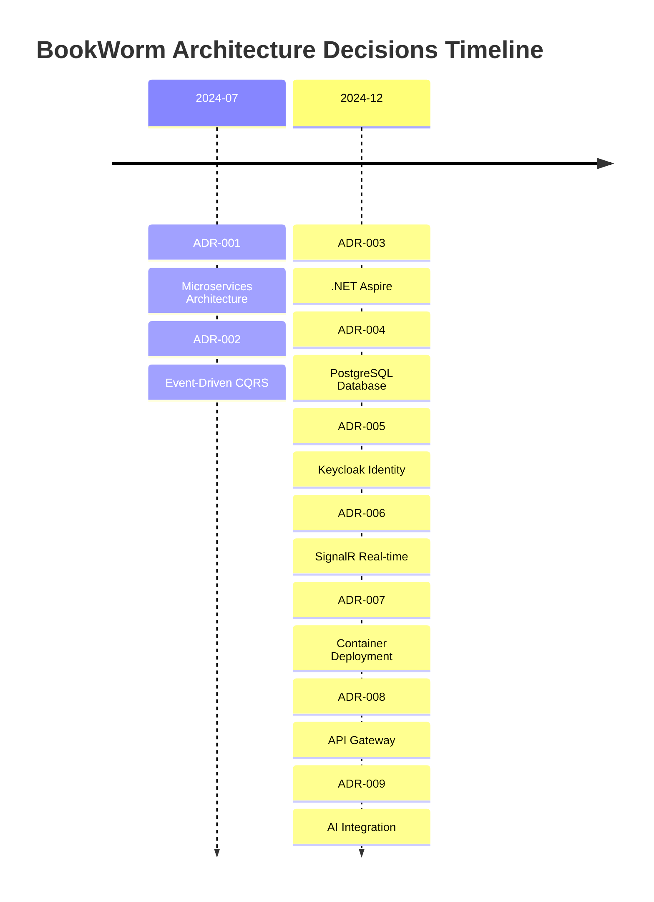
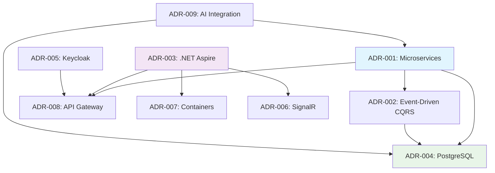

---
category:
  - Architecture Documentation
tag:
  - arc42
---

# 9. Architecture Decisions

## 9.1 Decision Record Format

This section documents significant architectural decisions using the Architecture Decision Record (ADR) format. Each decision includes context, considered options, and rationale.

## 9.2 Architecture Decision Records

### Infrastructure & Platform Decisions

- **[ADR-001: Microservices Architecture](adr/adr-001-microservices-architecture.md)**
  Adopting microservices with domain-driven service boundaries for scalability and team autonomy.

- **[ADR-003: .NET Aspire for Cloud-Native Development](adr/adr-003-aspire-cloud-native.md)**
  Using .NET Aspire as the primary cloud-native development framework for simplified orchestration.

- **[ADR-007: Container-First Deployment Strategy](adr/adr-007-container-deployment.md)**
  Container-based deployment using Docker and Azure Container Apps for consistency and scalability.

- **[ADR-008: API Gateway Pattern Implementation](adr/adr-008-api-gateway.md)**
  YARP-based API Gateway for unified client entry point and cross-cutting concerns.

### Data & Persistence Decisions

- **[ADR-004: PostgreSQL as Primary Database](adr/adr-004-postgresql-database.md)**
  PostgreSQL as the primary database for ACID compliance, JSON support, and performance.

- **[ADR-002: Event-Driven Architecture with CQRS](adr/adr-002-event-driven-cqrs.md)**
  Event-driven architecture with CQRS for scalability and loose coupling between services.

### Security & Identity Decisions

- **[ADR-005: Keycloak for Identity Management](adr/adr-005-keycloak-identity.md)**
  Keycloak for centralized identity and access management with standard protocols.

### Communication & Real-time Decisions

- **[ADR-006: SignalR for Real-time Communication](adr/adr-006-signalr-realtime.md)**
  ASP.NET Core SignalR for real-time bidirectional communication in chat features.

### AI & Intelligence Decisions

- **[ADR-009: AI Integration Strategy](adr/adr-009-ai-integration.md)**
  External AI services integration through abstracted interfaces for search and chat capabilities.

## 9.3 Decision Timeline

The following timeline shows when major architectural decisions were made:



## 9.4 Decision Impact Matrix

The following matrix shows how architectural decisions influence different quality attributes:

| Decision              | Performance            | Scalability            | Security              | Maintainability         | Testability            |
| --------------------- | ---------------------- | ---------------------- | --------------------- | ----------------------- | ---------------------- |
| **Microservices**     | ⚠️ Network overhead    | ✅ Independent scaling | ✅ Fault isolation    | ⚠️ Complexity           | ⚠️ Integration testing |
| **Event-Driven CQRS** | ✅ Read optimization   | ✅ Separate workloads  | ✅ Audit trail        | ⚠️ Eventual consistency | ⚠️ Event testing       |
| **PostgreSQL**        | ✅ Query performance   | ⚠️ Vertical scaling    | ✅ ACID compliance    | ✅ Mature tooling       | ✅ Local testing       |
| **Keycloak**          | ⚠️ Token validation    | ✅ Horizontal scaling  | ✅ Standard protocols | ✅ Centralized mgmt     | ✅ Mock integration    |
| **SignalR**           | ✅ Real-time updates   | ✅ Azure scaling       | ✅ Integrated auth    | ✅ .NET native          | ⚠️ Connection testing  |
| **API Gateway**       | ⚠️ Single bottleneck   | ✅ Load balancing      | ✅ Centralized auth   | ✅ Cross-cutting        | ✅ Integration point   |
| **Containers**        | ✅ Resource efficiency | ✅ Horizontal scaling  | ✅ Isolation          | ✅ Consistency          | ✅ Environment parity  |

Legend: ✅ Positive impact, ⚠️ Requires attention, ❌ Negative impact

## 9.5 Decision Dependencies

The following diagram shows how architectural decisions depend on each other:



## 9.6 Change Management

### Adding New ADRs

When proposing new architectural decisions:

1. **Create ADR File**: Use the next sequential number in the `adr/` directory
2. **Follow Template**: Maintain consistent format across all ADRs
3. **Update Index**: Add reference to this main file and ADR README
4. **Review Process**: Get stakeholder review before marking as "Accepted"
5. **Link Relations**: Reference related ADRs and update dependency diagrams

### Modifying Existing ADRs

When existing decisions need updates:

1. **Status Change**: Update status (Deprecated, Superseded, etc.)
2. **New ADR**: Create new ADR that supersedes the old one
3. **Cross-Reference**: Link between old and new decisions
4. **Impact Analysis**: Document impact on dependent decisions

### ADR Template

```markdown
# ADR-XXX: [Decision Title]

## Status

**[Proposed|Accepted|Deprecated|Superseded]** - [Date]

## Context

[Describe the situation and constraints]

## Decision

[What was decided and key implementation details]

## Rationale

[Why this decision was made]

## Consequences

### Positive

[Benefits and positive outcomes]

### Negative

[Drawbacks and risks]

## Alternatives Considered

[Other options that were evaluated]

## Related Decisions

[Links to other relevant ADRs]
```

## 9.7 Future Considerations

### Pending Decisions

The following architectural decisions are under consideration:

- **Service Mesh**: Evaluating Istio or Linkerd for advanced traffic management
- **Event Sourcing**: Full event sourcing for critical business aggregates
- **Multi-Region**: Cross-region deployment strategy for global availability
- **Advanced AI**: Integration of larger language models and specialized AI services

### Review Schedule

Architectural decisions should be reviewed periodically:

- **Quarterly Reviews**: Assess current decisions and identify needed changes
- **Technology Updates**: Evaluate impact of new .NET and Azure features
- **Performance Reviews**: Review decisions based on production metrics
- **Team Feedback**: Incorporate development team experiences and suggestions
