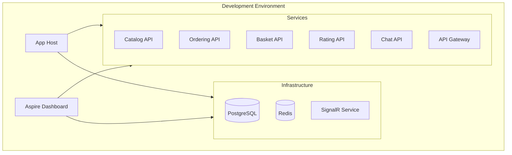

---
category:
  - Architecture Decisions Records
tag:
  - ADR
---

# ADR-003: .NET Aspire for Cloud-Native Development

## Status

**Accepted** - December 2024

## Context

The project aims to demonstrate modern .NET cloud-native development patterns. The development team needs:

- **Simplified Local Development**: Easy setup and debugging of microservices
- **Service Discovery**: Automatic service registration and discovery
- **Configuration Management**: Centralized and environment-specific configuration
- **Observability**: Integrated telemetry, logging, and monitoring
- **Cloud Deployment**: Simplified container deployment and orchestration
- **Developer Productivity**: Reduced complexity in multi-service development

Traditional approaches require manual setup of service discovery, monitoring, and configuration, leading to significant development overhead.

## Decision

Use .NET Aspire as the primary cloud-native development framework for the BookWorm project.

### Aspire Components Used

- **App Host**: Service orchestration and composition
- **Service Discovery**: Built-in service registration and discovery
- **Configuration**: Centralized configuration management
- **Telemetry**: OpenTelemetry integration for observability
- **Dashboard**: Development-time monitoring and debugging

## Rationale

### Why .NET Aspire?

1. **Developer Experience**: Significantly simplifies multi-service development
2. **Service Discovery**: Built-in service discovery eliminates manual configuration
3. **Observability**: Integrated telemetry without additional setup
4. **Configuration**: Centralized configuration with environment-specific overrides
5. **Cloud Deployment**: Simplified Azure deployment with proper resource provisioning
6. **Ecosystem Integration**: Native integration with Azure services

### Aspire Architecture



## Implementation

### App Host Configuration

```csharp
// AppHost project configuration
var builder = DistributedApplication.CreateBuilder(args);

// Infrastructure components
var postgres = builder.AddPostgres("postgres")
    .WithPgAdmin();

var redis = builder.AddRedis("redis")
    .WithRedisCommander();

var signalr = builder.AddAzureSignalR("signalr");

// Service projects
var catalogApi = builder.AddProject<Projects.BookWorm_Catalog_Api>("catalog-api")
    .WithReference(postgres)
    .WithReference(redis);

var orderingApi = builder.AddProject<Projects.BookWorm_Ordering_Api>("ordering-api")
    .WithReference(postgres)
    .WithReference(redis);

var basketApi = builder.AddProject<Projects.BookWorm_Basket_Api>("basket-api")
    .WithReference(redis);

var ratingApi = builder.AddProject<Projects.BookWorm_Rating_Api>("rating-api")
    .WithReference(postgres);

var chatApi = builder.AddProject<Projects.BookWorm_Chat_Api>("chat-api")
    .WithReference(postgres)
    .WithReference(signalr);

var gateway = builder
    .AddYarp("gateway")
    .WithConfigFile("Container/proxy/yarp.json")
    .WithReference(catalogApi)
    .WithReference(orderingApi)
    .WithReference(basketApi)
    .WithReference(ratingApi)
    .WithReference(chatApi);

builder.Build().Run();
```

### Configuration Management

```csharp
// Configuration in appsettings.json
{
  "ConnectionStrings": {
    "DefaultConnection": "Host=postgres;Database=bookworm;Username=postgres;Password=password"
  },
  "Services": {
    "CatalogApi": "https+http://catalog-api",
    "OrderingApi": "https+http://ordering-api"
  }
}
```

## Consequences

### Positive Outcomes

- **Simplified Development**: Single command starts entire application stack
- **Built-in Observability**: Comprehensive telemetry without configuration
- **Service Discovery**: Automatic service registration and discovery
- **Configuration Management**: Centralized configuration with environment support
- **Debugging Experience**: Unified debugging across all services
- **Azure Integration**: Simplified cloud deployment with proper resource provisioning
- **Container Orchestration**: Automatic containerization and orchestration

### Negative Outcomes

- **Framework Lock-in**: Tight coupling to .NET Aspire ecosystem
- **Learning Curve**: Team members need to learn Aspire-specific patterns
- **Limited Ecosystem**: Restricted to .NET services and supported components
- **Version Dependencies**: Aspire version updates may require application changes
- **Azure Bias**: Optimized for Azure, may complicate other cloud deployments

### Risk Mitigation

- **Abstraction Layers**: Use abstractions for service communication
- **Documentation**: Maintain comprehensive Aspire setup documentation
- **Fallback Plans**: Document manual setup procedures for each service
- **Training**: Provide team training on Aspire concepts and patterns

## Development Workflow

### Local Development

1. **Start Application**: `dotnet aspire run` starts all services
2. **Access Dashboard**: Navigate to Aspire dashboard for monitoring
3. **Service Debugging**: Attach debugger to individual services
4. **Log Viewing**: Centralized log viewing in dashboard
5. **Metrics Monitoring**: Real-time metrics and traces

## Cloud Deployment

### Azure Container Apps

Aspire generates Bicep templates for Azure deployment:

```bicep
// Generated by Aspire publish
resource containerEnvironment 'Microsoft.App/managedEnvironments@2024-03-01' = {
  name: 'bookworm-env'
  location: location
  properties: {
    appLogsConfiguration: {
      destination: 'log-analytics'
      logAnalyticsConfiguration: {
        customerId: logAnalytics.properties.customerId
        sharedKey: logAnalytics.listKeys().primarySharedKey
      }
    }
  }
}

resource catalogApi 'Microsoft.App/containerApps@2024-03-01' = {
  name: 'catalog-api'
  location: location
  properties: {
    managedEnvironmentId: containerEnvironment.id
    configuration: {
      activeRevisionsMode: 'Single'
      ingress: {
        external: true
        targetPort: 8080
      }
    }
    template: {
      containers: [
        {
          name: 'catalog-api'
          image: '${containerRegistry.properties.loginServer}/catalog-api:latest'
          resources: {
            cpu: json('0.25')
            memory: '0.5Gi'
          }
        }
      ]
      scale: {
        minReplicas: 1
        maxReplicas: 10
      }
    }
  }
}
```

## Related Decisions

- [ADR-001: Microservices Architecture](adr-001-microservices-architecture.md)
- [ADR-007: Container-First Deployment Strategy](adr-007-container-deployment.md)
- [ADR-008: API Gateway Pattern Implementation](adr-008-api-gateway.md)

## Future Considerations

- **Multi-Cloud Support**: Evaluate Aspire support for other cloud providers
- **Advanced Orchestration**: Consider Kubernetes integration for complex scenarios
- **Custom Components**: Develop custom Aspire components for specialized infrastructure
