---
category:
  - Architecture Decisions Records
tag:
  - ADR
---

# ADR-005: Keycloak for Identity Management

## Status

**Accepted** - December 2024

## Context

The system requires secure authentication and authorization with support for:

- Multiple identity providers (Google, Microsoft, GitHub)
- Modern authentication protocols (OAuth 2.0, OIDC, SAML)
- Fine-grained authorization (role-based and attribute-based access control)
- Multi-tenant support for different user types
- Admin console for user and role management
- Integration with microservices architecture

## Decision

Use Keycloak as the identity and access management solution.

## Rationale

- **Standard Protocols**: Full OAuth 2.0, OIDC, and SAML support
- **Identity Federation**: Seamless integration with external identity providers
- **Authorization**: Role-based and attribute-based access control
- **Admin Interface**: Comprehensive web-based administration
- **Open Source**: No vendor lock-in with strong community support
- **Scalability**: Proven in enterprise environments

## Implementation

### Integration Architecture

```mermaid
graph TB
    Client[👤 Client Application]
    Gateway[🌐 API Gateway]
    Keycloak[🔐 Keycloak]
    Service[🔧 Microservice]

    Client -->|1/ Login Request| Keycloak
    Keycloak -->|2/ JWT Token| Client
    Client -->|3/ API Request + Token| Gateway
    Gateway -->|4/ Validate Token| Keycloak
    Gateway -->|5/ Forward Request| Service
    Service -->|6/ Response| Gateway
    Gateway -->|7/ Response| Client
```



### Authentication Flow

```csharp
public static class AuthenticationExtensions
{
    public static IHostApplicationBuilder AddDefaultAuthentication(
        this IHostApplicationBuilder builder,
        string realm = "bookworm"
    )
    {
        var services = builder.Services;

        services
            .AddAuthentication(options =>
            {
                options.DefaultAuthenticateScheme = JwtBearerDefaults.AuthenticationScheme;
                options.DefaultChallengeScheme = JwtBearerDefaults.AuthenticationScheme;
            })
            .AddKeycloakJwtBearer(
                Components.KeyCloak,
                realm,
                options =>
                {
                    options.RequireHttpsMetadata = false;
                    options.Audience = "account";
                }
            );

        services
            .AddAuthorizationBuilder()
            .AddPolicy(
                Authorization.Policies.Admin,
                policy => policy.RequireRole(Authorization.Roles.Admin)
            )
            .AddPolicy(Authorization.Policies.User, policy => policy.RequireAuthenticatedUser())
            .SetDefaultPolicy(new AuthorizationPolicyBuilder().RequireAuthenticatedUser().Build());

        return builder;
    }
}
```

## Consequences

### Positive

- Industry-standard security protocols
- Centralized identity management
- Rich admin console and user self-service
- Strong community and enterprise support

### Negative

- Additional infrastructure component
- Complex initial setup and configuration
- Potential single point of failure

## Related Decisions

- [ADR-008: API Gateway Pattern Implementation](adr-008-api-gateway.md)
