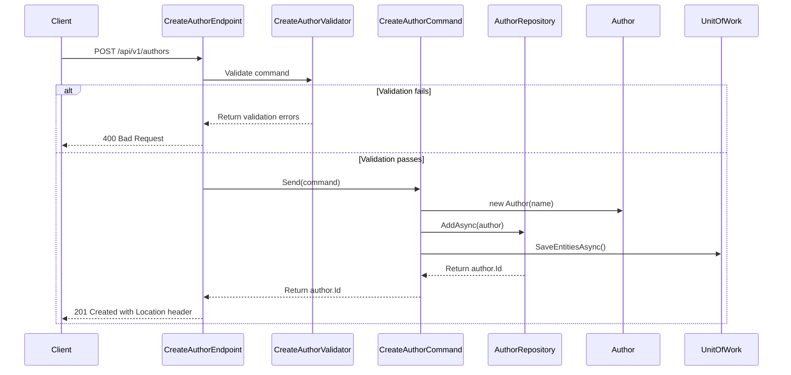

## Overview

This endpoint implements the command part of CQRS pattern to create a new Author entity in the Catalog bounded context. It follows Domain-Driven Design principles by encapsulating the author creation operation as a discrete business capability.

### Security

- **Authorization**: Requires admin privileges (Policy: `Admin`)
- **Authentication**: Required
- **API Version**: 1.0

### Implementation Details

The endpoint follows these key principles:

1. **CQRS Pattern**: Implements the Command side for author creation
2. **Domain-Driven Design**: Encapsulates author creation as a domain operation
3. **Vertical Slice Architecture**: Contains all layers (API, Application, Domain, Infrastructure) within the Catalog bounded context



### Validation Rules

- Author name is required (cannot be empty)
- Author name has a maximum length constraint defined by `DataSchemaLength.Large`

### Technical Characteristics

- **Idempotency**: Author creation operations are idempotent
- **Transactional**: Changes are wrapped in a unit of work
- **Response**: Returns the newly created author's GUID
- **HTTP Method**: POST
- **Endpoint**: `/api/v1/authors`

## Architecture

<NodeGraph />

## POST `(/api/v1/authors)`

### Request Body

<SchemaViewer file="request-body.json" maxHeight="500" id="request-body" />

#### Example Usage

```bash
curl -X POST "https://api.bookworm.com/api/v1/authors/{id}" \
  -H "Authorization: Bearer <admin-token>" \
  -H "Content-Type: application/json" \
  -d '{
    "name": "John Doe"
  }'
```

### Response Details

#### <span className="text-green-500">201 Created</span>

- Returns the newly created author's GUID
- Includes a Location header with the URL to the new resource
- Format: `/api/v1/authors/{guid}`

#### <span className="text-orange-500">400 Bad Request</span>

Returned when:
- Author name is empty
- Author name exceeds maximum length
- Invalid request format

<SchemaViewer file="response-400.json" maxHeight="500" id="response-400" />

#### <span className="text-red-500">401 Unauthorized</span>

Returned when the request lacks valid authentication credentials.

#### <span className="text-red-500">403 Forbidden</span>

Returned when the authenticated user lacks admin privileges.
