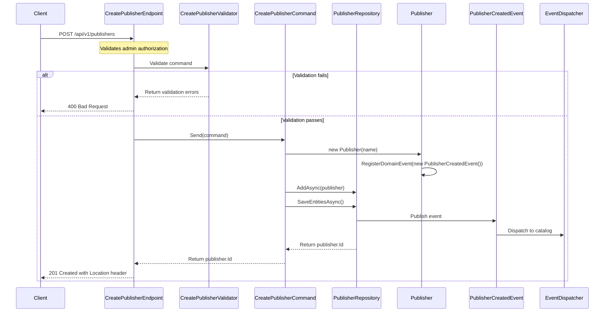

## Overview

Creates a new Publisher entity in the Catalog domain. Publishers are aggregate roots that represent book publishing companies within our bounded context.

This endpoint follows Domain-Driven Design principles by implementing the Command pattern through MediatR. The command is validated using FluentValidation before being processed by the domain service.

## Implementation Details

The Create Publisher operation is implemented using the CQRS pattern with a dedicated command handler:



### Key Components

1. **CreatePublisherCommand**: Implements `ICommand<Guid>` to create a new publisher
2. **CreatePublisherHandler**: Processes the command using repository pattern
3. **CreatePublisherValidator**: Validates the command parameters using FluentValidation
4. **CreatePublisherEndpoint**: Maps the HTTP POST request to the command handler
5. **Publisher Entity**: Domain entity that encapsulates publisher data and business rules
6. **PublisherCreatedEvent**: Domain event raised when publisher is created

## Domain Context

In our domain model, `Publisher` represents a core aggregate that encapsulates:

- Unique identifier (Id)
- Name of the publishing company
- Associated metadata and business rules

The Create Publisher command is a write operation that:

1. Validates the input parameters
2. Creates a new Publisher entity
3. Registers a PublisherCreatedEvent domain event
4. Persists the entity to the repository
5. Returns the unique identifier of the created publisher

## Business Rules

- Name must be provided and cannot be empty
- Name must not exceed the maximum length limit
- The operation raises a domain event that can trigger side effects in other bounded contexts

## Technical Implementation

The implementation uses several patterns and techniques:

1. **CQRS**: Separates the write model (command) from the read model (query)
2. **Repository Pattern**: The `IPublisherRepository` abstracts the data access layer
3. **Domain-Driven Design**: Uses domain entities and events to encapsulate business logic
4. **Minimal API**: Uses .NET's minimal API approach with endpoint mapping
5. **FluentValidation**: Validates the command parameters

The command execution flow:
1. The endpoint receives the HTTP POST request with the publisher data
2. The validator ensures all business rules are satisfied
3. The command handler creates a new Publisher entity
4. The entity registers a domain event
5. The repository persists the entity and publishes domain events
6. The endpoint returns a 201 Created response with the publisher ID and location header

## Authorization

This endpoint requires admin privileges. Users must have the Admin role to access this endpoint.

## Architecture

<NodeGraph />

## POST `(/api/v1/publishers)`

### Request Body

<SchemaViewer file="request-body.json" maxHeight="500" id="request-body" />

### Example Usage

```bash
curl -X POST https://api.bookworm.com/api/v1/publisers \
  -H "Authorization: Bearer <admin-token>" \
  -H "Content-Type: application/json" \
  -d '{
    "name": "New Publisher"
  }'
```

#### Validation Rules

- Name field is required and cannot be empty
- Name must not exceed the large data schema length limit

### Responses

#### <span className="text-green-500">200 Ok</span>

- Returns the newly created publisher's ID (GUID)

#### <span className="text-orange-500">400 Bad Request</span>

Returned when:
- The request body fails validation rules
- The name field is missing or empty
- The name exceeds the maximum length limit

<SchemaViewer file="response-400.json" maxHeight="500" id="response-400" />

#### <span className="text-red-500">401 Unauthorized</span>

Returned when the request lacks valid authentication credentials.

#### <span className="text-red-500">403 Forbidden</span>

Returned when the authenticated user lacks admin privileges.
