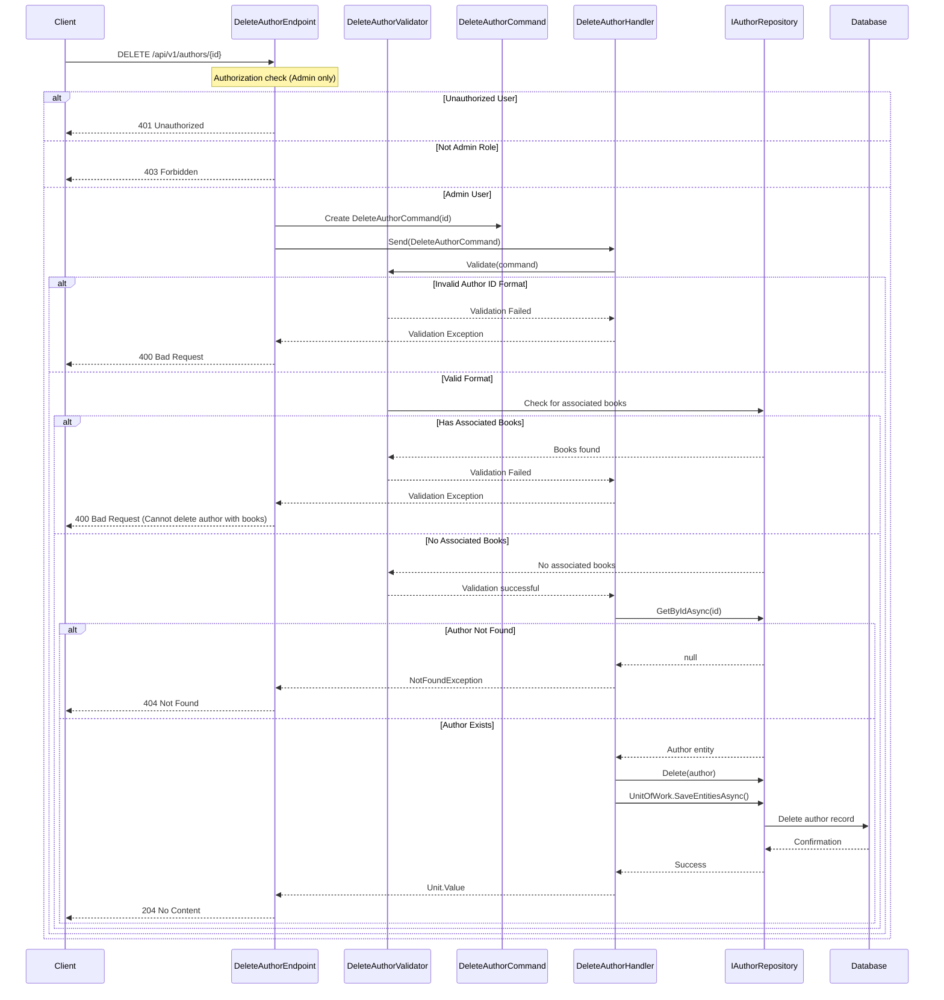

## Overview

This endpoint allows for the removal of an Author entity from the Catalog domain. Following Domain-Driven Design principles, this operation:

- Respects the Author aggregate boundary
- Enforces domain invariants and business rules
- Validates that the author can be safely removed without violating referential integrity
- Returns proper error responses if the operation violates any domain constraints
- Requires administrative privileges to execute

The implementation uses CQRS (Command Query Responsibility Segregation) pattern with a `DeleteAuthorCommand` processed by MediatR, maintaining separation between the command interface and the domain logic.

:::warning
This endpoint requires administrative privileges. Only users with the Admin policy can perform this operation.
:::

:::note[Important Validation Rules]
1. Authors with associated books cannot be deleted until those relationships are removed first
2. The author ID must exist in the system
3. The author ID must be a valid GUID format
:::

## Architecture

<NodeGraph />

### Sequence Diagram



## DELETE `(/api/v1/authors/{id})`

### Authorization

Requires Admin role/policy to access this endpoint.

### Parameters

- **id** (path) (required)
  - Format: GUID
  - Example: "a1e1b3b4-1b1b-4b1b-9b1b-1b1b1b1b1b1b"

### Request Body

No request body required for this endpoint.

### Example Usage

```bash
curl -X DELETE "https://api.bookworm.com/api/v1/authors/{id}" \
  -H "Authorization: Bearer <admin-token>"
```

### Responses

#### <span className="text-green-500">204 No Content</span>

Successful deletion of the author.

#### <span className="text-red-500">404 Not Found</span>

Returned when the specified author ID does not exist in the system.

#### <span className="text-red-500">401 Unauthorized</span>

Returned when the user is not authenticated.

#### <span className="text-red-500">403 Forbidden</span>

Returned when the authenticated user does not have administrative privileges.

### Implementation Details

The deletion process follows these steps:

1. **API Endpoint (DeleteAuthorEndpoint)**:
   - Receives DELETE request at `/api/v1/authors/{id}`
   - Enforces Admin policy authorization
   - Creates a DeleteAuthorCommand with the author ID
   - Sends the command to the mediator

2. **Validation (DeleteAuthorValidator)**:
   - Validates the author ID format
   - Checks if the author has any associated books using the BookAuthorFilterSpec
   - Rejects deletion if books are associated with the author

3. **Command Handling (DeleteAuthorHandler)**:
   - Retrieves the author entity from the repository
   - Throws NotFoundException if author doesn't exist
   - Calls Delete method on the repository
   - Commits changes through UnitOfWork pattern

4. **Repository Operations**:
   - Removes the author from the database
   - Ensures domain events are dispatched if applicable
   - Returns 204 No Content upon successful deletion

This implementation adheres to Domain-Driven Design principles by:
- Encapsulating business logic in the domain model
- Using the repository pattern to abstract data access
- Implementing CQRS with command/handler separation
- Validating business rules before executing operations

### Error Handling

The endpoint implements comprehensive error handling:
- Domain-specific validation through `DeleteAuthorValidator`
- Not Found exceptions for non-existent authors
- Business rule validation preventing deletion of authors with books
