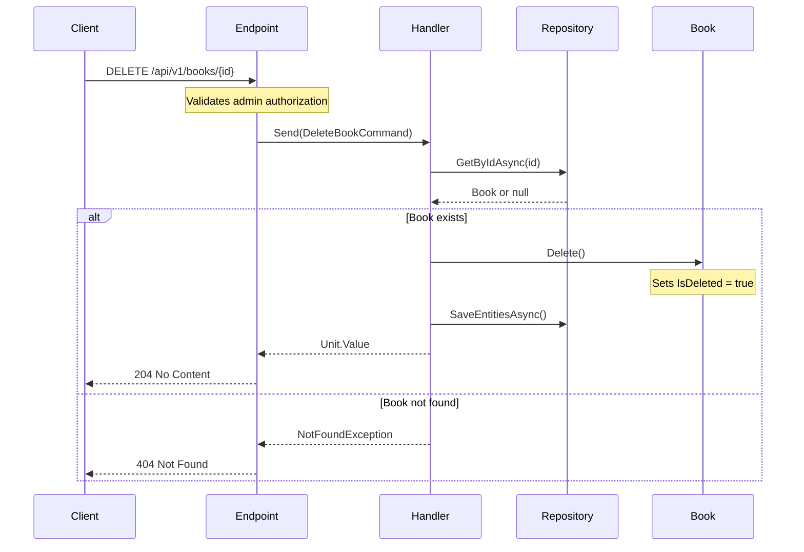

## Overview

The DELETE operation performs a soft delete of a book entity from the catalog domain. This endpoint enforces proper domain boundaries by validating the book's existence and ensuring there are no constraint violations before deletion.

The operation is idempotent - multiple identical requests will have the same effect as a single request, aligning with REST architectural constraints.

**Authorization**: Requires "ADMIN" role to maintain aggregate integrity.

**Domain Validation**:

- Validates book exists before deletion
- Performs a soft delete by marking the book as deleted rather than removing it from the database
- Returns 404 Not Found if the book doesn't exist

## Technical Details

### Implementation Notes

- Uses soft delete pattern through `ISoftDelete` interface
- Maintains audit trail through `AuditableEntity` base class
- Preserves data integrity while marking records as deleted
- Handled by `DeleteBookHandler` using CQRS pattern with MediatR

### Error Handling

The service implements robust error handling:

- Returns 404 if book is not found
- Returns 400 for invalid GUID format
- Returns 403 if user lacks admin privileges

## Architecture

<NodeGraph />

## Implementation Details

The DELETE operation is implemented using the following components:



## DELETE `(/api/v1/books/{id})`

### Parameters

- **id** (path) (required)
  - Format: GUID
  - Example: "123e4567-e89b-12d3-a456-426614174000"

### Request Body

<SchemaViewer file="request-body.json" maxHeight="500" id="request-body" />

### Example Usage

```bash
curl -X DELETE "https://api.bookworm.com/api/v1/books/{id}" \
  -H "Authorization: Bearer <admin-token>"
```

### Responses

#### <span className="text-green-500">204 No Content</span>

Successful deletion of the book.

#### <span className="text-orange-500">400 Bad Request</span>

Invalid request format or constraints violation.

<SchemaViewer file="response-400.json" maxHeight="500" id="response-400" />

#### <span className="text-red-500">404 Not Found</span>

Book with specified ID does not exist.

#### <span className="text-red-500">403 Forbidden</span>

User does not have admin privileges.
