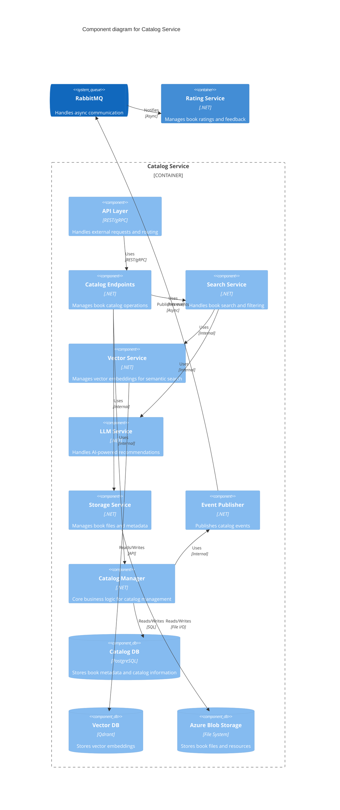

<Tiles>
  <Tile
    icon="DocumentIcon"
    href={`/docs/services/${frontmatter.id}/${frontmatter.version}/changelog`}
    title="View the changelog"
    description="Want to know the history of this service? View the change logs"
  />
  <Tile
    icon="UserGroupIcon"
    href="/docs/users/nhanxnguyen"
    title="Contact the author"
    description="Any questions? Feel free to contact the owners"
  />
  <Tile
    icon="BoltIcon"
    href={`/visualiser/services/${frontmatter.id}/${frontmatter.version}`}
    title={`Sends ${frontmatter.sends.length} messages`}
    description="This service sends messages to downstream consumers"
  />
  <Tile
    icon="BoltIcon"
    href={`/visualiser/services/${frontmatter.id}/${frontmatter.version}`}
    title={`Receives ${frontmatter.receives.length} messages`}
    description="This service receives messages from other services"
  />
</Tiles>

## Overview

The Catalog Service is a core bounded context within the BookWorm ecosystem that implements Domain-Driven Design principles to manage the book inventory and metadata. This service is responsible for:

- Managing the book catalog, including details like title, ISBN, publication date, and price
- Maintaining author profiles and their associated works
- Organizing books by categories and genres
- Handling publisher information and their published titles
- Processing book metadata updates and synchronization
- Broadcasting domain events when significant catalog changes occur

The domain model follows strategic DDD patterns with clearly defined aggregates, entities, and value objects. The Catalog domain enforces business rules such as ISBN validation, category relationships, and author attribution.

The service publishes domain events via message broker integration to notify other bounded contexts about catalog changes, maintaining eventual consistency across the system.

## Component Diagram



## Core Features

| Feature               | Description                                                                                          |
| --------------------- | ---------------------------------------------------------------------------------------------------- |
| **Manage Books**      | Create, update, and delete book records, including title, ISBN, author, category, and price details. |
| **Manage Authors**    | Maintain author profiles with biographical information and associated works.                         |
| **Manage Publishers** | Store publisher details and their published titles, including ISBN, publication date, and price.     |
| **Manage Categories** | Organize books by categories and genres, ensuring proper classification and searchability.           |
| **View Book Details** | Retrieve detailed information about a specific book, including author, category, and publisher data. |
| **Search and Filter** | Search for books by title, author, category, or ISBN, with advanced filtering options.               |

## Architecture diagram

<NodeGraph />

## Infrastructure

The Catalog Service is deployed on Microsoft Azure and leverages various Azure services for scalability, reliability, and performance. The infrastructure components include:

```mermaid
architecture-beta
    group api(logos:microsoft-azure)[API]

    service db(logos:postgresql)[Database] in api
    service server(logos:docker-icon)[Server] in api
    service disk(disk)[Storage] in api
    service llm(server)[LLM] in api
    service vector_db(database)[Vector Database] in api

    db:L -- R:server
    server:L -- R:disk
    server:L -- R:llm
    server:L -- R:vector_db
```



The service uses Azure Database for PostgreSQL as the primary data store, ensuring ACID compliance and data durability. Azure Blob Storage provides scalable file storage for book cover images and other media assets. Redis Cache is used for performance optimization and session management. Ollama (LLM) and Vector Database are used for GenAI integration.

## Security

The Catalog Service implements comprehensive security measures to protect data and ensure secure access:

### Authentication & Authorization

- JWT-based authentication with Azure AD integration
- Role-based access control (RBAC) for different user types
- API key authentication for service-to-service communication

### Rate Limiting & DDoS Protection

- Azure DDoS Protection for network-level security
- Rate limiting per API key and user
- Request throttling based on service tier

## Performance & Scalability

The service is designed for high performance and scalability:

### Performance Targets

- API Response Time: < 100ms for 95th percentile
- Cache Hit Ratio: > 90%
- Database Query Time: < 50ms for 95th percentile

### Scalability Features

- Horizontal scaling with Azure Kubernetes Service
- Auto-scaling based on CPU and memory metrics
- Read replicas for database scaling
- CDN integration for static content delivery

### Monitoring & Alerts

- Real-time performance monitoring
- Automated alerts for performance degradation
- Custom dashboards for key metrics

## Monitoring & Observability

The Catalog Service implements comprehensive monitoring and observability features to ensure system health and performance:

### Metrics & Telemetry

The service exposes key metrics through Azure Monitor:

#### Business Metrics

- Total number of books in catalog
- Number of active authors
- Number of publishers
- Book search success rate
- Average book rating

#### Technical Metrics

- API response times
- Error rates by endpoint
- Cache hit/miss ratios
- Database query performance
- Memory and CPU usage
- Network latency

### Distributed Tracing

The service implements distributed tracing using OpenTelemetry:

- Request/response flow tracking
- Dependency tracking (database, cache, external services)
- Performance profiling
- Error tracking with stack traces

### Alerting

Automated alerts are configured for:

- Error rate thresholds
- Response time degradation
- Resource utilization
- Business metric anomalies
- Security incidents

### Dashboard

Azure Monitor dashboards provide real-time visibility into:

- Service health status
- Performance metrics
- Error rates and types
- Resource utilization
- Business metrics trends

<Steps title="How to connect to Catalog Service">
  <Step title="Get the base URL">
    The base URL for the Catalog Service API is `https://api.bookworm.com/catalog/api/v1`.
  </Step>
  <Step title="Configure API client">
      ```javascript
      import axios from 'axios';

      const catalogService = axios.create({
        baseURL: 'https://api.bookworm.com/catalog/api/v1',
        timeout: 5000,
        headers: {
          'Content-Type': 'application/json',
          'Authorization': 'Bearer YOUR_JWT_TOKEN'
        },
      });

      // Add request interceptor for error handling
      catalogService.interceptors.request.use(
        config => {
          // Add retry logic for failed requests
          config.retry = 3;
          config.retryDelay = 1000;
          return config;
        },
        error => Promise.reject(error)
      );

      // Add response interceptor for error handling
      catalogService.interceptors.response.use(
        response => response,
        async error => {
          const { config } = error;

          // Handle rate limiting
          if (error.response?.status === 429) {
            const retryAfter = error.response.headers['retry-after'];
            await new Promise(resolve => setTimeout(resolve, retryAfter * 1000));
            return catalogService(config);
          }

          // Handle authentication errors
          if (error.response?.status === 401) {
            // Implement token refresh logic here
            return Promise.reject(error);
          }

          return Promise.reject(error);
        }
      );
      ```

  </Step>
  <Step title="Make a test request">
    ```javascript
    // Example with error handling and pagination
    async function getBooks(page = 1, pageSize = 10) {
      try {
        const response = await catalogService.get('/books', {
          params: {
            page,
            pageSize,
            sortBy: 'title',
            sortOrder: 'asc'
          }
        });

        return {
          books: response.data.items,
          totalCount: response.data.totalCount,
          currentPage: response.data.currentPage,
          totalPages: response.data.totalPages
        };
      } catch (error) {
        if (error.response) {
          // Handle specific error cases
          switch (error.response.status) {
            case 400:
              console.error('Invalid request parameters:', error.response.data);
              break;
            case 404:
              console.error('Resource not found');
              break;
            case 429:
              console.error('Rate limit exceeded');
              break;
            default:
              console.error('An unexpected error occurred');
          }
        }
        throw error;
      }
    }

    // Example usage
    getBooks()
      .then(result => {
        console.log('Books:', result.books);
        console.log('Total count:', result.totalCount);
        console.log('Current page:', result.currentPage);
      })
      .catch(error => {
        console.error('Failed to fetch books:', error);
      });
    ```

  </Step>
</Steps>

## Error Handling

The Catalog Service uses standard HTTP status codes and provides detailed error responses:

### Error Response Format

```json
{
  "type": "RFC URI identifying the problem type",
  "title": "A short, human-readable summary of the problem",
  "status": "The HTTP status code",
  "detail": "A human-readable explanation of the error"
}
```

### Best Practices for Error Handling

1. Always check the response status code
2. Implement exponential backoff for retries
3. Handle rate limiting with proper backoff
4. Log errors with appropriate context
5. Implement circuit breakers for failing endpoints
6. Cache successful responses to reduce API calls
