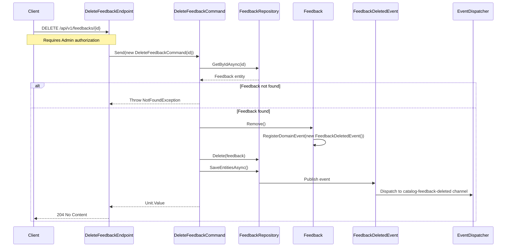

## Overview

The Delete Feedback operation allows removing customer feedback from the Rating domain. This endpoint is part of the Rating bounded context and operates on the Feedback aggregate.

## Implementation Details

The Delete Feedback operation is implemented using the CQRS pattern with a dedicated command handler:



### Key Components

1. **DeleteFeedbackCommand**: Implements `ICommand` to delete a feedback by ID
2. **Admin Authorization**: Endpoint is protected with the Admin policy
3. **Domain Events**: `FeedbackDeletedEvent` is raised when feedback is removed
4. **Integration Events**: Events are dispatched to the catalog service for rating recalculation

## Domain Context

Within our domain model, Feedback represents a customer's opinion about a book, which is an important entity in our system. The Feedback aggregate contains:

- Book reference (BookId)
- Customer information (FirstName, LastName)
- Rating value (0-5 scale)
- Comment text

Deleting feedback is a domain operation that:

1. Retrieves the feedback entity from the repository
2. Calls the `Remove()` method on the Feedback aggregate
3. Raises a `FeedbackDeletedEvent` with the book ID, rating, and feedback ID
4. Physically removes the feedback entity from the repository
5. Publishes an integration event to notify the Catalog service

## Command Flow

When a DELETE request is received:

1. The `DeleteFeedbackEndpoint` validates the request and authorization
2. The `DeleteFeedbackCommand` is dispatched through the mediator
3. The command handler retrieves the feedback entity from the repository
4. If the feedback is not found, a `NotFoundException` is thrown
5. The `Remove()` method is called on the feedback entity, which registers a domain event
6. The feedback is removed from the repository
7. The unit of work is saved, which publishes the domain events
8. The `FeedbackDeletedEventHandler` dispatches an integration event to the Catalog service
9. A 204 No Content response is returned to the client

## Business Rules

- Only administrators can delete feedback (enforced by the Admin policy)
- Feedback must exist to be deleted
- Deleting feedback triggers recalculation of the aggregate rating for the associated book

This operation maintains the integrity of our Rating domain while allowing administrators to manage inappropriate content within the system.

## Architecture

<NodeGraph />

## DELETE `(/api/v1/feedbacks/{id})`

### Path Parameters

- **id** (path) (required): The unique identifier of the feedback to delete

### Example Usage

```bash
curl -X DELETE "https://api.bookworm.com/api/v1/feedbacks/{feedbackId}" \
    -H "Authorization: Bearer <admin-jwt-token>"
```

### Responses

#### <span className="text-green-500">204 No Content</span>

Returned when the feedback is successfully deleted.

#### <span className="text-red-500">401 Unauthorized</span>

Returned when the request lacks valid authentication credentials.

#### <span className="text-red-500">403 Forbidden</span>

Returned when the authenticated user does not have administrator privileges.

#### <span className="text-red-500">404 Not Found</span>

Returned when the feedback with the specified ID does not exist.
