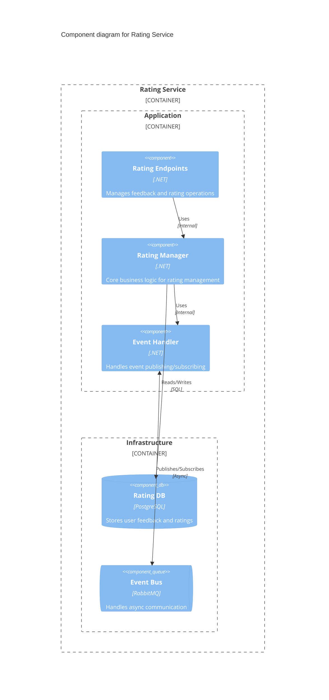
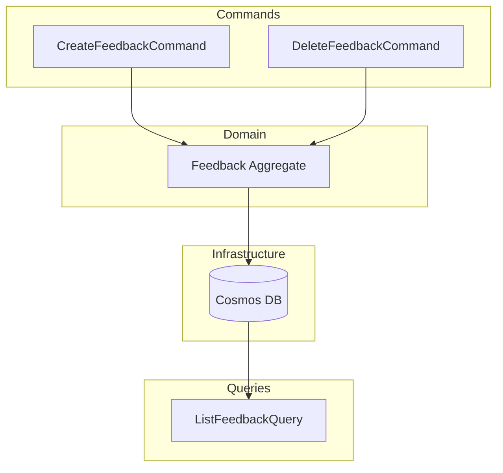
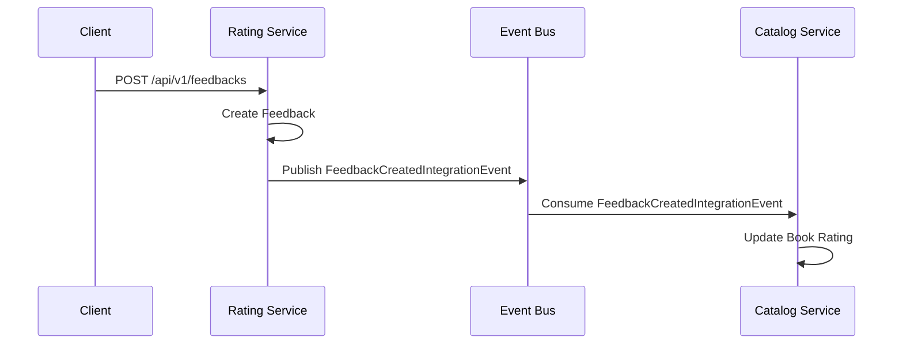

<Tiles>
  <Tile
    icon="DocumentIcon"
    href={`/docs/services/${frontmatter.id}/${frontmatter.version}/changelog`}
    title="View the changelog"
    description="Want to know the history of this service? View the change logs"
  />
  <Tile
    icon="UserGroupIcon"
    href="/docs/users/nhanxnguyen"
    title="Contact the author"
    description="Any questions? Feel free to contact the owners"
  />
  <Tile
    icon="BoltIcon"
    href={`/visualiser/services/${frontmatter.id}/${frontmatter.version}`}
    title={`Sends ${frontmatter.sends.length} messages`}
    description="This service sends messages to downstream consumers"
  />
  <Tile
    icon="BoltIcon"
    href={`/visualiser/services/${frontmatter.id}/${frontmatter.version}`}
    title={`Receives ${frontmatter.receives.length} messages`}
    description="This service receives messages from other services"
  />
</Tiles>

## Overview

The Rating Service represents a distinct bounded context within the BookWorm ecosystem, responsible for managing user feedback and ratings for books. As a core domain service, it implements Domain-Driven Design principles to maintain a clean separation of concerns while providing critical functionality for the user experience.

### Key Responsibilities

- Collecting and storing user ratings and reviews
- Calculating aggregate rating metrics for books
- Validating feedback content against business rules
- Publishing domain events when feedback changes

## Component Diagram

### Domain Events

The service emits domain events such as `FeedbackCreatedEvent` and `FeedbackDeletedEvent` to notify other bounded contexts about changes in the rating domain. These events enable loose coupling between services while maintaining data consistency.

### Integration Points

Rating Service integrates with:

- **Catalog Service**: Updates book rating information
- **Notification Service**: Triggers notifications for review responses

### Implementation Details

The service follows the CQRS pattern with separate command and query models, enabling optimized read and write operations. The repository pattern is used for data access, ensuring persistence concerns remain separated from domain logic.

## Core Features

| Feature             | Description                                                                            |
| ------------------- | -------------------------------------------------------------------------------------- |
| **Add Feedback**    | Allows users to submit feedback and ratings for books, storing them in the database.   |
| **Delete Feedback** | Supports the removal of user feedback, updating the book's rating metrics accordingly. |
| **Get Feedbacks**   | Provides an API endpoint to retrieve feedback for a specific book or user.             |

## Architecture diagram

<NodeGraph />

## Technical Architecture

The Rating Service is built on a modern, cloud-native architecture following these key design principles:

### Command Query Responsibility Segregation (CQRS)

The service implements CQRS pattern with:

- **Command Stack**: Handles write operations through commands like `CreateFeedbackCommand` and `DeleteFeedbackCommand`
- **Query Stack**: Manages read operations with queries like `ListFeedbackQuery`
- **MediatR Pipeline**: Processes commands and queries with cross-cutting concerns:
  - Validation behavior
  - Activity tracking for observability
  - Logging behavior

### Event-Driven Architecture

The service publishes domain events that are transformed into integration events for cross-service communication:

- **Domain Events**: `FeedbackCreatedEvent`, `FeedbackDeletedEvent`
- **Integration Events**: `FeedbackCreatedIntegrationEvent`, `FeedbackDeletedIntegrationEvent`
- **Event Bus**: Implemented with MassTransit for reliable message delivery
- **Inbox/Outbox Pattern**: Ensures at-least-once delivery semantics

## Infrastructure

This service is built using C# and .NET Core, leveraging Entity Framework Core for data access and Azure Cosmos Database for persistence. The service is containerized using Docker and deployed to Azure Kubernetes Service (AKS) for scalability and reliability.

```mermaid
architecture-beta
    group api(logos:microsoft-azure)[API]

    service server(logos:docker-icon)[Server] in api
    service db(logos:postgresql)[Database] in api

    db:L -- R:server
```

