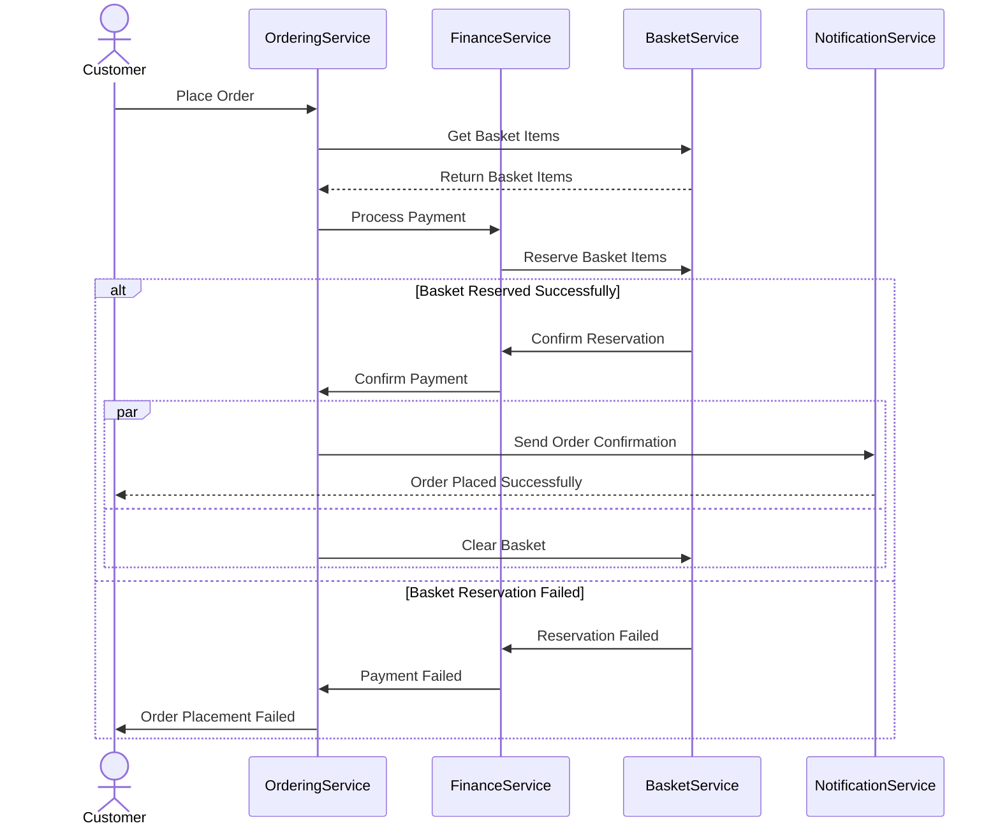

## Overview

The Ordering domain represents a strategic core domain within the BookWorm system, responsible for managing the complete lifecycle of customer orders from creation through fulfillment. As a core domain, it embodies critical business capabilities that directly impact the organization's competitive advantage.

<Tiles>
  <Tile
    icon="UserGroupIcon"
    href="/docs/users/nhanxnguyen"
    title="Contact the author"
    description="Any questions? Feel free to contact the owners"
  />
  <Tile
    icon="RectangleGroupIcon"
    href={`/visualiser/domains/${frontmatter.id}/${frontmatter.version}`}
    title={`${frontmatter.services.length} services are in this domain`}
    description="This domain contains Ordering, Basket, Finance, and Notification services"
  />
</Tiles>

### Domain Characteristics

- **Bounded Context**: The Ordering domain has a well-defined boundary with explicit integration points between its constituent services (Ordering, Basket, Finance, and Notification) through gRPC communication.

- **Service Architecture**: The domain is composed of four specialized services:

  - **Ordering Service**: Core service managing order lifecycle and state
  - **Basket Service**: Handles shopping cart and item management
  - **Finance Service**: Manages payment processing and financial transactions
  - **Notification Service**: Handles customer communications and alerts

- **Event Sourcing**: The domain implements event sourcing as its persistence mechanism, storing the complete history of order-related events rather than just the current state. This approach provides a comprehensive audit trail and enables temporal queries and state reconstruction at any point in time.

### Business Rules and Invariants

- Orders must contain at least one item to be submitted
- Order status transitions follow a predefined state machine (e.g., Placed -> Completed or Cancelled)
- Cancellation is only permitted before the "Shipped" status
- Price calculations and summaries are validated against business rules
- Basket items must be reserved before order confirmation
- Financial transactions must be atomic and consistent

The domain handles complex business scenarios like partial fulfillment, order modifications, and cancellations while maintaining consistency and enforcing business rules throughout the order lifecycle.

## Architecture diagram

<NodeGraph />

<MessageTable format="all" limit={4} />

## Ordering process (sequence diagram)

