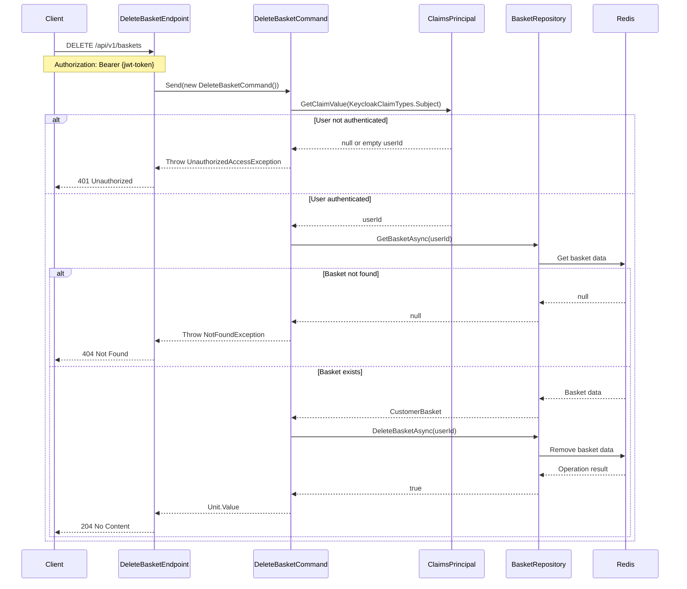

## Overview

This endpoint allows you to delete a shopping basket by its unique identifier. This operation is an essential part of the Basket domain's lifecycle management.

### Business Rules

- Basket must exist to be deleted
- Only the authenticated owner of the basket can delete their own basket
- Deleting a basket will permanently remove all items within it
- The basket ID is automatically derived from the authenticated user's ID

### Authentication

This endpoint requires authentication. The user's identity is verified using Keycloak authentication:
- A valid authentication token must be provided
- The user's ID is extracted from the `sub` claim in the JWT token
- Unauthorized access will result in a 401 Unauthorized response

### Implementation Details

The delete operation is handled by the `DeleteBasketCommandHandler` which:
- Validates user authentication
- Verifies basket ownership
- Removes the basket from the repository
- Uses the user's ID from claims as the basket identifier



## Architecture

<NodeGraph />

## DELETE `(/api/v1/baskets)`

### Request

No request body is required. The basket ID is automatically determined from the authenticated user's identity.

### Example Usage

```bash
curl -X DELETE https://api.bookworm.com/api/v1/baskets/{basketId} \
  -H "Authorization: Bearer <your-jwt-token>"
```

### Responses

#### <span className="text-green-500">204 No Content</span>

Successful deletion of the basket.

#### <span className="text-red-500">401 Unauthorized</span>

Returned when:
- No authentication token is provided
- Invalid authentication token
- Token has expired

#### <span className="text-orange-500">404 Not Found</span>

Returned when:
- The basket does not exist for the authenticated user

### Error Examples

<Tabs>
  <TabItem title="401 Unauthorized">
    ```json title="401 Unauthorized"
    {
      "type": "https://tools.ietf.org/html/rfc7235#section-3.1",
      "title": "Unauthorized",
      "status": 401,
      "detail": "User is not authenticated."
    }
    ```
  </TabItem>
  <TabItem title="404 Not Found">
    ```json title="404 Not Found"
    {
      "type": "https://tools.ietf.org/html/rfc7231#section-6.5.4",
      "title": "Not Found",
      "status": 404,
      "detail": "Basket with id {userId} not found."
    }
    ```
  </TabItem>
</Tabs>
