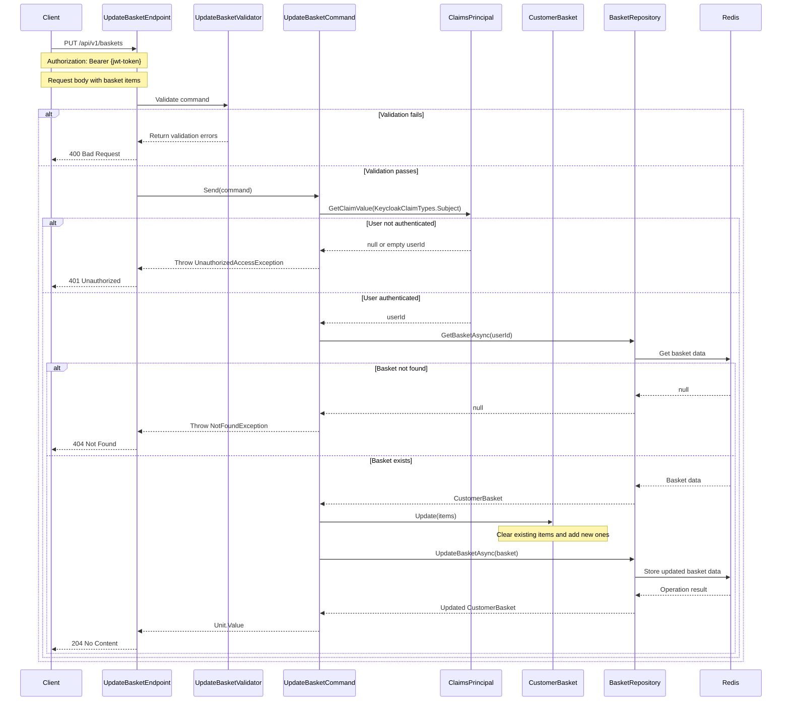

## Overview

This endpoint updates an existing basket entity or creates a new one if it doesn't exist. The basket represents an aggregate root in our domain model that maintains its own consistency boundaries.

The operation follows the Repository Pattern for persistence and triggers domain events when the basket state changes. This aligns with our DDD approach by:

1. Treating the basket as a complete aggregate with items as value objects
2. Maintaining invariants during the update operation
3. Encapsulating business rules within the domain model
4. Ensuring atomic updates to maintain data consistency
5. Publishing domain events for cross-boundary communication

When a basket is updated, the system publishes integration events that other bounded contexts (like Catalog and Ordering) can subscribe to if needed.

## Implementation Details

The Update Basket operation is implemented using the CQRS pattern with a dedicated command handler:



### Key Components

1. **UpdateBasketCommand**: Implements `ICommand` to update an existing basket with new items
2. **UpdateBasketHandler**: Processes the command using repository pattern
3. **UpdateBasketValidator**: Validates the command parameters using FluentValidation
4. **CustomerBasket**: Domain entity that encapsulates basket data and business rules
5. **BasketItem**: Value object representing an item in the basket
6. **IBasketRepository**: Repository interface for basket persistence operations

### Technical Implementation

The update operation follows these steps:

1. **Authentication**: Extracts the user ID from the JWT token claims
2. **Basket Retrieval**: Fetches the existing basket using the user ID as the key
3. **Domain Update**: Calls the `Update` method on the `CustomerBasket` entity
4. **Persistence**: Saves the updated basket to the repository
5. **Response**: Returns a 204 No Content response on success

The implementation enforces several key principles:

- **Command Validation**: Ensures the request contains valid data before processing
- **Domain Encapsulation**: The basket entity controls its own state changes
- **Repository Abstraction**: Data access is abstracted behind a repository interface
- **Error Handling**: Specific exceptions for different error scenarios

## Authentication

This endpoint requires authentication. The user must be logged in with a valid JWT token containing a Keycloak subject claim. The basket is associated with the authenticated user's ID.

## Validation Rules

The following validation rules are enforced:

- The basket items collection must not be empty
- For each basket item:
  - Book ID must not be empty
  - Quantity must be greater than 0

## Architecture

<NodeGraph />

## PUT `(/api/v1/baskets)`

### Request Body

<SchemaViewer file="request-body.json" maxHeight="500" id="request-body" />

### Example Usage

```bash
curl -X PUT https://api.bookworm.com/api/v1/baskets \
  -H "Authorization: Bearer <your-jwt-token>" \
  -H "Content-Type: application/json" \
  -d '{
  "items": [
    {
      "id": "0195e52d-4f5b-7280-9a17-ec3bf0a5f733",
      "quantity": 2
    },
    {
      "id": "0195e52d-4f5b-7a69-8489-2c0985141a63",
      "quantity": 1
    }
  ]
}'
```

### Responses

#### <span className="text-green-500">204 No Content</span>

Returned when the basket is successfully updated.

#### <span className="text-orange-500">400 Bad Request</span>

Returned when the request validation fails.

<SchemaViewer file="response-400.json" maxHeight="500" id="response-400" />

#### <span className="text-red-500">401 Unauthorized</span>

Returned when:

- The user is not authenticated
- The authentication token is missing or invalid

#### <span className="text-red-500">404 Not Found</span>

Returned when the basket for the authenticated user cannot be found.

## Error Handling

The service handles various error scenarios:

1. **Validation Errors**: Returns 400 Bad Request with detailed validation messages
2. **Authentication Errors**: Returns 401 Unauthorized if user is not properly authenticated
3. **Not Found Errors**: Returns 404 if the basket doesn't exist

## Implementation Notes

- The endpoint is versioned (v1) and follows REST principles
- Uses optimistic concurrency for basket updates
- Implements domain-driven design patterns with `Basket` as an aggregate root
- Provides immediate consistency for basket operations
