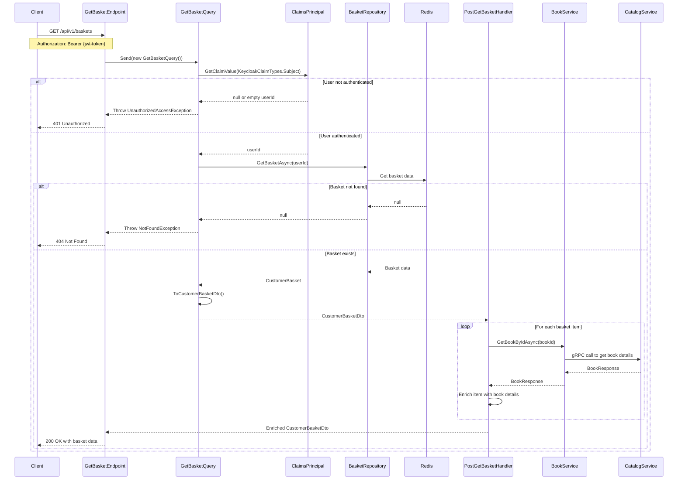

## Overview

This endpoint retrieves a user's shopping basket based on their identity. In our domain model, a Basket is an aggregate root that contains a collection of BasketItems, each representing a book the user intends to purchase.

## Implementation Details

The Get Basket operation is implemented using the CQRS pattern with a dedicated query handler and post-processor:



### Key Components

1. **GetBasketQuery**: Implements `IQuery<CustomerBasketDto>` to retrieve a user's basket
2. **GetBasketHandler**: Processes the query using repository pattern
3. **PostGetBasketHandler**: Post-processor that enriches basket items with book details from the Catalog service
4. **BookService**: gRPC client for the Catalog service
5. **CustomerBasketDto**: Data transfer object representing the basket and its items

### Technical Implementation

The query execution follows these steps:
1. **Authentication**: Extracts the user ID from the JWT token claims
2. **Basket Retrieval**: Fetches the basket from Redis using the user ID as the key
3. **DTO Conversion**: Converts the domain entity to a DTO
4. **Data Enrichment**: Post-processes the DTO to add book details from the Catalog service
5. **Response**: Returns the enriched basket DTO to the client

The implementation includes several notable features:
- **Cross-Service Data Enrichment**: Basket items are enriched with book details from the Catalog service
- **gRPC Communication**: Uses gRPC for efficient inter-service communication
- **Post-Processing**: Uses MediatR's post-processing pipeline for separation of concerns
- **Error Handling**: Specific exceptions for different error scenarios

### Domain Context

Within our bounded context, the basket represents the current selection of items a user has chosen but not yet purchased. The basket is identified by a unique user identifier and maintains the state of the user's shopping session.

### Business Rules

- Each user can have only one active basket
- Basket items contain references to catalog items (books) with quantity
- Prices are stored in the basket to maintain price consistency during the shopping session
- Anonymous users' baskets are tracked via temporary identifiers
- The basket is automatically populated with current book information from the catalog service

### Use Cases

- Initial page load for returning users
- Checkout process initiation
- Basket summary display
- Price verification before checkout

### Integration Points

This endpoint is consumed by the web UI and integrates with the Catalog service to fetch current book information.

## Architecture

<NodeGraph />

## GET `(/api/v1/baskets)`

### Request Body

No request body is required. The basket ID is automatically determined from the authenticated user's identity.

### Example Usage

```bash
curl -X GET "https:///api.bookworm.com/api/v1/baskets" \
  -H "Authorization: Bearer <your-jwt-token>" \
  -H "Content-Type: application/json" \
```

### Responses

#### <span className="text-green-500">200 OK</span>

Returns the user's basket details, including items and their prices. The response includes the basket ID and a list of items with their quantities and prices.

<SchemaViewer file="response-200.json" maxHeight="500" id="response-200" />

#### Example Response:

```json title="200 OK"
{
  "id": "0195e531-cc9d-7925-ba84-b9588bb3653d",
  "items": [
    {
      "id": "0195e531-cc9d-71f1-ad7f-57cfc0712f1b",
      "quantity": 2,
      "name": "The Great Gatsby",
      "price": 29.99,
      "priceSale": 24.99
    }
  ]
}
```

#### <span className="text-red-500">401 Unauthorized</span>

The user is not authenticated. The request must include a valid authentication token.

#### <span className="text-red-500">404 Not Found</span>

The basket for the authenticated user was not found.

<SchemaViewer file="response-404.json" maxHeight="500" id="response-404" />

### Error Handling

The endpoint handles the following error scenarios:
- Missing or invalid authentication token
- Basket not found for the user
- Book information not found in the catalog service
- Invalid request parameters

### Security

- Requires authentication via Bearer token
- User can only access their own basket
- All requests must be made over HTTPS

### Rate Limiting

- Standard rate limits apply
- Maximum 100 requests per minute per user

### Caching

- Response is not cached
- Each request fetches fresh data from the catalog service
