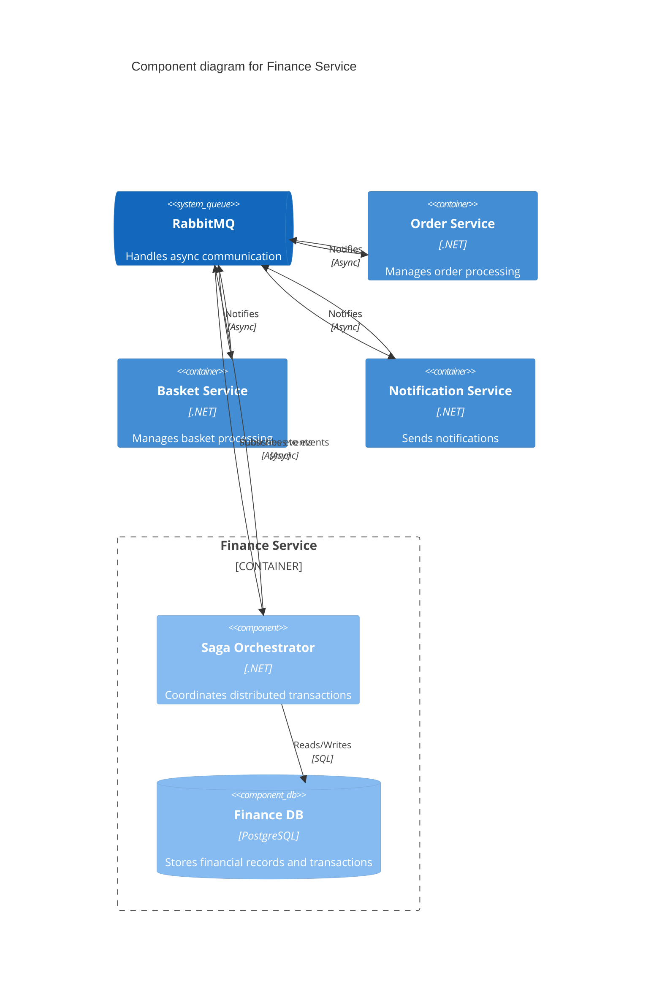

<Tiles>
  <Tile
    icon="DocumentIcon"
    href={`/docs/services/${frontmatter.id}/${frontmatter.version}/changelog`}
    title="View the changelog"
    description="Want to know the history of this service? View the change logs"
  />
  <Tile
    icon="UserGroupIcon"
    href="/docs/users/nhanxnguyen"
    title="Contact the author"
    description="Any questions? Feel free to contact the owners"
  />
  <Tile
    icon="BoltIcon"
    href={`/visualiser/services/${frontmatter.id}/${frontmatter.version}`}
    title={`Sends ${frontmatter.sends.length} messages`}
    description="This service sends messages to downstream consumers"
  />
  <Tile
    icon="BoltIcon"
    href={`/visualiser/services/${frontmatter.id}/${frontmatter.version}`}
    title={`Receives ${frontmatter.receives.length} messages`}
    description="This service receives messages from other services"
  />
</Tiles>

## Overview

The Finance service acts as a critical orchestration component within the BookWorm ecosystem, implementing Domain-Driven Design principles to manage financial transactions and state transitions across the order fulfillment process.

### Integration Patterns

The Finance service implements a sophisticated event-driven architecture using MassTransit for message-based communication:

- **Event Sourcing**: Captures all state changes as a sequence of events
- **Saga Pattern**: Orchestrates long-running business processes across multiple services
- **Outbox Pattern**: Ensures reliable message delivery with transactional outbox
- **Correlation**: Links related events using correlation IDs (OrderId)

## Component Diagram

### Technical Implementation

The service is built with modern .NET technologies and patterns:

- **MassTransit State Machine**: Implements a robust saga pattern for order processing workflow
- **Entity Framework Core**: Persists saga state and implements outbox pattern
- **PostgreSQL**: Stores saga state, inbox/outbox messages
- **Minimal API**: Exposes RESTful endpoints for querying order state
- **AsyncAPI**: Documents event-driven messaging contracts

## State Machine Workflow

The Finance service implements a state machine with the following states:

| State         | Description                                                                |
| ------------- | -------------------------------------------------------------------------- |
| **Placed**    | Initial state when an order is placed via `UserCheckedOutIntegrationEvent` |
| **Completed** | Final state for successfully processed orders                              |
| **Cancelled** | State for orders that have been cancelled                                  |
| **Failed**    | State for orders that encountered errors during processing                 |

### State Transitions

The state machine handles the following transitions:

1. **Initially → Placed**: When `OrderPlaced` event is received

   - Publishes `PlaceOrderCommand`

2. **Placed → Failed**: When `BasketDeletedFailed` event is received

   - Publishes `DeleteBasketFailedCommand`

3. **Placed → Completed**: When `OrderCompleted` event is received

   - Publishes `CompleteOrderCommand` (if email is available)

4. **Placed → Cancelled**: When `OrderCancelled` event is received
   - Publishes `CancelOrderCommand` (if email is available)

## Core Features

| Feature                        | Description                                                                                                      |
| ------------------------------ | ---------------------------------------------------------------------------------------------------------------- |
| **Order Processing**           | Orchestrates the financial aspects of order processing, including payment authorization, capture, and settlement |
| **Basket Cleanup**             | Manages the deletion of baskets after order placement, with failure handling                                     |
| **Order State Tracking**       | Maintains the state of orders throughout their lifecycle                                                         |
| **Event-Driven Communication** | Publishes and subscribes to events for asynchronous processing                                                   |
| **State Querying**             | Provides API endpoints to retrieve current order state                                                           |

## Architecture diagram

<NodeGraph />

## Infrastructure

The Finance service is deployed on Microsoft Azure, leveraging Azure Database for PostgreSQL as the primary data store.

```mermaid
architecture-beta
    group api(logos:microsoft-azure)[API]

    service db(logos:postgresql)[Database] in api
    service server(logos:docker-icon)[Server] in api

    db:L -- R:server
```

## Technical Stack

- **MassTransit**: Distributed application framework for message-based communication
- **Entity Framework Core**: ORM for data access
- **PostgreSQL**: Relational database for persistence
- **MediatR**: In-process messaging with CQRS pattern
- **Aspire**: Cloud-native application platform
- **OpenAPI/AsyncAPI**: API documentation
