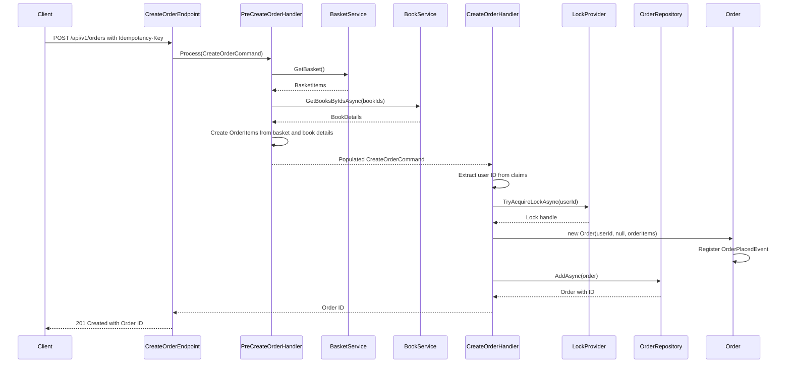

## Overview

The Create Order endpoint represents a key aggregate root operation within the Ordering bounded context. This command follows the CQRS pattern and is responsible for initiating a new order in the system based on the authenticated user's shopping basket.

## Implementation Details

The Create Order operation is implemented using the CQRS pattern with a command handler and pre-processor:



### Key Components

1. **CreateOrderCommand**: Implements `ICommand<Guid>` to create a new order and return its ID
2. **PreCreateOrderHandler**: Pre-processes the command by retrieving basket items and book details
3. **BasketService**: Provides the current user's basket items
4. **BookService**: Provides book details for pricing information
5. **Distributed Lock**: Ensures only one order can be created at a time for a given user
6. **OrderPlacedEvent**: Domain event triggered when a new order is created

## Business Rules

- Orders are created automatically from the user's current basket
- The buyer ID is automatically derived from the authenticated user's identity
- Order items are created from basket items with pricing from the Catalog service
- Each order item must have a quantity greater than zero
- Each order item must have a price greater than or equal to zero
- Initial order status is set to "New" upon creation
- Total order value is calculated as the sum of all item prices multiplied by quantities
- Distributed locking prevents concurrent order creation for the same user

## Domain Events

Upon successful order creation, the following domain event is published:

- `OrderPlacedEvent`: Contains the complete order information for downstream processing

## Idempotency

The Create Order endpoint supports idempotency through the use of an Idempotency-Key header. This ensures that retrying the same request will not create duplicate orders.

## Architecture

<NodeGraph />

## POST `(/api/v1/orders)`

### Request

This endpoint does not require a request body as it automatically uses the authenticated user's current basket.

### Headers

- **x-request-id** (required): A unique identifier for the request to ensure idempotency

### Example Usage

```bash
curl -X POST "https://api.bookworm.com/api/v1/orders" \
    -H "Authorization: Bearer <your-jwt-token>" \
    -H "x-request-id: <unique-request-id>"
```

### Responses

#### <span className="text-green-500">201 Created</span>

- Returns the ID of the newly created order
- Location header includes a versioned URL to the newly created resource
- Format: `/api/v1/orders/{guid}`

#### <span className="text-red-500">400 Bad Request</span>

Returned when the request validation fails or when the basket is empty.

#### <span className="text-red-500">401 Unauthorized</span>

Returned when the request lacks valid authentication credentials.

#### <span className="text-red-500">409 Conflict</span>

Returned when another process is already creating an order for the same user or when a request with the same Idempotency-Key has already been processed.
