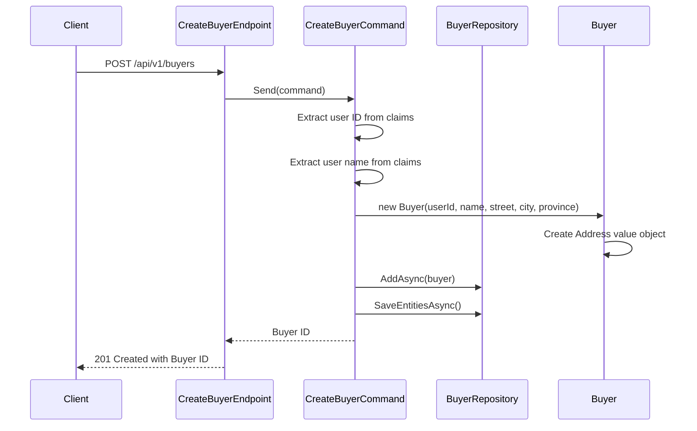

## Overview

Create a new buyer in the Ordering bounded context. The Buyer represents a crucial aggregate root in the Ordering domain model that encapsulates customer purchasing identity and address information. This endpoint requires authentication, as the buyer is created based on the authenticated user's identity.

## Implementation Details

The Create Buyer operation is implemented using the CQRS pattern with a command handler:



### Key Components

1. **CreateBuyerCommand**: Implements `ICommand<Guid>` to create a new buyer and return its ID
2. **Address Value Object**: Encapsulates the buyer's address information (street, city, province)
3. **Buyer Aggregate**: The root entity that maintains the buyer's identity and address
4. **Claims Extraction**: The user's ID and name are extracted from the authentication claims

## Business Rules

- The buyer ID is automatically derived from the authenticated user's identity
- The buyer name is extracted from the authenticated user's claims
- Address information (street, city, province) is required and validated
- Each field has a maximum length constraint (defined in DataSchemaLength.Medium)
- The buyer is created with an empty collection of orders

## Architecture

<NodeGraph />

## POST `(/api/v1/buyers)`

### Request

<SchemaViewer file="request-body.json" maxHeight="500" id="request-body" />

### Example Usage

```bash
curl -X POST "https://api.bookworm.com/api/v1/buyers" \
    -H "Content-Type: application/json" \
    -H "Authorization: Bearer <your-jwt-token>" \
    -d '{
        "street": "123 Main Street",
        "city": "New York",
        "province": "NY"
    }'
```

### Responses

#### <span className="text-green-500">201 Created</span>

- Returns the ID of the newly created buyer.
- Location header includes a versioned URL to the newly created resource
- Format: `/api/v1/buyers/{guid}`

#### <span className="text-red-500">400 Bad Request</span>

Returned when the request validation fails.

```json title="400 Bad Request"
{
  "type": "https://tools.ietf.org/html/rfc7231#section-6.5.1",
  "title": "Bad Request",
  "status": 400,
  "errors": {
    "Street": ["The Street field is required."],
    "City": ["The City field is required."],
    "Province": ["The Province field is required."]
  }
}
```

#### <span className="text-red-500">401 Unauthorized</span>

Returned when the request lacks valid authentication credentials.

#### <span className="text-red-500">409 Conflict</span>

Returned when a buyer with the same ID already exists.
