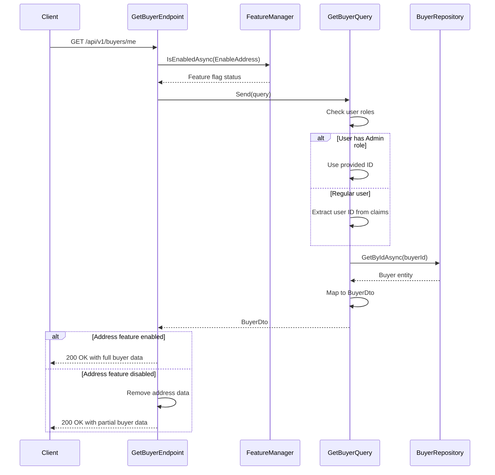

## Overview

This endpoint retrieves the current buyer's information from the Ordering bounded context. In our domain model, a Buyer represents a customer entity with purchasing capabilities and order history.

## Implementation Details

The Get Buyer operation is implemented using the CQRS pattern with a dedicated query handler:



### Key Components

1. **GetBuyerQuery**: Implements `IQuery<BuyerDto>` to retrieve a buyer by ID
2. **Role-Based Access Control**: Admins can retrieve any buyer, regular users can only retrieve their own data
3. **Feature Flag**: The `EnableAddress` feature flag controls whether address information is included in the response
4. **BuyerDto**: Lightweight projection of the Buyer aggregate for read operations

## Domain Significance

Within the Ordering domain, the Buyer aggregate is responsible for:

- Maintaining buyer identity and preferences
- Tracking order history and purchasing patterns
- Managing payment methods and shipping addresses

## Technical Implementation

This endpoint follows the CQRS pattern using a dedicated query handler that:

1. Authenticates the current user and checks their roles
2. For admin users, uses the provided buyer ID; for regular users, extracts the ID from their claims
3. Retrieves the corresponding Buyer aggregate from the repository
4. Maps the domain entity to a DTO for the response
5. Conditionally includes or excludes address information based on feature flag

## Administrative Access

Administrators can access specific buyer information by providing an optional query parameter:

- `?id={buyerId}`: Retrieve a specific buyer by their unique identifier (admin only)

When accessed by regular users, the endpoint always returns the buyer information associated with the authenticated user's identity, regardless of any ID parameter provided.

## Architecture

<NodeGraph />

## GET `(/api/v1/buyers/me)`

### Query Parameters

- **id** (query) (optional): The buyer ID to retrieve (only used when the requester has admin role)

### Example Usage

#### Regular User

```bash
curl -X GET "https://api.bookworm.com/api/v1/buyers/me" \
    -H "Authorization: Bearer <your-jwt-token>"
```

#### Admin User

```bash
curl -X GET "https://api.bookworm.com/api/v1/buyers/me?id={buyerId}" \
    -H "Authorization: Bearer <admin-jwt-token>"
```

### Responses

#### <span className="text-green-500">200 OK</span>

Returns the buyer information.

<SchemaViewer file="response-200.json" maxHeight="500" id="response-200" />

#### Example Response

```json title="200 OK"
{
  "id": "3fa85f64-5717-4562-b3fc-2c963f66afa6",
  "name": "John Doe",
  "address": "123 Main St, New York, NY"
}
```

#### <span className="text-red-500">401 Unauthorized</span>

Returned when the request lacks valid authentication credentials.

#### <span className="text-red-500">403 Forbidden</span>

Returned when a non-admin user attempts to access another user's buyer information.

#### <span className="text-red-500">404 Not Found</span>

Returned when the requested buyer does not exist.
