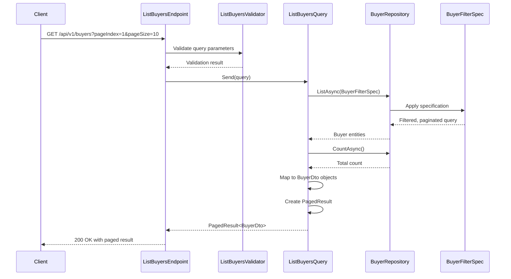

## Overview

This endpoint retrieves a paginated list of buyers from the Ordering bounded context. In our domain model, a Buyer represents a customer who can place orders within the system.

## Implementation Details

The List Buyers operation is implemented using the CQRS pattern with a dedicated query handler:



### Key Components

1. **ListBuyersQuery**: Implements `IQuery<PagedResult<BuyerDto>>` to retrieve a paginated list of buyers
2. **ListBuyersValidator**: Validates the pagination parameters
3. **BuyerFilterSpec**: Specification pattern implementation for filtering and pagination
4. **BuyerDto**: Lightweight projection of the Buyer aggregate for read operations
5. **PagedResult**: Generic container for paginated data with metadata

## Domain Context

Within the Ordering bounded context, Buyers are important aggregate roots that encapsulate order history, payment methods, and delivery preferences. The paged query approach respects the query optimization patterns in DDD by:

- Implementing a read-focused projection of the Buyer aggregate
- Using pagination to maintain performance with potentially large datasets
- Exposing only the relevant Buyer attributes needed for listing scenarios

## Technical Implementation

This query is implemented using CQRS pattern:

- **Command/Query Separation**: This read-only endpoint uses a dedicated query handler
- **Materialized View**: Returns a lightweight DTO projection optimized for reads
- **Repository Pattern**: Abstracts the underlying data access concerns
- **Specification Pattern**: Uses a dedicated specification class for filtering and pagination
- **Feature Flag**: Protected by a feature flag for controlled rollout

The pagination follows DDD best practices by treating page size and number as domain concepts rather than technical implementation details, allowing business rules to dictate appropriate limits.

## Architecture

<NodeGraph />

## GET `(/api/v1/buyers)`

### Query Parameters

- **pageIndex** (query) (optional): The page number to retrieve (default: 1)
- **pageSize** (query) (optional): The number of items per page (default: 10)

### Validation Rules

- **pageIndex**: Must be greater than 0
- **pageSize**: Must be greater than 0

### Example Usage

```bash
curl -X GET "https://api.bookworm.com/api/v1/buyers?pageIndex=2&pageSize=15" \
    -H "Content-Type: application/json"
```

### Responses

#### <span className="text-green-500">200 OK</span>

Returns a paginated list of buyers with metadata about the pagination.

<SchemaViewer file="response-200.json" maxHeight="500" id="response-200" />

#### Example Response

```json title="200 OK"
{
  "pageIndex": 2,
  "pageSize": 15,
  "totalItems": 45,
  "totalPages": 3,
  "hasNextPage": false,
  "hasPreviousPage": true,
  "items": [
    {
      "id": "3fa85f64-5717-4562-b3fc-2c963f66afa6",
      "name": "John Doe",
      "address": "123 Main St, New York, NY"
    },
    {
      "id": "8a1b6a9c-7d3e-4f5a-9b2c-1d3e5f7a9b2c",
      "name": "Jane Smith",
      "address": "456 Oak Ave, San Francisco, CA"
    }
  ]
}
```

#### <span className="text-red-500">400 Bad Request</span>

Returned when the request validation fails.

```json title="400 Bad Request"
{
  "type": "https://tools.ietf.org/html/rfc7231#section-6.5.1",
  "title": "Bad Request",
  "status": 400,
  "errors": {
    "PageIndex": ["The field PageIndex must be greater than 0."],
    "PageSize": ["The field PageSize must be greater than 0."]
  }
}
```
