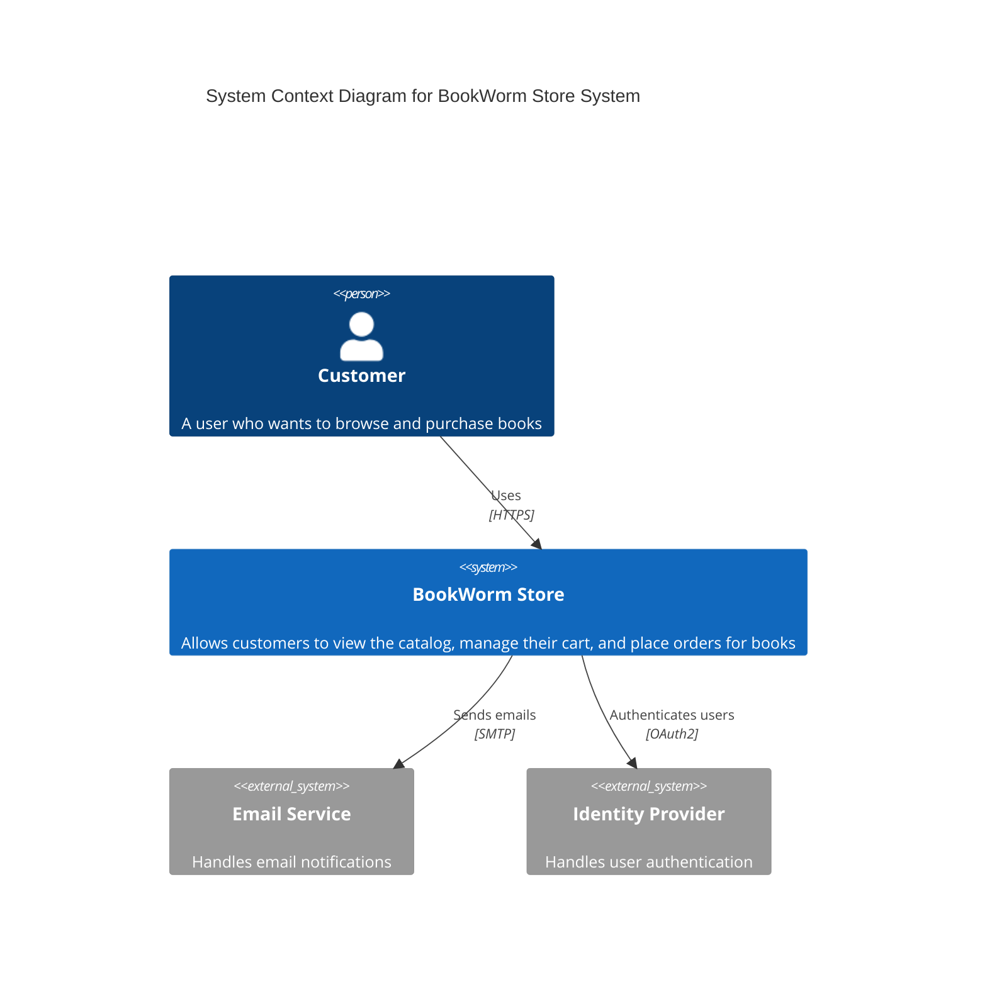
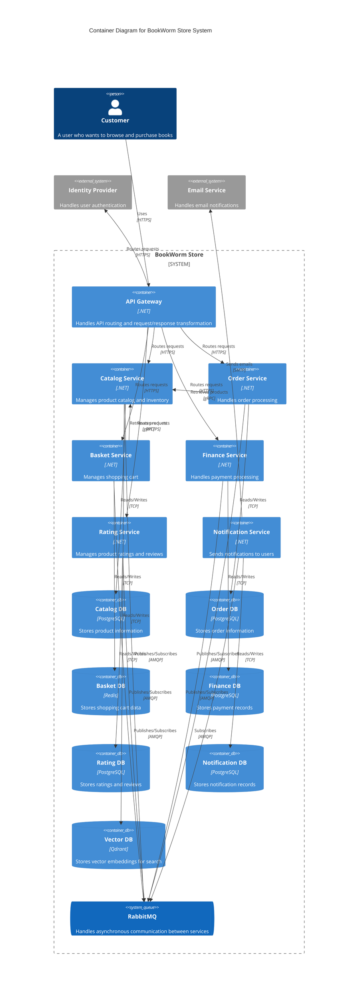

<Tiles>
  <Tile
    icon="UserGroupIcon"
    href="/docs/users/nhanxnguyen"
    title="Contact the author"
    description="Any questions? Feel free to contact the owners"
  />
  <Tile
    icon="RectangleGroupIcon"
    href={`/visualiser/domains/${frontmatter.id}/${frontmatter.version}`}
    title="Domain Architecture"
    description="Explore our domain structure and service interactions"
  />
</Tiles>

## Overview

The Store domain is a strategic core domain within the BookWorm system, integrating functionalities from both the **Orders** and **Catalog** domains. It is responsible for managing the store's business capabilities and services, encompassing essential functionalities that directly impact the organization's competitive advantage and overall performance.

## Subdomains

The Store domain is composed of the following subdomains:

- **Orders** - Manages the complete order lifecycle, from basket management to order fulfillment, payment processing, and customer notifications.
- **Catalog** - Manages the product catalog, including book information, inventory, pricing, and user reviews. It provides the foundation for product discovery and browsing.

## Event Storming

We conducted an [event storming](https://www.eventstorming.com/) session for the Store domain to understand its complexities and subdomain interactions. This session helped us map key events, commands, and aggregates, aligning our technical implementation with business needs for robust functionality.

<Miro boardId="uXjVIG4lIr0=/" moveToWidget="3458764623724644744" edit={false} />

## High-level architecture

To effectively visualize and understand the architecture of the BookWorm system, we will employ the [C4 model](https://c4model.com/). This model allows us to represent the system at various levels of abstraction, providing a comprehensive view of its structure and interactions.

### System Context Diagram

### Container Diagram

## Current Production Architecture

Below is the interactive event-driven architecture diagram for the BookWorm Store system.

<NodeGraph />

## Service Level Agreements

The following SLAs are defined for the Store domain:

- **SLA-001**: The system must be available 99.9% of the time.
- **SLA-002**: The system must respond to requests within 1 second.
- **SLA-003**: The system must be able to handle 1000 requests per second.
