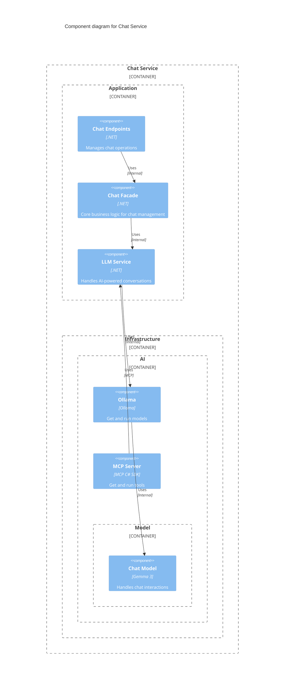

<Tiles>
  <Tile
    icon="DocumentIcon"
    href={`/docs/services/${frontmatter.id}/${frontmatter.version}/changelog`}
    title="View the changelog"
    description="Want to know the history of this service? View the change logs"
  />
  <Tile
    icon="UserGroupIcon"
    href="/docs/users/nhanxnguyen"
    title="Contact the author"
    description="Any questions? Feel free to contact the owners"
  />
  <Tile
    icon="BoltIcon"
    href={`/visualiser/services/${frontmatter.id}/${frontmatter.version}`}
    title={`Receives ${frontmatter.receives.length} messages`}
    description="This service receives messages from other services"
  />
</Tiles>

## Overview

The Chat Service is a specialized bounded context within the BookWorm ecosystem that implements natural language processing capabilities to provide interactive conversations with users. This service is responsible for:

- Processing user chat prompts and generating contextually relevant responses
- Maintaining chat session state and history
- Providing book recommendations and information through conversational interfaces
- Leveraging large language models (LLMs) to understand and respond to user queries
- Integrating with the catalog service to access book metadata and information

The domain model follows strategic DDD patterns with clearly defined aggregates, entities, and value objects. The Chat domain enforces business rules such as prompt validation, session management, and response generation.

## Component Diagram

## Core Features

| Feature               | Description                                                                                    |
| --------------------- | ---------------------------------------------------------------------------------------------- |
| **Create Chat**       | Initialize a new chat session with a prompt and receive a unique identifier.                   |
| **Cancel Chat**       | Terminate an existing chat session.                                                            |
| **Conversational AI** | Engage with an AI assistant that can answer questions about books and provide recommendations. |
| **Context Awareness** | Maintain conversation context across multiple interactions within a session.                   |

## Architecture diagram

<NodeGraph />

## Infrastructure

The Chat Service is deployed on Microsoft Azure and leverages various Azure services for scalability, reliability, and performance. The infrastructure components include:

```mermaid
architecture-beta
    group api(logos:microsoft-azure)[API]

    service server(logos:docker-icon)[Server] in api
    service llm(server)[LLM] in api

    server:L -- R:llm
    llm:L -- R:server
```

## Security

The Chat Service implements several security measures to protect user data and ensure secure communication:

- TLS/SSL encryption for all API endpoints
- JWT-based authentication for user sessions
- Rate limiting to prevent abuse
- Input validation and sanitization to prevent injection attacks
- Secure storage of conversation history

## API Documentation

The Chat Service exposes RESTful API endpoints for creating and managing chat sessions. The API is documented using the OpenAPI specification, which provides detailed information about available endpoints, request/response formats, and authentication requirements.
