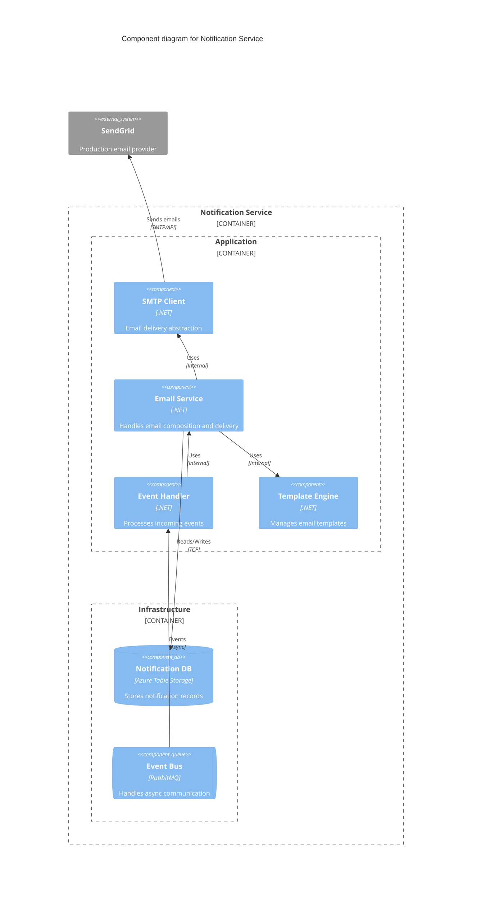
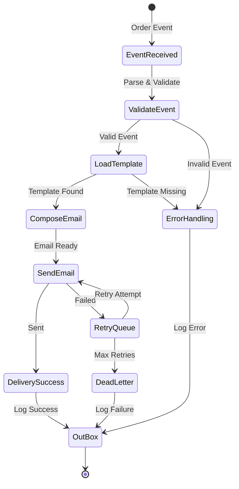

<Tiles>
  <Tile
    icon="DocumentIcon"
    href={`/docs/services/${frontmatter.id}/${frontmatter.version}/changelog`}
    title="View the changelog"
    description="Want to know the history of this service? View the change logs"
  />
  <Tile
    icon="UserGroupIcon"
    href="/docs/users/nhanxnguyen"
    title="Contact the author"
    description="Any questions? Feel free to contact the owners"
  />
  <Tile
    icon="BoltIcon"
    href={`/visualiser/services/${frontmatter.id}/${frontmatter.version}`}
    title={`Receives ${frontmatter.receives.length} messages`}
    description="This service receives messages from other services"
  />
</Tiles>

## Overview

The Notification Service is a supporting service within BookWorm's [microservices architecture](https://foxminchan.github.io/BookWorm/architecture/adr/adr-001-microservices-architecture.html), responsible for sending transactional emails to customers at critical points in the order lifecycle. Built using our [event-driven approach](https://foxminchan.github.io/BookWorm/architecture/adr/adr-002-event-driven-cqrs.html), this service listens for integration events from other domains and transforms them into appropriate customer communications.

### Key Responsibilities

- **Event Processing**: Consumes order-related events from the message bus
- **Email Composition**: Transforms events into well-formatted email messages
- **Template Management**: Maintains and renders email templates with dynamic content
- **Delivery Orchestration**: Manages email delivery through multiple providers
- **Retry & Resilience**: Implements robust retry mechanisms for failed deliveries
- **Audit Trail**: Maintains comprehensive logs of all notification attempts

## Component Diagram

## Architecture diagram

<NodeGraph />

## Message Flow

The Notification Service processes the following commands:

| Command                | Channel                     | Purpose                              | SLA      |
| ---------------------- | --------------------------- | ------------------------------------ | -------- |
| `PlaceOrderCommand`    | notification-place-order    | Sends order confirmation emails      | < 5 min  |
| `CompleteOrderCommand` | notification-complete-order | Sends order completion notifications | < 10 min |
| `CancelOrderCommand`   | notification-cancel-order   | Delivers order cancellation notices  | < 5 min  |

### Event Processing Pipeline

## Email Templates

Each notification type follows a standardized template structure:

- **Order Confirmation**: "Your order has been placed successfully."
- **Order Completion**: "Your order has been completed successfully."
- **Order Cancellation**: "Your order has been cancelled."

## Infrastructure

The Notification Service is deployed on Microsoft Azure, leveraging Azure Service Bus for message consumption and Azure Monitor for observability.

For `Development` environment, the service uses MailPit for email delivery.

For `Production` environment, the service uses SendGrid for email delivery.

```mermaid
architecture-beta
    group prod[Production Environment]
    group dev[Development Environment]

    service app(logos:docker)[Notification Service] in prod
    service sg(logos:sendgrid)[SendGrid API] in prod
    service bus(logos:rabbitmq)[RabbitMQ] in prod
    service storage(logos:microsoft-azure)[Table Storage] in prod
    service monitor(logos:microsoft-azure)[Azure Monitor] in prod

    service appDev(logos:docker)[Notification Service] in dev
    service mail(logos:docker)[MailPit SMTP] in dev
    service busDev(logos:rabbitmq)[RabbitMQ] in dev

    app:R --> L:sg
    bus:R --> L:app
    app:B --> T:storage
    app:L --> R:monitor

    busDev:R --> L:appDev
    appDev:R --> L:mail
```

## Security Considerations

- **PII Protection**: Customer data is encrypted at rest and in transit
- **API Key Management**: SendGrid API keys stored in Azure Key Vault
- **Rate Limiting**: Protection against notification spam
- **Content Sanitization**: HTML content is sanitized to prevent XSS
- **Audit Compliance**: GDPR-compliant data retention policies

## Performance Optimizations

- **Async Processing**: All operations are fully asynchronous
- **Batch Processing**: Groups multiple notifications when possible
- **Template Caching**: Compiled templates cached in memory
- **Connection Pooling**: Reuses SMTP/HTTP connections
- **Parallel Delivery**: Concurrent email sending with throttling
