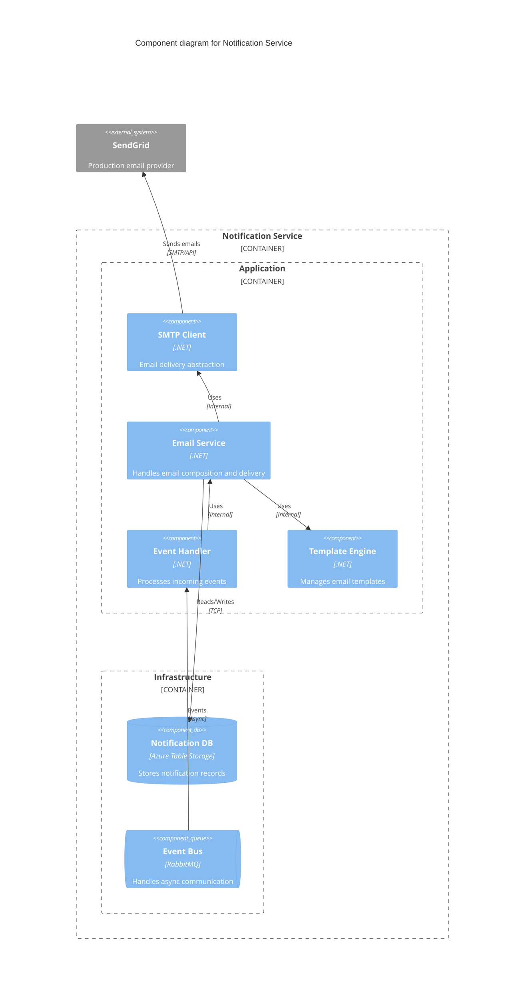

## Overview

The Notification Service is a supporting service within BookWorm's microservices architecture, responsible for sending transactional emails to customers at critical points in the order lifecycle. Built using an event-driven approach, this service listens for integration events from other domains and transforms them into appropriate customer communications.

<Tiles>
  <Tile
    icon="DocumentIcon"
    href={`/docs/services/${frontmatter.id}/${frontmatter.version}/changelog`}
    title="View the changelog"
    description="Want to know the history of this service? View the change logs"
  />
  <Tile
    icon="UserGroupIcon"
    href="/docs/users/nhanxnguyen"
    title="Contact the author"
    description="Any questions? Feel free to contact the owners"
  />
  <Tile
    icon="BoltIcon"
    href={`/visualiser/services/${frontmatter.id}/${frontmatter.version}`}
    title={`Receives ${frontmatter.receives.length} messages`}
    description="This service receives messages from other services"
  />
</Tiles>

## Component Diagram

## Architecture diagram

<NodeGraph />

## Technical Implementation

The Notification Service is implemented using modern cloud-native practices:

### Email Providers

The service supports multiple email delivery mechanisms through a clean abstraction:

- **Development Environment**: Uses local SMTP server (MailPit) for testing
- **Production Environment**: Integrates with SendGrid for reliable email delivery
- **Interface Abstraction**: Implements `ISmtpClient` interface for provider flexibility

## Message Flow

The Notification Service processes the following commands:

| Command                | Channel                     | Purpose                              |
| ---------------------- | --------------------------- | ------------------------------------ |
| `PlaceOrderCommand`    | notification-place-order    | Sends order confirmation emails      |
| `CompleteOrderCommand` | notification-complete-order | Sends order completion notifications |
| `CancelOrderCommand`   | notification-cancel-order   | Delivers order cancellation notices  |

## Email Templates

Each notification type follows a standardized template structure:

- **Order Confirmation**: "Your order has been placed successfully."
- **Order Completion**: "Your order has been completed successfully."
- **Order Cancellation**: "Your order has been cancelled."

## Infrastructure

The Notification Service is deployed on Microsoft Azure, leveraging Azure Service Bus for message consumption and Azure Monitor for observability.

For `Development` environment, the service uses MailPit for email delivery.

For `Production` environment, the service uses SendGrid for email delivery.
