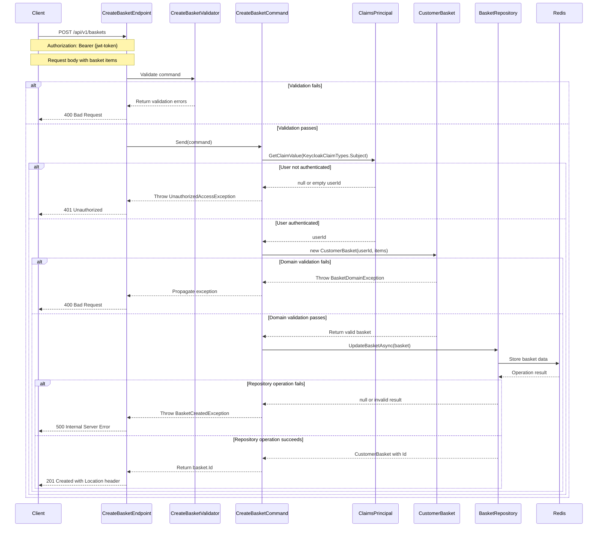

## Overview

This endpoint creates a new shopping basket for a user. In our domain model, a `Basket` represents an Aggregate Root in the Basket bounded context. Each Basket maintains its own identity and encapsulates a collection of `BasketItem` entities, which are part of the Basket's aggregate boundary.

The `Basket` enforces invariants across its contained items and manages the lifecycle of the `BasketItem` entities through well-defined domain operations. When a basket is created, it establishes the consistency boundary for transactional operations related to the user's shopping experience.

Each `BasketItem` captures the user's intent to purchase a specific book, maintaining quantity and price information while preserving the connection to the Catalog domain through book identifiers.

## Implementation Details

The Create Basket operation is implemented using the CQRS pattern with a dedicated command handler:



### Key Components

1. **CreateBasketCommand**: Implements `ICommand<string>` to create a new basket with items
2. **CreateBasketHandler**: Processes the command using repository pattern
3. **CreateBasketValidator**: Validates the command parameters using FluentValidation
4. **CustomerBasket**: Domain entity that encapsulates basket data and business rules
5. **BasketItem**: Value object representing an item in the basket
6. **IBasketRepository**: Repository interface for basket persistence operations

### Validation Rules

The command validation enforces several business rules:
- The items collection must not be empty
- Each item must have a valid ID
- Each item must have a quantity greater than zero

The domain model enforces additional invariants:
- Customer ID cannot be null
- Basket must contain at least one item

## Architecture

<NodeGraph />

## POST `(/api/v1/baskets)`

### Request Body

<SchemaViewer file="request-body.json" maxHeight="500" id="request-body" />

### Example Usage

```bash
curl -X POST https://api.bookworm.com/api/v1/baskets \
  -H "Authorization: Bearer <your-jwt-token>" \
  -H "Content-Type: application/json" \
  -d '{
    "items": [
      {
        "id": "0195e6d3-36e1-72f9-9c60-09a9f13a07e9",
        "quantity": 2
      },
      {
        "id": "0195e6d3-36e1-78af-9e8d-a295555ca961",
        "quantity": 1
      }
    ]
  }'
```

### Responses

#### <span className="text-green-500">201 Created</span>

- Returns the newly created basket ID.
- Includes a Location header with the URL to the new resource
- Format: `/api/v1/baskets/{guid}`

#### <span className="text-orange-500">400 Bad Request</span>

Returned when the request validation fails.

<SchemaViewer file="response-400.json" maxHeight="500" id="response-400" />

#### <span className="text-red-500">401 Unauthorized</span>

Returned when:
- The user is not authenticated
- The authentication token is missing or invalid

## Implementation Notes

- The endpoint is versioned (v1) and follows REST principles
- Uses optimistic concurrency for basket updates
- Implements domain-driven design patterns with `Basket` as an aggregate root
- Provides immediate consistency for basket operations
