<Tiles >
    <Tile icon="DocumentIcon" href={`/docs/services/${frontmatter.id}/${frontmatter.version}/changelog`}  title="View the changelog" description="Want to know the history of this service? View the change logs" />
    <Tile icon="UserGroupIcon" href="/docs/users/nhanxnguyen" title="Contact the author" description="Any questions? Feel free to contact the owners" />
    <Tile icon="BoltIcon" href={`/visualiser/services/${frontmatter.id}/${frontmatter.version}`} title={`Sends ${frontmatter.sends.length} messages`} description="This service sends messages to downstream consumers" />
    <Tile icon="BoltIcon"  href={`/visualiser/services/${frontmatter.id}/${frontmatter.version}`} title={`Receives ${frontmatter.receives.length} messages`} description="This service receives messages from other services" />
</Tiles>

## Overview

The Basket Service is a domain-centric microservice within our bounded context that implements a RESTful API architecture to manage the transient state of customer shopping carts. This service encapsulates the complete lifecycle of a basket aggregate, from creation through modification to eventual checkout processing.

As a core part of our Domain-Driven Design implementation, the Basket Service maintains its own dedicated persistence store, ensuring proper encapsulation of the basket domain model. It serves as the system of record for the shopping intent of customers before this intent is transformed into an order through domain events.

The service implements several key domain operations:

- Adding/removing items to the basket
- Updating quantities of basket items
- Calculating totals with applied discounts and promotions
- Managing the checkout process and transition to the Order bounded context

Following tactical DDD patterns, the basket is modeled as an aggregate root with basket items as entities within its boundary, ensuring consistency through transactional integrity and proper domain invariants.

## Core Features

| Feature                     | Description                                                                                                           |
| --------------------------- | --------------------------------------------------------------------------------------------------------------------- |
| **Add Item to Basket**      | Allows customers to add items to their basket, updating the basket's total price and item count.                      |
| **Remove Item from Basket** | Enables customers to remove items from their basket, recalculating the basket's total price and item count.           |
| **Update Item Quantity**    | Supports customers in updating the quantity of items in their basket, adjusting the basket's total price accordingly. |
| **View Basket**             | Provides customers with the ability to view the contents of their basket, including item details and total price.     |

## Architecture diagram

<NodeGraph />

<MessageTable format="all" limit={4} />

## Key Concepts

<AccordionGroup>
  <Accordion title="Basket">
    The basket is the core domain entity representing a customer's shopping cart. It encapsulates the items added by the customer, their quantities, and the total price of the basket.
  </Accordion>
  <Accordion title="Basket Item">
    Basket items are the individual products added to the basket by the customer. They contain information such as the product ID, quantity, and price.
  </Accordion>
</AccordionGroup>

## Infrastructure

The Basket Service is deployed as a containerized application within the BookWorm ecosystem. It leverages cloud-native technologies for scalability and resilience, ensuring high availability and fault tolerance.

```mermaid
architecture-beta
    group api(logos:microsoft-azure)[API]

    service db(logos:redis)[Database] in api
    service server(logos:docker-icon)[Server] in api

    db:L -- R:server
```

The service is hosted on a cloud platform, utilizing managed services for database storage and container orchestration. This infrastructure setup enables seamless scaling and efficient resource utilization, supporting the dynamic demands of customer shopping activities.
