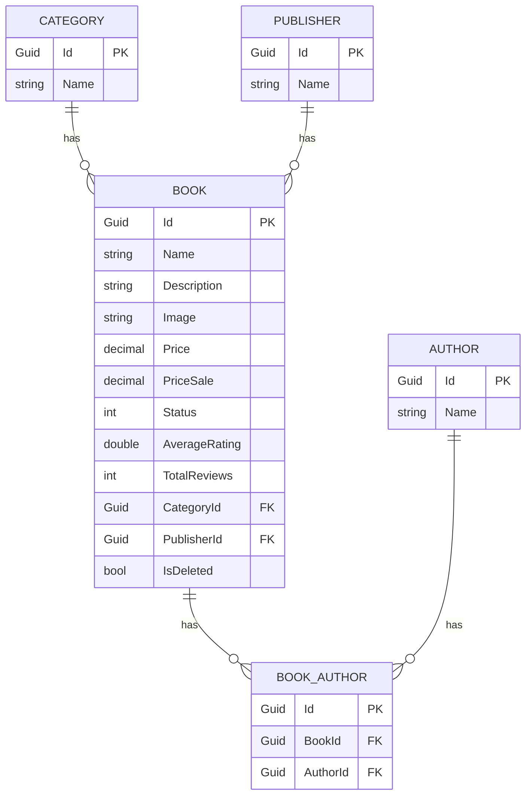

<Tiles >
    <Tile icon="UserGroupIcon" href="/docs/users/nhanxnguyen" title="Contact the author" description="Any questions? Feel free to contact the owners" />
    <Tile icon="RectangleGroupIcon" href={`/visualiser/domains/${frontmatter.id}/${frontmatter.version}`} title={`${frontmatter.services.length} services are in this domain`} description="This service sends messages to downstream consumers" />
</Tiles>

## Overview

The Catalog domain is responsible for managing the products that are available for purchase in the BookWorm platform. It serves as the central repository for all book-related information including metadata, inventory status, pricing, and categorization.

This domain allows customers to browse the extensive collection of books, view detailed product information including author details, publisher information,... and preview content when available. The search functionality enables users to find books based on various criteria such as title, author, genre, publication date, and keywords.

The domain also provides robust management capabilities for product categories, series, collections, and publishers. It maintains relationships between books, such as series orders, related titles, and author bibliographies.

For administrators, the Catalog domain offers inventory management tools, allowing them to add new books, update existing information, manage stock levels, and control pricing and discounts.

As a core domain in the BookWorm ecosystem, Catalog integrates with other services like the Basket domain for purchasing flows, the Rating domain for customer reviews, and the Ordering domain for inventory verification during checkout processes.

## Architecture

The Catalog service is built using a clean architecture approach with the following key components:

- **Domain Layer**: Contains the core business logic and domain models
  - Aggregates: Book, Publisher, Author, and Category
  - Domain Events and Event Handlers
  - Domain Exceptions
- **Infrastructure Layer**: Handles data persistence and external service integration
- **Features**: Implements specific use cases and business operations
- **gRPC**: Provides service-to-service communication
- **Integration Events**: Manages cross-service event communication

## Domain Model

The Catalog domain is structured around four main aggregates:

1. **Book Aggregate**
   - Core entity representing books in the catalog
   - Manages book metadata, pricing, and inventory
   - Handles relationships with authors, publishers, and categories

2. **Publisher Aggregate**
   - Manages publisher information and relationships
   - Handles publisher-specific metadata and branding

3. **Author Aggregate**
   - Manages author information and bibliographies
   - Handles author-specific metadata and relationships with books

4. **Category Aggregate**
   - Manages book categorization and classification
   - Handles hierarchical category structures

Each aggregate maintains its own consistency boundary and encapsulates its business rules and invariants.

## Bounded context

<NodeGraph />

<MessageTable format="all" limit={4} />

## Entity Relationship Diagram

:::note

The common properties such as `CreatedAt`, `UpdatedAt`, and audit fields are not shown in the diagram for simplicity. All entities inherit these base tracking fields.

:::

#### <ins>Table: Book</ins>

| Column | Type | Description |
|--------|------|-------------|
| Id | Guid | The unique identifier for the book |
| Name | string | The name of the book |
| Description | string | The description of the book |
| Image | string | The image of the book |
| Price | decimal | The price of the book |
| PriceSale | decimal | The sale price of the book |
| Status | int | The status of the book |
| AverageRating | double | The average rating of the book |
| TotalReviews | int | The total reviews of the book |
| CategoryId | Guid | The category id of the book |
| PublisherId | Guid | The publisher id of the book |
| IsDeleted | bool | The deleted flag of the book |

#### <ins>Table: BookAuthor</ins>

| Column | Type | Description |
|--------|------|-------------|
| Id | Guid | The unique identifier for the book author |
| BookId | Guid | The book id of the book author |
| AuthorId | Guid | The author id of the book author |

#### <ins>Table: Author</ins>

| Column | Type | Description |
|--------|------|-------------|
| Id | Guid | The unique identifier for the author |
| Name | string | The name of the author |

#### <ins>Table: Category</ins>

| Column | Type | Description |
|--------|------|-------------|
| Id | Guid | The unique identifier for the category |
| Name | string | The name of the category |

#### <ins>Table: Publisher</ins>

| Column | Type | Description |
|--------|------|-------------|
| Id | Guid | The unique identifier for the publisher |
| Name | string | The name of the publisher |

## Domain Events

The Catalog domain produces and consumes various events including:

- `BookCreatedEvent`: Event raised when a new book is created
- `BookUpdatedEvent`: Event raised when a book is updated

## Business Rules and Invariants

- Books must have at least one author
- Books must have a valid category
- Books must have a valid publisher
- Books must have a valid price
- Books must have a valid inventory status
