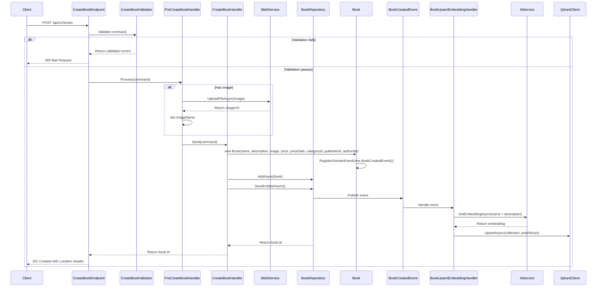

## Overview

The Create Book endpoint allows administrators to add new books to the Catalog domain. This operation follows Domain-Driven Design principles by:

1. Validating the book entity against domain rules and invariants
2. Creating a new aggregate root in the Books collection
3. Publishing a `BookCreatedEvent` that other bounded contexts can subscribe to
4. Automatically generating embeddings for semantic search using AI

This endpoint represents the command side of our CQRS pattern implementation. The book entity becomes immediately available for queries after successful creation.

:::note
Book creation requires proper authentication with Admin privileges, as indicated by the badge.
:::

## Architecture

<NodeGraph />

## POST `(/api/v1/books)`

### Request Body

<SchemaViewer file="request-body.json" maxHeight="500" id="request-body" />

### Example Usage

```bash
curl -X POST "https://api.bookworm.com/api/v1/books" \
  -H "Content-Type: multipart/form-data" \
  -H "Authorization: Bearer <admin-token>" \
  -F "name=Updated Book Name" \
  -F "description=Updated Book Description" \
  -F "price=19.99" \
  -F "priceSale=14.99" \
  -F "categoryId=123e4567-e89b-12d3-a456-426614174000" \
  -F "publisherId=123e4567-e89b-12d3-a456-426614174000" \
  -F "authorIds=123e4567-e89b-12d3-a456-426614174000,123e4567-e89b-12d3-a456-426614174001" \
  -F "image=@/path/to/image.jpg"
```

### Implementation Details

The Create Book operation is implemented using the CQRS pattern with a dedicated command handler:



### Key Components

1. **CreateBookCommand**: Implements `ICommand<Guid>` to create a new book
2. **PreCreateBookHandler**: Processes image upload before book creation
3. **CreateBookHandler**: Processes the command using repository pattern
4. **CreateBookValidator**: Validates the command parameters using FluentValidation
5. **CreateBookEndpoint**: Maps the HTTP POST request to the command handler
6. **Book Entity**: Domain entity that encapsulates book data and business rules
7. **BookCreatedEvent**: Domain event raised when book is created
8. **BookUpsertEmbeddingHandler**: Handles semantic search embedding generation

### Technical Implementation

The implementation uses several patterns and techniques:

1. **CQRS**: Separates the write model (command) from the read model (query)
2. **Repository Pattern**: The `IBookRepository` abstracts the data access layer
3. **Domain-Driven Design**: Uses domain entities and events to encapsulate business logic
4. **Minimal API**: Uses .NET's minimal API approach with endpoint mapping
5. **FluentValidation**: Validates the command parameters
6. **Event Sourcing**: Uses domain events for side effects (embedding generation)

The command execution flow:

1. The endpoint receives the HTTP POST request with the book data
2. The validator ensures all business rules are satisfied
3. If an image is provided, it's uploaded to blob storage
4. The command handler creates a new Book entity
5. The entity registers a domain event
6. The repository persists the entity and publishes domain events
7. The embedding handler processes the book for semantic search
8. The endpoint returns a 201 Created response with the book ID and location header

### Validation Rules

The endpoint enforces the following validation rules:

- **Name**: Required, maximum length of 100 characters
- **Description**: Optional, maximum length of 4000 characters
- **Price**: Required, must be greater than 0
- **PriceSale**: Optional, must be greater than 0 and less than or equal to regular price
- **CategoryId**: Required
- **PublisherId**: Required
- **AuthorIds**: Required, at least one author must be specified
- **Image**: Optional, if provided:
  - Maximum file size: 1MB
  - Allowed file types: JPEG and PNG only

### File Upload

The endpoint supports image uploads for books. Images are:
- Processed asynchronously
- Stored in blob storage
- URL is saved with the book record

### Domain Events

Upon successful creation, the following domain events are triggered:

1. `BookCreatedEvent`: Notifies other bounded contexts about the new book
2. Automatically triggers embedding generation for semantic search capabilities

### Responses

#### <span className="text-orange-500">400 Bad Request</span>

<SchemaViewer file="response-400.json" maxHeight="500" id="response-400" />

#### <span className="text-green-500">201 Created</span>

- Returns the newly created book ID
- Includes a Location header with the URL to the new resource
- Format: `/api/v1/books/{guid}`
