<Tiles >
    <Tile icon="DocumentIcon" href={`/docs/services/${frontmatter.id}/${frontmatter.version}/changelog`}  title="View the changelog" description="Want to know the history of this service? View the change logs" />
    <Tile icon="UserGroupIcon" href="/docs/users/nhanxnguyen" title="Contact the author" description="Any questions? Feel free to contact the owners" />
    <Tile icon="BoltIcon" href={`/visualiser/services/${frontmatter.id}/${frontmatter.version}`} title={`Sends ${frontmatter.sends.length} messages`} description="This service sends messages to downstream consumers" />
    <Tile icon="BoltIcon"  href={`/visualiser/services/${frontmatter.id}/${frontmatter.version}`} title={`Receives ${frontmatter.receives.length} messages`} description="This service receives messages from other services" />
</Tiles>

## Overview

The Catalog Service is a core bounded context within the BookWorm ecosystem that implements Domain-Driven Design principles to manage the book inventory and metadata. This service is responsible for:

- Managing the book catalog, including details like title, ISBN, publication date, and price
- Maintaining author profiles and their associated works
- Organizing books by categories and genres
- Handling publisher information and their published titles
- Processing book metadata updates and synchronization
- Broadcasting domain events when significant catalog changes occur

The domain model follows strategic DDD patterns with clearly defined aggregates, entities, and value objects. The Catalog domain enforces business rules such as ISBN validation, category relationships, and author attribution.

Key components include:

- **Domain Layer**: Contains book, author, publisher, and category aggregates with encapsulated business logic
- **Application Layer**: Implements CQRS with MediatR for query and command separation
- **Infrastructure Layer**: Provides persistence using the repository pattern and EF Core
- **API Layer**: Offers RESTful endpoints for catalog management

The service publishes domain events via message broker integration to notify other bounded contexts about catalog changes, maintaining eventual consistency across the system.

## Core Features

| Feature               | Description                                                                                          |
| --------------------- | ---------------------------------------------------------------------------------------------------- |
| **Manage Books**      | Create, update, and delete book records, including title, ISBN, author, category, and price details. |
| **Manage Authors**    | Maintain author profiles with biographical information and associated works.                         |
| **Manage Publishers** | Store publisher details and their published titles, including ISBN, publication date, and price.     |
| **Manage Categories** | Organize books by categories and genres, ensuring proper classification and searchability.           |
| **View Book Details** | Retrieve detailed information about a specific book, including author, category, and publisher data. |
| **Search and Filter** | Search for books by title, author, category, or ISBN, with advanced filtering options.               |

## Architecture diagram

<NodeGraph />

## Infrastructure

The Catalog Service is deployed on Microsoft Azure and leverages various Azure services for scalability, reliability, and performance. The infrastructure components include:

```mermaid
architecture-beta
    group api(logos:microsoft-azure)[API]

    service db(logos:postgresql)[Database] in api
    service server(logos:docker-icon)[Server] in api
    service disk(disk)[Storage] in api
    service llm(server)[LLM] in api
    service vector_db(database)[Vector Database] in api

    db:L -- R:server
    server:L -- R:disk
    server:L -- R:llm
    server:L -- R:vector_db
```



The service uses Azure Database for PostgreSQL as the primary data store, ensuring ACID compliance and data durability. Azure Blob Storage provides scalable file storage for book cover images and other media assets. Ollama (LLM) and Vector Database are used for GenAI integration.

<Steps title="How to connect to Catalog Service">
  <Step title="Get the base URL">
    The base URL for the Catalog Service API is `https://api.bookworm.com/catalog/api/v1`.
  </Step>
  <Step title="Configure API client">
     Use the following code to initialize the Catalog Service client:
      ```javascript
      import axios from 'axios';

      const catalogService = axios.create({
        baseURL: 'https://api.bookworm.com/catalog/api/v1',
        timeout: 5000,
        headers: {
          'Content-Type': 'application/json',
        },
      });
      ```

  </Step>
  <Step title="Make a test request">
    Test the connection by fetching the list of books:
    ```javascript
    catalogService.get('/books')
      .then((response) => {
        console.log(response.data);
      })
      .catch((error) => {
        console.error(error);
      });
    ```
  </Step>
</Steps>
