<Tiles >
    <Tile icon="DocumentIcon" href={`/docs/services/${frontmatter.id}/${frontmatter.version}/changelog`}  title="View the changelog" description="Want to know the history of this service? View the change logs" />
    <Tile icon="UserGroupIcon" href="/docs/users/nhanxnguyen" title="Contact the author" description="Any questions? Feel free to contact the owners" />
    <Tile icon="BoltIcon" href={`/visualiser/services/${frontmatter.id}/${frontmatter.version}`} title={`Sends ${frontmatter.sends.length} messages`} description="This service sends messages to downstream consumers" />
    <Tile icon="BoltIcon"  href={`/visualiser/services/${frontmatter.id}/${frontmatter.version}`} title={`Receives ${frontmatter.receives.length} messages`} description="This service receives messages from other services" />
</Tiles>

## Overview

The Finance service acts as a critical orchestration component within the BookWorm ecosystem, implementing Domain-Driven Design principles to manage financial transactions and state transitions across the order fulfillment process.

### Integration Patterns

As an orchestrator, this service:

- Listens for checkout events from the Basket service
- Communicates order status changes to the Order service

### Technical Implementation

Built with a hexagonal architecture, separating:

- Domain core (business rules and invariants)
- Application services (workflow orchestration)

The service maintains its own read model optimized for financial reporting and audit requirements.

## Core Features

| Feature              | Description                                                                                                       |
| -------------------- | ----------------------------------------------------------------------------------------------------------------- |
| **Order Processing** | Orchestrates the financial aspects of order processing, including payment authorization, capture, and settlement. |

## Architecture diagram

<NodeGraph />

## Infrastructure

The Finance service is deployed on Microsoft Azure, leveraging Azure Database for PostgreSQL as the primary data store.

```mermaid
architecture-beta
    group api(logos:microsoft-azure)[API]

    service db(logos:postgresql)[Database] in api
    service server(logos:docker-icon)[Server] in api

    db:L -- R:server
```

